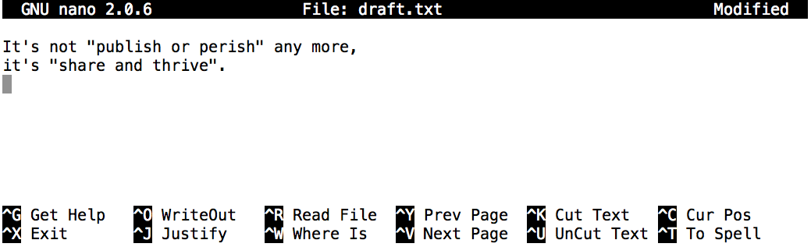

# Working with Files and Directories

We now know how to explore files and directories,
but how do we create them in the first place?
Let's go back to our `data-shell` directory on the Desktop
and use `ls -F` to see what it contains:


{:.input_area}
```bash
cd data-shell
```

{:.output_stream}
```
bash: cd: data-shell: No such file or directory

```


{:.input_area}
```bash
pwd
```

{:.output_stream}
```
/home/stuart/Git/Aperio/stfc_website/notebooks/01-bash

```


{:.input_area}
```bash
ls -F
```

{:.output_stream}
```
01-introducing-the-shell_instructor.ipynb
01-introducing-the-shell.ipynb
02-files-and-directories_instructor.ipynb
02-files-and-directories.ipynb
03-working-with-files-and-directories_instructor.ipynb
03-working-with-files-and-directories.ipynb
filesystem-challenge.svg
filesystem.svg
home-directories.svg
nano-screenshot.png

```

Let's create a new directory called `thesis` using the command `mkdir thesis` (which has no output):


{:.input_area}
```bash
mkdir thesis
```

As you might guess from its name, `mkdir` means "make directory". Since `thesis`
is a relative path (i.e., doesn't have a leading slash), the new directory is
created in the current working directory:


{:.input_area}
```bash
ls -F
```

{:.output_stream}
```
01-introducing-the-shell_instructor.ipynb
01-introducing-the-shell.ipynb
02-files-and-directories_instructor.ipynb
02-files-and-directories.ipynb
03-working-with-files-and-directories_instructor.ipynb
03-working-with-files-and-directories.ipynb
filesystem-challenge.svg
filesystem.svg
home-directories.svg
nano-screenshot.png
thesis/

```


<section class="callout panel panel-warning">
<div class="panel-heading">
<h2><span class="fa fa-thumb-tack"></span> Two ways of doing the same thing</h2>
</div>


<div class="panel-body">

<p>Using the shell to create a directory is no different than using a file explorer.
If you open the current directory using your operating system's graphical file explorer,
the <code>thesis</code> directory will appear there too.
While they are two different ways of interacting with the files,
the files and directories themselves are the same.</p>

</div>

</section>


<section class="callout panel panel-warning">
<div class="panel-heading">
<h2><span class="fa fa-thumb-tack"></span> Good names for files and directories</h2>
</div>


<div class="panel-body">

<p>Complicated names of files and directories can make your life painful
when working on the command line. Here we provide a few useful
tips for the names of your files.</p>
<ol>
<li>Don't use whitespaces.</li>
</ol>
<p>Whitespaces can make a name more meaningful
   but since whitespace is used to break arguments on the command line
   it is better to avoid them in names of files and directories.
   You can use <code>-</code> or <code>_</code> instead of whitespace.</p>
<ol>
<li>Don't begin the name with <code>-</code> (dash).</li>
</ol>
<p>Commands treat names starting with <code>-</code> as options.</p>
<ol>
<li>Stick with letters, numbers, <code>.</code> (period or 'full stop'), <code>-</code> (dash) and <code>_</code> (underscore).</li>
</ol>
<p>Many other characters have special meanings on the command line.
   We will learn about some of these during this lesson.
   There are special characters that can cause your command to not work as
   expected and can even result in data loss.</p>
<p>If you need to refer to names of files or directories that have whitespace
or another non-alphanumeric character, you should surround the name in quotes (<code>""</code>).</p>

</div>

</section>


Since we've just created the `thesis` directory, there's nothing in it yet:


{:.input_area}
```bash
ls -F thesis
```

Let's change our working directory to `thesis` using `cd`,
then run a text editor called Nano to create a file called `draft.txt`:


{:.input_area}
```bash
cd thesis
```


{:.input_area}
```bash
nano draft.txt
```


<section class="callout panel panel-warning">
<div class="panel-heading">
<h2><span class="fa fa-thumb-tack"></span> Which Editor?</h2>
</div>


<div class="panel-body">

<p>When we say, "<code>nano</code> is a text editor," we really do mean "text": it can
only work with plain character data, not tables, images, or any other
human-friendly media. We use it in examples because it is one of the 
least complex text editors. However, because of this trait, it may 
not be powerful enough or flexible enough for the work you need to do
after this workshop. On Unix systems (such as Linux and Mac OS X),
many programmers use <a href="http://www.gnu.org/software/emacs/">Emacs</a> or
<a href="http://www.vim.org/">Vim</a> (both of which require more time to learn), 
or a graphical editor such as
<a href="http://projects.gnome.org/gedit/">Gedit</a>. On Windows, you may wish to
use <a href="http://notepad-plus-plus.org/">Notepad++</a>.  Windows also has a built-in
editor called <code>notepad</code> that can be run from the command line in the same
way as <code>nano</code> for the purposes of this lesson.  </p>
<p>No matter what editor you use, you will need to know where it searches
for and saves files. If you start it from the shell, it will (probably)
use your current working directory as its default location. If you use
your computer's start menu, it may want to save files in your desktop or
documents directory instead. You can change this by navigating to
another directory the first time you "Save As..."</p>

</div>

</section>


Let's type in a few lines of text.
Once we're happy with our text, we can press `Ctrl-O` (press the Ctrl or Control key and, while
holding it down, press the O key) to write our data to disk
(we'll be asked what file we want to save this to:
press Return to accept the suggested default of `draft.txt`).


Once our file is saved, we can use `Ctrl-X` to quit the editor and
return to the shell.


<section class="callout panel panel-warning">
<div class="panel-heading">
<h2><span class="fa fa-thumb-tack"></span> Control, Ctrl, or ^ Key</h2>
</div>


<div class="panel-body">

<p>The Control key is also called the "Ctrl" key. There are various ways
in which using the Control key may be described. For example, you may
see an instruction to press the Control key and, while holding it down,
press the X key, described as any of:</p>
<ul>
<li><code>Control-X</code></li>
<li><code>Control+X</code></li>
<li><code>Ctrl-X</code></li>
<li><code>Ctrl+X</code></li>
<li><code>^X</code></li>
<li><code>C-x</code></li>
</ul>
<p>In nano, along the bottom of the screen you'll see <code>^G Get Help ^O WriteOut</code>.
This means that you can use <code>Control-G</code> to get help and <code>Control-O</code> to save your
file.</p>

</div>

</section>


`nano` doesn't leave any output on the screen after it exits,
but `ls` now shows that we have created a file called `draft.txt`:


{:.input_area}
```bash
ls
```

{:.output_stream}
```
draft.txt

```


<section class="challenge panel panel-success">
<div class="panel-heading">
<h2><span class="fa fa-pencil"></span> Creating Files a Different Way</h2>
</div>


<div class="panel-body">

<p>We have seen how to create text files using the <code>nano</code> editor.
Now, try the following command in your home directory:</p>
<div class="codehilite"><pre><span></span>$ <span class="nb">cd</span>                  <span class="c1"># go to your home directory</span>
$ touch my_file.txt
</pre></div>


<ol>
<li>
<p>What did the touch command do?
    When you look at your home directory using the GUI file explorer,
    does the file show up?</p>
</li>
<li>
<p>Use <code>ls -l</code> to inspect the files.  How large is <code>my_file.txt</code>?</p>
</li>
<li>
<p>When might you want to create a file this way?</p>
</li>
</ol>

</div>

</section>


<section class="solution panel panel-primary">
<div class="panel-heading">
<h2><span class="fa fa-eye"></span> Solution</h2>
</div>


<div class="panel-body">

<ol>
<li>The touch command generates a new file called 'my_file.txt' in
    your home directory.  If you are in your home directory, you
    can observe this newly generated file by typing 'ls' at the 
    command line prompt.  'my_file.txt' can also be viewed in your
    GUI file explorer.</li>
<li>
<p>When you inspect the file with 'ls -l', note that the size of
    'my_file.txt' is 0kb.  In other words, it contains no data.
    If you open 'my_file.txt' using your text editor it is blank.</p>
</li>
<li>
<p>Some programs do not generate output files themselves, but
    instead require that empty files have already been generated.
    When the program is run, it searches for an existing file to
    populate with its output.  The touch command allows you to
    efficiently generate a blank text file to be used by such
    programs.</p>
</li>
</ol>

</div>

</section>


Returning to the `data-shell` directory,
let's tidy up the `thesis` directory by removing the draft we created:


{:.input_area}
```bash
rm draft.txt
```

This command removes files (`rm` is short for "remove"). If we run `ls` again,
its output is empty once more, which tells us that our file is gone:


{:.input_area}
```bash
ls
```


<section class="callout panel panel-warning">
<div class="panel-heading">
<h2><span class="fa fa-thumb-tack"></span> Deleting Is Forever</h2>
</div>


<div class="panel-body">

<p>The Unix shell doesn't have a trash bin that we can recover deleted
files from (though most graphical interfaces to Unix do).  Instead,
when we delete files, they are unhooked from the file system so that
their storage space on disk can be recycled. Tools for finding and
recovering deleted files do exist, but there's no guarantee they'll
work in any particular situation, since the computer may recycle the
file's disk space right away.</p>

</div>

</section>


Let's re-create that file
and then move up one directory to `/Users/nelle/Desktop/data-shell` using `cd ..`:


{:.input_area}
```bash
pwd
```

{:.output_stream}
```
/home/stuart/Git/Aperio/stfc_website/notebooks/01-bash/thesis

```


{:.input_area}
```bash
nano draft.txt
```


{:.input_area}
```bash
ls
```

{:.output_stream}
```
draft.txt

```


{:.input_area}
```bash
cd ..
```

If we try to remove the entire `thesis` directory using `rm thesis`,
we get an error message:


{:.input_area}
```bash
rm thesis
```

{:.output_stream}
```
rm: cannot remove 'thesis': Is a directory

```


This happens because `rm` by default only works on files, not directories.

To really get rid of `thesis` we must also delete the file `draft.txt`.
We can do this with the [recursive](https://en.wikipedia.org/wiki/Recursion) option for `rm`:


{:.input_area}
```bash
rm -r thesis
```


<section class="challenge panel panel-success">
<div class="panel-heading">
<h2><span class="fa fa-pencil"></span> Using `rm` Safely</h2>
</div>


<div class="panel-body">

<p>What happens when we type <code>rm -i thesis/quotations.txt</code>?
Why would we want this protection when using <code>rm</code>?</p>

</div>

</section>


<section class="solution panel panel-primary">
<div class="panel-heading">
<h2><span class="fa fa-eye"></span> Solution</h2>
</div>


<div class="panel-body">

<div class="codehilite"><pre><span></span>$ rm: remove regular file <span class="s1">&#39;thesis/quotations.txt&#39;</span>?
</pre></div>


<p>The -i option will prompt before every removal. 
The Unix shell doesn't have a trash bin, so all the files removed will disappear forever. 
By using the -i flag, we have the chance to check that we are deleting only the files that we want to remove.</p>

</div>

</section>


<section class="callout panel panel-warning">
<div class="panel-heading">
<h2><span class="fa fa-thumb-tack"></span> With Great Power Comes Great Responsibility</h2>
</div>


<div class="panel-body">

<p>Removing the files in a directory recursively can be a very dangerous
operation. If we're concerned about what we might be deleting we can
add the "interactive" flag <code>-i</code> to <code>rm</code> which will ask us for confirmation
before each step</p>
<div class="codehilite"><pre><span></span>$ rm -r -i thesis
rm: descend into directory ‘thesis’? y
rm: remove regular file ‘thesis/draft.txt’? y
rm: remove directory ‘thesis’? y
</pre></div>


<p>This removes everything in the directory, then the directory itself, asking
at each step for you to confirm the deletion.</p>

</div>

</section>


Let's create that directory and file one more time.
(Note that this time we're running `nano` with the path `thesis/draft.txt`,
rather than going into the `thesis` directory and running `nano` on `draft.txt` there.)


{:.input_area}
```bash
pwd
```

{:.output_stream}
```
/home/stuart/Git/Aperio/stfc_website/notebooks/01-bash

```


{:.input_area}
```bash
mkdir thesis
```


{:.input_area}
```bash
nano thesis/draft.txt
```


{:.input_area}
```bash
touch thesis/draft.txt
```


{:.input_area}
```bash
ls thesis
```

{:.output_stream}
```
draft.txt

```

`draft.txt` isn't a particularly informative name,
so let's change the file's name using `mv`,
which is short for "move":


{:.input_area}
```bash
mv thesis/draft.txt thesis/quotes.txt
```

The first argument tells `mv` what we're "moving",
while the second is where it's to go.
In this case,
we're moving `thesis/draft.txt` to `thesis/quotes.txt`,
which has the same effect as renaming the file.
Sure enough,
`ls` shows us that `thesis` now contains one file called `quotes.txt`:


{:.input_area}
```bash
ls thesis
```

{:.output_stream}
```
quotes.txt

```

The effect is to move the file from the directory it was in to the current working directory.
`ls` now shows us that `thesis` is empty:


{:.input_area}
```bash
mv thesis/quotes.txt .
```

One has to be careful when specifying the target file name, since `mv` will
silently overwrite any existing file with the same name, which could
lead to data loss. An additional flag, `mv -i` (or `mv --interactive`),
can be used to make `mv` ask you for confirmation before overwriting.

Just for the sake of consistency,
`mv` also works on directories

Let's move `quotes.txt` into the current working directory.
We use `mv` once again,
but this time we'll just use the name of a directory as the second argument
to tell `mv` that we want to keep the filename,
but put the file somewhere new.
(This is why the command is called "move".)
In this case,
the directory name we use is the special directory name `.` that we mentioned earlier.


{:.input_area}
```bash
ls thesis
```

Further,
`ls` with a filename or directory name as an argument only lists that file or directory.
We can use this to see that `quotes.txt` is still in our current directory:


{:.input_area}
```bash
ls quotes.txt
```

{:.output_stream}
```
quotes.txt

```


<section class="challenge panel panel-success">
<div class="panel-heading">
<h2><span class="fa fa-pencil"></span> Moving to the Current Folder</h2>
</div>


<div class="panel-body">

<p>After running the following commands,
Jamie realizes that she put the files <code>sucrose.dat</code> and <code>maltose.dat</code> into the wrong folder:</p>
<div class="codehilite"><pre><span></span>$ ls -F
 analyzed/ raw/
$ ls -F analyzed
fructose.dat glucose.dat maltose.dat sucrose.dat
$ <span class="nb">cd</span> raw/
</pre></div>


<p>Fill in the blanks to move these files to the current folder
(i.e., the one she is currently in):</p>
<div class="codehilite"><pre><span></span>$ mv ___/sucrose.dat  ___/maltose.dat ___
</pre></div>

</div>

</section>


<section class="solution panel panel-primary">
<div class="panel-heading">
<h2><span class="fa fa-eye"></span> Solution</h2>
</div>


<div class="panel-body">

<div class="codehilite"><pre><span></span>$ mv ../analyzed/sucrose.dat ../analyzed/maltose.dat .
</pre></div>


<p>Recall that <code>..</code> refers to the parent directory (i.e. one above the current directory)
and that <code>.</code> refers to the current directory.</p>

</div>

</section>


The `cp` command works very much like `mv`,
except it copies a file instead of moving it.
We can check that it did the right thing using `ls`
with two paths as arguments --- like most Unix commands,
`ls` can be given multiple paths at once:


{:.input_area}
```bash
cp quotes.txt thesis/quotations.txt
```


{:.input_area}
```bash
ls quotes.txt thesis/quotations.txt
```

{:.output_stream}
```
quotes.txt  thesis/quotations.txt

```

To prove that we made a copy,
let's delete the `quotes.txt` file in the current directory
and then run that same `ls` again.


{:.input_area}
```bash
rm quotes.txt
```


{:.input_area}
```bash
ls quotes.txt thesis/quotations.txt
```

{:.output_stream}
```
ls: cannot access 'quotes.txt': No such file or directory
thesis/quotations.txt

```


This time it tells us that it can't find `quotes.txt` in the current directory,
but it does find the copy in `thesis` that we didn't delete.


<section class="callout panel panel-warning">
<div class="panel-heading">
<h2><span class="fa fa-thumb-tack"></span> What's In A Name?</h2>
</div>


<div class="panel-body">

<p>You may have noticed that all of Nelle's files' names are "something dot
something", and in this part of the lesson, we always used the extension
<code>.txt</code>.  This is just a convention: we can call a file <code>mythesis</code> or
almost anything else we want. However, most people use two-part names
most of the time to help them (and their programs) tell different kinds
of files apart. The second part of such a name is called the
<strong>filename extension</strong>, and indicates
what type of data the file holds: <code>.txt</code> signals a plain text file, <code>.pdf</code>
indicates a PDF document, <code>.cfg</code> is a configuration file full of parameters
for some program or other, <code>.png</code> is a PNG image, and so on.</p>
<p>This is just a convention, albeit an important one. Files contain
bytes: it's up to us and our programs to interpret those bytes
according to the rules for plain text files, PDF documents, configuration
files, images, and so on.</p>
<p>Naming a PNG image of a whale as <code>whale.mp3</code> doesn't somehow
magically turn it into a recording of whalesong, though it <em>might</em>
cause the operating system to try to open it with a music player
when someone double-clicks it.</p>

</div>

</section>


<section class="challenge panel panel-success">
<div class="panel-heading">
<h2><span class="fa fa-pencil"></span> Renaming Files</h2>
</div>


<div class="panel-body">

<p>Suppose that you created a <code>.txt</code> file in your current directory to contain a list of the
statistical tests you will need to do to analyze your data, and named it: <code>statstics.txt</code>
After creating and saving this file you realize you misspelled the filename! You want to
correct the mistake, which of the following commands could you use to do so?</p>
<ol>
<li><code>cp statstics.txt statistics.txt</code></li>
<li><code>mv statstics.txt statistics.txt</code></li>
<li><code>mv statstics.txt .</code></li>
<li><code>cp statstics.txt .</code></li>
</ol>

</div>

</section>


<section class="solution panel panel-primary">
<div class="panel-heading">
<h2><span class="fa fa-eye"></span> Solution</h2>
</div>


<div class="panel-body">

<ol>
<li>No.  While this would create a file with the correct name, the incorrectly named file still exists in the directory
and would need to be deleted.</li>
<li>Yes, this would work to rename the file.</li>
<li>No, the period(.) indicates where to move the file, but does not provide a new file name; identical file names
cannot be created.</li>
<li>No, the period(.) indicates where to copy the file, but does not provide a new file name; identical file names
cannot be created.</li>
</ol>

</div>

</section>


<section class="challenge panel panel-success">
<div class="panel-heading">
<h2><span class="fa fa-pencil"></span> Moving and Copying</h2>
</div>


<div class="panel-body">

<p>What is the output of the closing <code>ls</code> command in the sequence shown below?</p>
<div class="codehilite"><pre><span></span>$ <span class="nb">pwd</span>
</pre></div>


<div class="codehilite"><pre><span></span>/Users/jamie/data
</pre></div>


<div class="codehilite"><pre><span></span>$ ls
</pre></div>


<div class="codehilite"><pre><span></span>proteins.dat
</pre></div>


<div class="codehilite"><pre><span></span>$ mkdir recombine
$ mv proteins.dat recombine/
$ cp recombine/proteins.dat ../proteins-saved.dat
$ ls
</pre></div>


<ol>
<li><code>proteins-saved.dat recombine</code></li>
<li><code>recombine</code></li>
<li><code>proteins.dat recombine</code></li>
<li><code>proteins-saved.dat</code></li>
</ol>

</div>

</section>


<section class="solution panel panel-primary">
<div class="panel-heading">
<h2><span class="fa fa-eye"></span> Solution</h2>
</div>


<div class="panel-body">

<p>We start in the <code>/Users/jamie/data</code> directory, and create a new folder called <code>recombine</code>.
The second line moves (<code>mv</code>) the file <code>proteins.dat</code> to the new folder (<code>recombine</code>).
The third line makes a copy of the file we just moved.  The tricky part here is where the file was
copied to.  Recall that <code>..</code> means "go up a level", so the copied file is now in <code>/Users/jamie</code>.
Notice that <code>..</code> is interpreted with respect to the current working
directory, <strong>not</strong> with respect to the location of the file being copied.
So, the only thing that will show using ls (in <code>/Users/jamie/data</code>) is the recombine folder.</p>
<ol>
<li>No, see explanation above.  <code>proteins-saved.dat</code> is located at <code>/Users/jamie</code></li>
<li>Yes</li>
<li>No, see explanation above.  <code>proteins.dat</code> is located at <code>/Users/jamie/data/recombine</code></li>
<li>No, see explanation above.  <code>proteins-saved.dat</code> is located at <code>/Users/jamie</code></li>
</ol>

</div>

</section>


<section class="challange panel panel-success">
<div class="panel-heading">
<h2><span class="fa fa-pencil"></span> Organizing Directories and Files</h2>
</div>


<div class="panel-body">

<p>Jamie is working on a project and she sees that her files aren't very well
organized:</p>
<div class="codehilite"><pre><span></span>$ ls -F
</pre></div>


<div class="codehilite"><pre><span></span>analyzed/  fructose.dat    raw/   sucrose.dat
</pre></div>


<p>The <code>fructose.dat</code> and <code>sucrose.dat</code> files contain output from her data
analysis. What command(s) covered in this lesson does she need to run so that the commands below will
produce the output shown?</p>
<div class="codehilite"><pre><span></span>$ ls -F
</pre></div>


<div class="codehilite"><pre><span></span>analyzed/   raw/
</pre></div>


<div class="codehilite"><pre><span></span>$ ls analyzed
</pre></div>


<div class="codehilite"><pre><span></span>fructose.dat    sucrose.dat
</pre></div>

</div>

</section>


<section class="solution panel panel-primary">
<div class="panel-heading">
<h2><span class="fa fa-eye"></span> Solution</h2>
</div>


<div class="panel-body">

<div class="codehilite"><pre><span></span>mv *.dat analyzed
</pre></div>


<p>Jamie needs to move her files <code>fructose.dat</code> and <code>sucrose.dat</code> to the <code>analyzed</code> directory.
The shell will expand *.dat to match all .dat files in the current directory.
The <code>mv</code> command then moves the list of .dat files to the "analyzed" directory.</p>

</div>

</section>


<section class="challange panel panel-success">
<div class="panel-heading">
<h2><span class="fa fa-pencil"></span> Copy with Multiple Filenames</h2>
</div>


<div class="panel-body">

<p>For this exercise, you can test the commands in the <code>data-shell/data</code> directory.</p>
<p>In the example below, what does <code>cp</code> do when given several filenames and a directory name?</p>
<div class="codehilite"><pre><span></span>$ mkdir backup
$ cp amino-acids.txt animals.txt backup/
</pre></div>


<p>In the example below, what does <code>cp</code> do when given three or more file names?</p>
<div class="codehilite"><pre><span></span>$ ls -F
</pre></div>


<div class="codehilite"><pre><span></span>amino-acids.txt  animals.txt  backup/  elements/  morse.txt  pdb/  planets.txt  salmon.txt  sunspot.txt
</pre></div>


<div class="codehilite"><pre><span></span>$ cp amino-acids.txt animals.txt morse.txt 
</pre></div>

</div>

</section>


<section class="solution panel panel-primary">
<div class="panel-heading">
<h2><span class="fa fa-eye"></span> Solution</h2>
</div>


<div class="panel-body">

<p>If given more than one file name followed by a directory name (i.e. the destination directory must 
be the last argument), <code>cp</code> copies the files to the named directory.</p>
<p>If given three file names, <code>cp</code> throws an error because it is expecting a directory
name as the last argument.</p>
<div class="codehilite"><pre><span></span><span class="n">cp</span><span class="o">:</span> <span class="n">target</span> <span class="err">‘</span><span class="n">morse</span><span class="o">.</span><span class="na">txt</span><span class="err">’</span> <span class="k">is</span> <span class="n">not</span> <span class="n">a</span> <span class="n">directory</span>
</pre></div>

</div>

</section>


<section class="challange panel panel-success">
<div class="panel-heading">
<h2><span class="fa fa-pencil"></span> Copy a folder structure but not the files</h2>
</div>


<div class="panel-body">

<p>You're starting a new experiment, and would like to duplicate the file
structure from your previous experiment without the data files so you can
add new data.</p>
<p>Assume that the file structure is in a folder called '2016-05-18-data',
which contains a <code>data</code> folder that in turn contains folders named <code>raw</code> and
<code>processed</code> that contain data files.  The goal is to copy the file structure
of the <code>2016-05-18-data</code> folder into a folder called <code>2016-05-20-data</code> and
remove the data files from the directory you just created.</p>
<p>Which of the following set of commands would achieve this objective?
What would the other commands do?</p>
<div class="codehilite"><pre><span></span>$ cp -r <span class="m">2016</span>-05-18-data/ <span class="m">2016</span>-05-20-data/
$ rm <span class="m">2016</span>-05-20-data/raw/*
$ rm <span class="m">2016</span>-05-20-data/processed/*
</pre></div>


<div class="codehilite"><pre><span></span>$ rm <span class="m">2016</span>-05-20-data/raw/*
$ rm <span class="m">2016</span>-05-20-data/processed/*
$ cp -r <span class="m">2016</span>-05-18-data/ <span class="m">2016</span>-5-20-data/
</pre></div>


<div class="codehilite"><pre><span></span>$ cp -r <span class="m">2016</span>-05-18-data/ <span class="m">2016</span>-05-20-data/
$ rm -r -i <span class="m">2016</span>-05-20-data/
</pre></div>

</div>

</section>


<section class="solution panel panel-primary">
<div class="panel-heading">
<h2><span class="fa fa-eye"></span> Solution</h2>
</div>


<div class="panel-body">

<p>The first set of commands achieves this objective.
First we have a recursive copy of a data folder.
Then two <code>rm</code> commands which remove all files in the specified directories.
The shell expands the '*' wild card to match all files and subdirectories.</p>
<p>The second set of commands have the wrong order: 
attempting to delete files which haven't yet been copied,
followed by the recursive copy command which would copy them.</p>
<p>The third set of commands would achieve the objective, but in a time-consuming way:
the first command copies the directory recursively, but the second command deletes
interactively, prompting for confirmation for each file and directory.</p>

</div>

</section>


---
The material in this notebook is derived from the Software Carpentry lessons
&copy; [Software Carpentry](http://software-carpentry.org/) under the terms
of the [CC-BY 4.0](https://creativecommons.org/licenses/by/4.0/) license.
