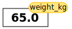
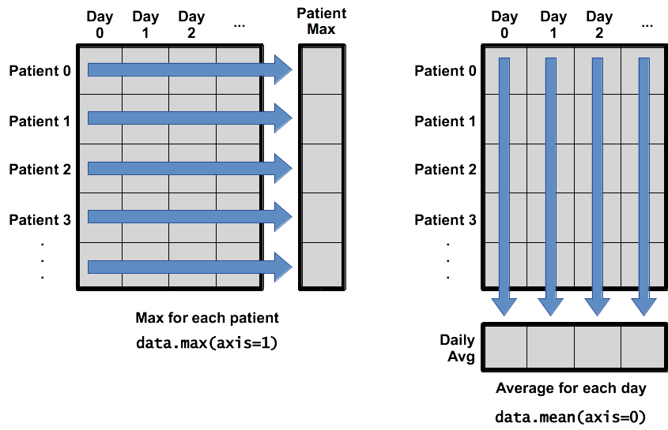

# An Introduction to Python

In this lesson we will learn how to work with arthritis inflammation datasets in Python. However,
before we discuss how to deal with many data points, let's learn how to work with
single data values.

## Variables

Any Python interpreter can be used as a calculator:


{:.input_area}
```python
3 + 5 * 4
```


{:.output_data_text}
```
23
```


This is great but not very interesting. To do anything useful with data, we need
to assign its value to a _variable_. In Python, we can assign a value to a
variable, using the equals sign `=`. For example, to assign value `60` to a
variable `weight_kg`, we would execute:


{:.input_area}
```python
weight_kg = 60
```

From now on, whenever we use `weight_kg`, Python will substitute the value we assigned to
it. In essence, **a variable is just a name for a value**.
In Python, variable names:

 - can include letters, digits, and underscores
 - cannot start with a digit
 - are case sensitive.

This means that, for example:
 - `weight0` is a valid variable name, whereas `0weight` is not
 - `weight` and `Weight` are different variables


## Types of data

Python knows various types of data. Three common ones are:

* integer numbers
* floating point numbers, and
* strings.

In the example above, variable `weight_kg` has an integer value of `60`.
To create a variable with a floating point value, we can execute:


{:.input_area}
```python
weight_kg = 60.0
```

And to create a string we simply have to add single or double quotes around some text, for example:


{:.input_area}
```python
weight_kg_text = 'weight in kilograms:'
```

## Using Variables in Python
To display the value of a variable to the screen in Python, we can use the `print` function:


{:.input_area}
```python
print(weight_kg)
```

{:.output_stream}
```
60.0

```

We can display multiple things at once using only one `print` command:


{:.input_area}
```python
print(weight_kg_text, weight_kg)
```

{:.output_stream}
```
weight in kilograms: 60.0

```

Moreover, we can do arithmetics with variables right inside the `print` function:


{:.input_area}
```python
print('weight in pounds:', 2.2 * weight_kg)
```

{:.output_stream}
```
weight in pounds: 132.0

```

The above command, however, did not change the value of `weight_kg`:


{:.input_area}
```python
print(weight_kg)
```

{:.output_stream}
```
60.0

```

To change the value of the `weight_kg` variable, we have to
**assign** `weight_kg` a new value using the equals `=` sign:


{:.input_area}
```python
weight_kg = 65.0
print('weight in kilograms is now:', weight_kg)
```

{:.output_stream}
```
weight in kilograms is now: 65.0

```

## Variables as Sticky Notes
A variable is analogous to a sticky note with a name written on it:
assigning a value to a variable is like putting that sticky note on a particular value.


This means that assigning a value to one variable does **not** change the values of other variables.
For example, let's store the subject's weight in pounds in its own variable:


{:.input_area}
```python
# There are 2.2 pounds per kilogram
weight_lb = 2.2 * weight_kg
print(weight_kg_text, weight_kg, 'and in pounds:', weight_lb)
```

{:.output_stream}
```
weight in kilograms: 65.0 and in pounds: 143.0

```


Let's now change `weight_kg`:


{:.input_area}
```python
weight_kg = 100.0
print('weight in kilograms is now:', weight_kg, 'and weight in pounds is still:', weight_lb)
```

{:.output_stream}
```
weight in kilograms is now: 100.0 and weight in pounds is still: 143.0

```


Since `weight_lb` doesn't remember where its value came from,
it isn't automatically updated when `weight_kg` changes.

Words are useful, but what's more useful are the sentences and stories we build
with them. Similarly, while a lot of powerful, general tools are built into
languages like Python, specialized tools built up from these basic units live in
libraries that can be called upon when needed.

## Loading data into Python

In order to load our inflammation data, we need to access
(import in Python terminology) a library called
[NumPy](http://docs.scipy.org/doc/numpy/ "NumPy Documentation").  In general you should use this
library if you want to do fancy things with numbers, especially if you have matrices or arrays.  We
can import NumPy using:


{:.input_area}
```python
import numpy
```

Importing a library is like getting a piece of lab equipment out of a storage locker and setting it
up on the bench. Libraries provide additional functionality to the basic Python package, much like
a new piece of equipment adds functionality to a lab space. Just like in the lab, importing too
many libraries can sometimes complicate and slow down your programs - so we only import what we
need for each program. Once we've imported the library, we can ask the library to read our data
file for us:


{:.input_area}
```python
numpy.loadtxt(fname='inflammation-01.csv', delimiter=',')
```


{:.output_data_text}
```
array([[0., 0., 1., ..., 3., 0., 0.],
       [0., 1., 2., ..., 1., 0., 1.],
       [0., 1., 1., ..., 2., 1., 1.],
       ...,
       [0., 1., 1., ..., 1., 1., 1.],
       [0., 0., 0., ..., 0., 2., 0.],
       [0., 0., 1., ..., 1., 1., 0.]])
```


The expression `numpy.loadtxt(...)` is a function call that asks Python to run
the function `loadtxt` which belongs to the `numpy` library. This dotted
notation is used everywhere in Python: the thing that appears before the dot
contains the thing that appears after.

As an example, John Smith is the John that belongs to the Smith family. We could
use the dot notation to write his name `smith.john`, just as `loadtxt` is a
function that belongs to the `numpy` library.

`numpy.loadtxt` has two parameters: the name of the file we want to read and the
delimiter that separates values on a line. These both need to be character
strings (or strings for short), so we put them in quotes.

Since we haven't told it to do anything else with the function's output,
the notebook displays it.
In this case,
that output is the data we just loaded.
By default,
only a few rows and columns are shown
(with `...` to omit elements when displaying big arrays). To save space, Python
displays numbers as `1.` instead of `1.0`
when there's nothing interesting after the decimal point.

Our call to `numpy.loadtxt` read our file
but didn't save the data in memory.
To do that,
we need to assign the array to a variable. Just as we can assign a single value to a variable, we
can also assign an array of values to a variable using the same syntax.  Let's re-run
`numpy.loadtxt` and save the returned data:


{:.input_area}
```python
data = numpy.loadtxt(fname='inflammation-01.csv', delimiter=',')
```

If we want to check that the data have been loaded,
we can print the variable's value:


{:.input_area}
```python
print(data)
```

{:.output_stream}
```
[[0. 0. 1. ... 3. 0. 0.]
 [0. 1. 2. ... 1. 0. 1.]
 [0. 1. 1. ... 2. 1. 1.]
 ...
 [0. 1. 1. ... 1. 1. 1.]
 [0. 0. 0. ... 0. 2. 0.]
 [0. 0. 1. ... 1. 1. 0.]]

```

Now that the data are in memory,
we can manipulate them.
First,
let's ask what type of thing `data` refers to:


{:.input_area}
```python
print(type(data))
```

{:.output_stream}
```
<class 'numpy.ndarray'>

```

The output tells us that `data` currently refers to
an N-dimensional array, the functionality for which is provided by the NumPy library.
These data correspond to arthritis patients' inflammation.
The rows are the individual patients, and the columns
are their daily inflammation measurements.


<section class="callout panel panel-warning">
<div class="panel-heading">
<h2><span class="fa fa-thumb-tack"></span> Data Type</h2>
</div>


<div class="panel-body">

<p>A Numpy array contains one or more elements
of the same type. The <code>type</code> function will only tell you that
a variable is a NumPy array but won't tell you the type of
thing inside the array.
We can find out the type
of the data contained in the NumPy array.</p>
<div class="codehilite"><pre><span></span><span class="k">print</span><span class="p">(</span><span class="n">data</span><span class="o">.</span><span class="n">dtype</span><span class="p">)</span>
</pre></div>


<div class="codehilite"><pre><span></span>dtype(&#39;float64&#39;)
</pre></div>


<p>This tells us that the NumPy array's elements are
floating-point numbers.</p>

</div>

</section>


With the following command, we can see the array's shape:


{:.input_area}
```python
print(data.shape)
```

{:.output_stream}
```
(60, 40)

```

The output tells us that the `data` array variable contains 60 rows and 40 columns. When we
created the variable `data` to store our arthritis data, we didn't just create the array; we also
created information about the array, called members or
attributes. This extra information describes `data` in the same way an adjective describes a noun.
`data.shape` is an attribute of `data` which describes the dimensions of `data`. We use the same
dotted notation for the attributes of variables that we use for the functions in libraries because
they have the same part-and-whole relationship.

If we want to get a single number from the array, we must provide an
index in square brackets after the variable name, just as we
do in math when referring to an element of a matrix.  Our inflammation data has two dimensions, so
we will need to use two indices to refer to one specific value:


{:.input_area}
```python
print('first value in data:', data[0, 0])
```

{:.output_stream}
```
first value in data: 0.0

```


{:.input_area}
```python
print('middle value in data:', data[30, 20])
```

{:.output_stream}
```
middle value in data: 13.0

```


{:.input_area}
```python
print(data[0:4, 0:10])
```

{:.output_stream}
```
[[0. 0. 1. 3. 1. 2. 4. 7. 8. 3.]
 [0. 1. 2. 1. 2. 1. 3. 2. 2. 6.]
 [0. 1. 1. 3. 3. 2. 6. 2. 5. 9.]
 [0. 0. 2. 0. 4. 2. 2. 1. 6. 7.]]

```

The expression `data[30, 20]` accesses the element at row 30, column 20. While this expression may
not surprise you,
 `data[0, 0]` might.
Programming languages like Fortran, MATLAB and R start counting at 1
because that's what human beings have done for thousands of years.
Languages in the C family (including C++, Java, Perl, and Python) count from 0
because it represents an offset from the first value in the array (the second
value is offset by one index from the first value). This is closer to the way
that computers represent arrays (if you are interested in the historical
reasons behind counting indices from zero, you can read
[Mike Hoye's blog post](http://exple.tive.org/blarg/2013/10/22/citation-needed/)).
As a result,
if we have an M×N array in Python,
its indices go from 0 to M-1 on the first axis
and 0 to N-1 on the second.
It takes a bit of getting used to,
but one way to remember the rule is that
the index is how many steps we have to take from the start to get the item we want.


## In the Corner

What may also surprise you is that when Python displays an array,
it shows the element with index `[0, 0]` in the upper left corner
rather than the lower left.
This is consistent with the way mathematicians draw matrices
but different from the Cartesian coordinates.
The indices are (row, column) instead of (column, row) for the same reason,
which can be confusing when plotting data.


## Slicing data

An index like `[30, 20]` selects a single element of an array,
but we can select whole sections as well.
For example,
we can select the first ten days (columns) of values
for the first four patients (rows) like this:

The slice `0:4` means, "Start at index 0 and go up to, but not
including, index 4."Again, the up-to-but-not-including takes a bit of getting used to, but the
rule is that the difference between the upper and lower bounds is the number of values in the slice.

We don't have to start slices at 0:


{:.input_area}
```python
print(data[5:10, 0:10])
```

{:.output_stream}
```
[[0. 0. 1. 2. 2. 4. 2. 1. 6. 4.]
 [0. 0. 2. 2. 4. 2. 2. 5. 5. 8.]
 [0. 0. 1. 2. 3. 1. 2. 3. 5. 3.]
 [0. 0. 0. 3. 1. 5. 6. 5. 5. 8.]
 [0. 1. 1. 2. 1. 3. 5. 3. 5. 8.]]

```

We also don't have to include the upper and lower bound on the slice.  If we don't include the lower
bound, Python uses 0 by default; if we don't include the upper, the slice runs to the end of the
axis, and if we don't include either (i.e., if we just use ':' on its own), the slice includes
everything:


{:.input_area}
```python
small = data[:3, 36:]
print('small is:')
print(small)
```

{:.output_stream}
```
small is:
[[2. 3. 0. 0.]
 [1. 1. 0. 1.]
 [2. 2. 1. 1.]]

```

The above example selects rows 0 through 2 and columns 36 through to the end of the array.

Arrays also know how to perform common mathematical operations on their values.  The simplest
operations with data are arithmetic: addition, subtraction, multiplication, and division.  When you
do such operations on arrays, the operation is done element-by-element.  Thus:


{:.input_area}
```python
doubledata = data * 2.0
```

will create a new array `doubledata`
each element of which is twice the value of the corresponding element in `data`:


{:.input_area}
```python
print('original:')
print(data[:3, 36:])
print('doubledata:')
print(doubledata[:3, 36:])
```

{:.output_stream}
```
original:
[[2. 3. 0. 0.]
 [1. 1. 0. 1.]
 [2. 2. 1. 1.]]
doubledata:
[[4. 6. 0. 0.]
 [2. 2. 0. 2.]
 [4. 4. 2. 2.]]

```

If, instead of taking an array and doing arithmetic with a single value (as above), you did the
arithmetic operation with another array of the same shape, the operation will be done on
corresponding elements of the two arrays.  Thus:


{:.input_area}
```python
tripledata = doubledata + data
```

will give you an array where `tripledata[0,0]` will equal `doubledata[0,0]` plus `data[0,0]`,
and so on for all other elements of the arrays.


{:.input_area}
```python
print('tripledata:')
print(tripledata[:3, 36:])
```

{:.output_stream}
```
tripledata:
[[6. 9. 0. 0.]
 [3. 3. 0. 3.]
 [6. 6. 3. 3.]]

```

Often, we want to do more than add, subtract, multiply, and divide array elements.  NumPy knows how
to do more complex operations, too.  If we want to find the average inflammation for all patients on
all days, for example, we can ask NumPy to compute `data`'s mean value:


{:.input_area}
```python
print(numpy.mean(data))
```

{:.output_stream}
```
6.14875

```

`mean` is a function that takes an array as an argument.


<section class="callout panel panel-warning">
<div class="panel-heading">
<h2><span class="fa fa-thumb-tack"></span> Not All Functions Have Input</h2>
</div>


<div class="panel-body">

<p>Generally, a function uses inputs to produce outputs.
However, some functions produce outputs without
needing any input. For example, checking the current time
doesn't require any input.</p>
<div class="codehilite"><pre><span></span><span class="kn">import</span> <span class="nn">time</span>
<span class="k">print</span><span class="p">(</span><span class="n">time</span><span class="o">.</span><span class="n">ctime</span><span class="p">())</span>
</pre></div>


<div class="codehilite"><pre><span></span>&#39;Sat Mar 26 13:07:33 2016&#39;
</pre></div>


<p>For functions that don't take in any arguments,
we still need parentheses (<code>()</code>)
to tell Python to go and do something for us.</p>

</div>

</section>


NumPy has lots of useful functions that take an array as input.
Let's use three of those functions to get some descriptive values about the dataset.
We'll also use multiple assignment,
a convenient Python feature that will enable us to do this all in one line.


{:.input_area}
```python
maxval, minval, stdval = numpy.max(data), numpy.min(data), numpy.std(data)

print('maximum inflammation:', maxval)
print('minimum inflammation:', minval)
print('standard deviation:', stdval)
```

{:.output_stream}
```
maximum inflammation: 20.0
minimum inflammation: 0.0
standard deviation: 4.613833197118566

```

Here we've assigned the return value from `numpy.max(data)` to the variable `maxval`, the value
from `numpy.min(data)` to `minval`, and so on.


<section class="callout panel panel-warning">
<div class="panel-heading">
<h2><span class="fa fa-thumb-tack"></span> Mystery Functions in IPython</h2>
</div>


<div class="panel-body">

<p>How did we know what functions NumPy has and how to use them?
If you are working in the IPython/Jupyter Notebook, there is an easy way to find out.
If you type the name of something followed by a dot, then you can use tab completion
(e.g. type <code>numpy.</code> and then press tab)
to see a list of all functions and attributes that you can use. After selecting one, you
can also add a question mark (e.g. <code>numpy.cumprod?</code>), and IPython will return an
explanation of the method! This is the same as doing <code>help(numpy.cumprod)</code>.</p>

</div>

</section>


When analyzing data, though,
we often want to look at variations in statistical values,
such as the maximum inflammation per patient
or the average inflammation per day.
One way to do this is to create a new temporary array of the data we want,
then ask it to do the calculation:


{:.input_area}
```python
patient_0 = data[0, :] # 0 on the first axis (rows), everything on the second (columns)
print('maximum inflammation for patient 0:', patient_0.max())
```

{:.output_stream}
```
maximum inflammation for patient 0: 18.0

```

Everything in a line of code following the '#' symbol is a
comment that is ignored by Python.
Comments allow programmers to leave explanatory notes for other
programmers or their future selves.

We don't actually need to store the row in a variable of its own.
Instead, we can combine the selection and the function call:


{:.input_area}
```python
print('maximum inflammation for patient 2:', numpy.max(data[2, :]))
```

{:.output_stream}
```
maximum inflammation for patient 2: 19.0

```

What if we need the maximum inflammation for each patient over all days (as in the
next diagram on the left) or the average for each day (as in the
diagram on the right)? As the diagram below shows, we want to perform the
operation across an axis:



To support this functionality,
most array functions allow us to specify the axis we want to work on.
If we ask for the average across axis 0 (rows in our 2D example),
we get:


{:.input_area}
```python
print(numpy.mean(data, axis=0))
```

{:.output_stream}
```
[ 0.          0.45        1.11666667  1.75        2.43333333  3.15
  3.8         3.88333333  5.23333333  5.51666667  5.95        5.9
  8.35        7.73333333  8.36666667  9.5         9.58333333 10.63333333
 11.56666667 12.35       13.25       11.96666667 11.03333333 10.16666667
 10.          8.66666667  9.15        7.25        7.33333333  6.58333333
  6.06666667  5.95        5.11666667  3.6         3.3         3.56666667
  2.48333333  1.5         1.13333333  0.56666667]

```

As a quick check,
we can ask this array what its shape is:


{:.input_area}
```python
print(numpy.mean(data, axis=0).shape)
```

{:.output_stream}
```
(40,)

```

The expression `(40,)` tells us we have an N×1 vector,
so this is the average inflammation per day for all patients.
If we average across axis 1 (columns in our 2D example), we get:


{:.input_area}
```python
print(numpy.mean(data, axis=1))
```

{:.output_stream}
```
[5.45  5.425 6.1   5.9   5.55  6.225 5.975 6.65  6.625 6.525 6.775 5.8
 6.225 5.75  5.225 6.3   6.55  5.7   5.85  6.55  5.775 5.825 6.175 6.1
 5.8   6.425 6.05  6.025 6.175 6.55  6.175 6.35  6.725 6.125 7.075 5.725
 5.925 6.15  6.075 5.75  5.975 5.725 6.3   5.9   6.75  5.925 7.225 6.15
 5.95  6.275 5.7   6.1   6.825 5.975 6.725 5.7   6.25  6.4   7.05  5.9  ]

```

which is the average inflammation per patient across all days.

## Visualizing data
The mathematician Richard Hamming once said, "The purpose of computing is insight, not numbers," and
the best way to develop insight is often to visualize data.  Visualization deserves an entire
lecture of its own, but we can explore a few features of Python's `matplotlib` library here.  While
there is no official plotting library, `matplotlib` is the _de facto_ standard.  First, we will
import the `pyplot` module from `matplotlib` and use two of its functions to create and display a
heat map of our data:


{:.input_area}
```python
%matplotlib inline
```


{:.input_area}
```python
import matplotlib.pyplot
image = matplotlib.pyplot.imshow(data)
matplotlib.pyplot.show()
```


Blue pixels in this heat map represent low values, while yellow pixels represent high values.  As we
can see, inflammation rises and falls over a 40-day period.


{:.input_area}
```python
ave_inflammation = numpy.mean(data, axis=0)
ave_plot = matplotlib.pyplot.plot(ave_inflammation)
matplotlib.pyplot.show()
```


Here, we have put the average per day across all patients in the variable `ave_inflammation`, then
asked `matplotlib.pyplot` to create and display a line graph of those values.  The result is a
roughly linear rise and fall, which is suspicious: we might instead expect a sharper rise and slower
fall.  Let's have a look at two other statistics:


{:.input_area}
```python
max_plot = matplotlib.pyplot.plot(numpy.max(data, axis=0))
matplotlib.pyplot.show()
```


{:.input_area}
```python
min_plot = matplotlib.pyplot.plot(numpy.min(data, axis=0))
matplotlib.pyplot.show()
```


The maximum value rises and falls smoothly, while the minimum seems to be a step function.  Neither
trend seems particularly likely, so either there's a mistake in our calculations or something is
wrong with our data.  This insight would have been difficult to reach by examining the numbers
themselves without visualization tools.


<section class="callout panel panel-warning">
<div class="panel-heading">
<h2><span class="fa fa-thumb-tack"></span> Scientists Dislike Typing</h2>
</div>


<div class="panel-body">

<p>We have just been importing NumPy and matplotlib using <code>import numpy</code> and <code>import matplotlib.pyplot</code>.</p>
<p>From here on we are going to shorten these imports, you can either adopt this or continue using the long version. The reason we are going to start using the shortened versions is that that is the way that the majority of open source scientific python libraries use these imports, so we want to get you used to them now.</p>
<p>When working with other people, it is important to agree on a convention of how common libraries
are imported.</p>

</div>

</section>


{:.input_area}
```python
import numpy as np
import matplotlib.pyplot as plt
```

### Grouping plots
You can group similar plots in a single figure using subplots.
This script below uses a number of new commands. The function `plt.figure()`
creates a space into which we will place all of our plots. The parameter `figsize`
tells Python how big to make this space. Each subplot is placed into the figure using
its `add_subplot` method. The `add_subplot` method takes 3
parameters. The first denotes how many total rows of subplots there are, the second parameter
refers to the total number of subplot columns, and the final parameter denotes which subplot
your variable is referencing (left-to-right, top-to-bottom). Each subplot is stored in a
different variable (`axes1`, `axes2`, `axes3`). Once a subplot is created, the axes can
be titled using the `set_xlabel()` command (or `set_ylabel()`).
Here are our three plots side by side:


{:.input_area}
```python
data = np.loadtxt(fname='inflammation-01.csv', delimiter=',')

fig = plt.figure(figsize=(10.0, 3.0))

axes1 = fig.add_subplot(1, 3, 1)
axes2 = fig.add_subplot(1, 3, 2)
axes3 = fig.add_subplot(1, 3, 3)

axes1.set_ylabel('average')
axes1.plot(numpy.mean(data, axis=0))

axes2.set_ylabel('max')
axes2.plot(numpy.max(data, axis=0))

axes3.set_ylabel('min')
axes3.plot(numpy.min(data, axis=0))

fig.tight_layout()

plt.show()
```


The call to `loadtxt` reads our data,
and the rest of the program tells the plotting library
how large we want the figure to be,
that we're creating three subplots,
what to draw for each one,
and that we want a tight layout.
(If we leave out that call to `fig.tight_layout()`,
the graphs will actually be squeezed together more closely.)


<section class="challenge panel panel-success">
<div class="panel-heading">
<h2><span class="fa fa-pencil"></span> Challenge: Check Your Understanding</h2>
</div>


<div class="panel-body">

<p>What values do the variables <code>mass</code> and <code>age</code> have after each statement in the following program?
Test your answers by executing the commands.</p>
<div class="codehilite"><pre><span></span><span class="n">mass</span> <span class="o">=</span> <span class="mf">47.5</span>
<span class="n">age</span> <span class="o">=</span> <span class="mi">122</span>
<span class="n">mass</span> <span class="o">=</span> <span class="n">mass</span> <span class="o">*</span> <span class="mf">2.0</span>
<span class="n">age</span> <span class="o">=</span> <span class="n">age</span> <span class="o">-</span> <span class="mi">20</span>
</pre></div>

</div>

</section>


<section class="challenge panel panel-success">
<div class="panel-heading">
<h2><span class="fa fa-pencil"></span> Challenge: Sorting Out References</h2>
</div>


<div class="panel-body">

<p>What does the following program print out?</p>
<div class="codehilite"><pre><span></span>first, second = &#39;Grace&#39;, &#39;Hopper&#39;
third, fourth = second, first
print(third, fourth)
</pre></div>

</div>

</section>


<section class="solution panel panel-primary">
<div class="panel-heading">
<h2><span class="fa fa-eye"></span> Solution</h2>
</div>


<div class="panel-body">

<div class="codehilite"><pre><span></span>Hopper Grace
</pre></div>

</div>

</section>


<section class="challenge panel panel-success">
<div class="panel-heading">
<h2><span class="fa fa-pencil"></span> Challenge: Slicing Strings</h2>
</div>


<div class="panel-body">

<p>A section of an array is called a slice.
We can take slices of character strings as well:</p>
<div class="codehilite"><pre><span></span><span class="n">element</span> <span class="o">=</span> <span class="s1">&#39;oxygen&#39;</span>
<span class="k">print</span><span class="p">(</span><span class="s1">&#39;first three characters:&#39;</span><span class="p">,</span> <span class="n">element</span><span class="p">[</span><span class="mi">0</span><span class="p">:</span><span class="mi">3</span><span class="p">])</span>
<span class="k">print</span><span class="p">(</span><span class="s1">&#39;last three characters:&#39;</span><span class="p">,</span> <span class="n">element</span><span class="p">[</span><span class="mi">3</span><span class="p">:</span><span class="mi">6</span><span class="p">])</span>
</pre></div>


<div class="codehilite"><pre><span></span>first three characters: oxy
last three characters: gen
</pre></div>


<p>What is the value of <code>element[:4]</code>?
What about <code>element[4:]</code>?
Or <code>element[:]</code>?</p>

</div>

</section>


<section class="solution panel panel-primary">
<div class="panel-heading">
<h2><span class="fa fa-eye"></span> Solution</h2>
</div>


<div class="panel-body">

<div class="codehilite"><pre><span></span>oxyg
en
oxygen
</pre></div>

</div>

</section>


<section class="challenge panel panel-success">
<div class="panel-heading">
<h2><span class="fa fa-pencil"></span> Challenge:</h2>
</div>


<div class="panel-body">

<p>What is <code>element[-1]</code>?
What is <code>element[-2]</code>?</p>

</div>

</section>


<section class="solution panel panel-primary">
<div class="panel-heading">
<h2><span class="fa fa-eye"></span> Solution</h2>
</div>


<div class="panel-body">

<div class="codehilite"><pre><span></span>n
e
</pre></div>

</div>

</section>


<section class="challenge panel panel-success">
<div class="panel-heading">
<h2><span class="fa fa-pencil"></span> Challenge:</h2>
</div>


<div class="panel-body">

<p>Given those answers, explain what <code>element[1:-1]</code> does.</p>

</div>

</section>


<section class="solution panel panel-primary">
<div class="panel-heading">
<h2><span class="fa fa-eye"></span> Solution</h2>
</div>


<div class="panel-body">

<p>Creates a substring from index 1 up to (not including) the final index,
effectively removing the first and last letters from 'oxygen'</p>

</div>

</section>


<section class="challenge panel panel-success">
<div class="panel-heading">
<h2><span class="fa fa-pencil"></span> Challenge:  Thin Slices</h2>
</div>


<div class="panel-body">

<p>The expression <code>element[3:3]</code> produces an empty string,
i.e., a string that contains no characters.
If <code>data</code> holds our array of patient data,
what does <code>data[3:3, 4:4]</code> produce?
What about <code>data[3:3, :]</code>?</p>

</div>

</section>


<section class="solution panel panel-primary">
<div class="panel-heading">
<h2><span class="fa fa-eye"></span> Solution</h2>
</div>


<div class="panel-body">

<div class="codehilite"><pre><span></span>[]
[]
</pre></div>

</div>

</section>


<section class="challenge panel panel-success">
<div class="panel-heading">
<h2><span class="fa fa-pencil"></span> Challenge: Plot Scaling</h2>
</div>


<div class="panel-body">

<p>Why do all of our plots stop just short of the upper end of our graph?</p>

</div>

</section>


<section class="solution panel panel-primary">
<div class="panel-heading">
<h2><span class="fa fa-eye"></span> Solution</h2>
</div>


<div class="panel-body">

<p>Because matplotlib normally sets x and y axes limits to the min and max of our data
(depending on data range)</p>
<p>If we want to change this, we can use the <code>set_ylim(min, max)</code> method of each 'axes',
for example:</p>
<div class="codehilite"><pre><span></span><span class="n">axes3</span><span class="o">.</span><span class="n">set_ylim</span><span class="p">(</span><span class="mi">0</span><span class="p">,</span><span class="mi">6</span><span class="p">)</span>
</pre></div>

</div>

</section>


<section class="challenge panel panel-success">
<div class="panel-heading">
<h2><span class="fa fa-pencil"></span> Challenge:</h2>
</div>


<div class="panel-body">

<p>Update your plotting code to automatically set a more appropriate scale.
(Hint: you can make use of the <code>max</code> and <code>min</code> methods to help.)</p>

</div>

</section>


<section class="solution panel panel-primary">
<div class="panel-heading">
<h2><span class="fa fa-eye"></span> Solution</h2>
</div>


<div class="panel-body">

<div class="codehilite"><pre><span></span><span class="c1"># One method</span>
<span class="n">axes3</span><span class="o">.</span><span class="n">set_ylabel</span><span class="p">(</span><span class="s1">&#39;min&#39;</span><span class="p">)</span>
<span class="n">axes3</span><span class="o">.</span><span class="n">plot</span><span class="p">(</span><span class="n">numpy</span><span class="o">.</span><span class="n">min</span><span class="p">(</span><span class="n">data</span><span class="p">,</span> <span class="n">axis</span><span class="o">=</span><span class="mi">0</span><span class="p">))</span>
<span class="n">axes3</span><span class="o">.</span><span class="n">set_ylim</span><span class="p">(</span><span class="mi">0</span><span class="p">,</span><span class="mi">6</span><span class="p">)</span>
</pre></div>


<div class="codehilite"><pre><span></span><span class="c1"># A more automated approach</span>
<span class="n">min_data</span> <span class="o">=</span> <span class="n">numpy</span><span class="o">.</span><span class="n">min</span><span class="p">(</span><span class="n">data</span><span class="p">,</span> <span class="n">axis</span><span class="o">=</span><span class="mi">0</span><span class="p">)</span>
<span class="n">axes3</span><span class="o">.</span><span class="n">set_ylabel</span><span class="p">(</span><span class="s1">&#39;min&#39;</span><span class="p">)</span>
<span class="n">axes3</span><span class="o">.</span><span class="n">plot</span><span class="p">(</span><span class="n">min_data</span><span class="p">)</span>
<span class="n">axes3</span><span class="o">.</span><span class="n">set_ylim</span><span class="p">(</span><span class="n">numpy</span><span class="o">.</span><span class="n">min</span><span class="p">(</span><span class="n">min_data</span><span class="p">),</span> <span class="n">numpy</span><span class="o">.</span><span class="n">max</span><span class="p">(</span><span class="n">min_data</span><span class="p">)</span> <span class="o">*</span> <span class="mf">1.1</span><span class="p">)</span>
</pre></div>

</div>

</section>


<section class="challenge panel panel-success">
<div class="panel-heading">
<h2><span class="fa fa-pencil"></span> Challenge: Drawing Straight Lines</h2>
</div>


<div class="panel-body">

<p>In the center and right subplots above, we expect all lines to look like step functions because
non-integer value are not realistic for the minimum and maximum values. However, you can see
that the lines are not always vertical or horizontal, and in particular the step function
in the subplot on the right looks slanted. Why is this?</p>

</div>

</section>


<section class="solution panel panel-primary">
<div class="panel-heading">
<h2><span class="fa fa-eye"></span> Solution</h2>
</div>


<div class="panel-body">

<p>Because matplotlib interpolates (draws a straight line) between the points.
One way to do avoid this is to use the Matplotlib <code>drawstyle</code> option:</p>

</div>

</section>


{:.input_area}
```python
import numpy as np
import matplotlib.pyplot as plt

data = numpy.loadtxt(fname='inflammation-01.csv', delimiter=',')

fig = plt.figure(figsize=(10.0, 3.0))

axes1 = fig.add_subplot(1, 3, 1)
axes2 = fig.add_subplot(1, 3, 2)
axes3 = fig.add_subplot(1, 3, 3)

axes1.set_ylabel('average')
axes1.plot(numpy.mean(data, axis=0), drawstyle='steps-mid')

axes2.set_ylabel('max')
axes2.plot(numpy.max(data, axis=0), drawstyle='steps-mid')

axes3.set_ylabel('min')
axes3.plot(numpy.min(data, axis=0), drawstyle='steps-mid')

fig.tight_layout()

plt.show()
```


<section class="challenge panel panel-success">
<div class="panel-heading">
<h2><span class="fa fa-pencil"></span> Challenge: Make Your Own Plot</h2>
</div>


<div class="panel-body">

<p>Create a plot showing the standard deviation (<code>numpy.std</code>)
of the inflammation data for each day across all patients.</p>

</div>

</section>


<section class="solution panel panel-primary">
<div class="panel-heading">
<h2><span class="fa fa-eye"></span> Solution</h2>
</div>

</section>


{:.input_area}
```python
std_plot = plt.plot(numpy.std(data, axis=0))
plt.show()
```


<section class="challenge panel panel-success">
<div class="panel-heading">
<h2><span class="fa fa-pencil"></span> Challenge: Moving Plots Around</h2>
</div>


<div class="panel-body">

<p>Modify the program to display the three plots on top of one another
instead of side by side.</p>

</div>

</section>


<section class="solution panel panel-primary">
<div class="panel-heading">
<h2><span class="fa fa-eye"></span> Solution</h2>
</div>

</section>


{:.input_area}
```python
import numpy as np
import matplotlib.pyplot as plt

data = numpy.loadtxt(fname='inflammation-01.csv', delimiter=',')

# change figsize (swap width and height)
fig = plt.figure(figsize=(3.0, 10.0))

# change add_subplot (swap first two parameters)
axes1 = fig.add_subplot(3, 1, 1)
axes2 = fig.add_subplot(3, 1, 2)
axes3 = fig.add_subplot(3, 1, 3)

axes1.set_ylabel('average')
axes1.plot(numpy.mean(data, axis=0))

axes2.set_ylabel('max')
axes2.plot(numpy.max(data, axis=0))

axes3.set_ylabel('min')
axes3.plot(numpy.min(data, axis=0))

fig.tight_layout()

plt.show()
```


## Stacking Arrays

Arrays can be concatenated and stacked on top of one another,
using NumPy's `vstack` and `hstack` functions for vertical and horizontal stacking, respectively.


{:.input_area}
```python
import numpy as np
A = numpy.array([[1,2,3], [4,5,6], [7, 8, 9]])
print('A = ')
print(A)

B = numpy.hstack([A, A])
print('B = ')
print(B)

C = numpy.vstack([A, A])
print('C = ')
print(C)

```

{:.output_stream}
```
A = 
[[1 2 3]
 [4 5 6]
 [7 8 9]]
B = 
[[1 2 3 1 2 3]
 [4 5 6 4 5 6]
 [7 8 9 7 8 9]]
C = 
[[1 2 3]
 [4 5 6]
 [7 8 9]
 [1 2 3]
 [4 5 6]
 [7 8 9]]

```


<section class="challenge panel panel-success">
<div class="panel-heading">
<h2><span class="fa fa-pencil"></span> Challenge:</h2>
</div>


<div class="panel-body">

<p>Write some additional code that slices the first and last columns of <code>A</code>,
and stacks them into a 3x2 array.
Make sure to <code>print</code> the results to verify your solution.</p>

</div>

</section>


<section class="solution panel panel-primary">
<div class="panel-heading">
<h2><span class="fa fa-eye"></span> Solution</h2>
</div>


<div class="panel-body">

<p>A 'gotcha' with array indexing is that singleton dimensions
are dropped by default. That means <code>A[:, 0]</code> is a one dimensional
array, which won't stack as desired. To preserve singleton dimensions,
the index itself can be a slice or array. For example, <code>A[:, :1]</code> returns
a two dimensional array with one singleton dimension (i.e. a column
vector).</p>

</div>

</section>


{:.input_area}
```python
D = np.hstack((A[:, :1], A[:, -1:]))
print('D = ')
print(D)
```

{:.output_stream}
```
D = 
[[1 3]
 [4 6]
 [7 9]]

```


<section class="solution panel panel-primary">
<div class="panel-heading">
<h2><span class="fa fa-eye"></span> Solution</h2>
</div>


<div class="panel-body">

<p>An alternative way to achieve the same result is to use Numpy's
delete function to remove the second column of A.</p>

</div>

</section>


{:.input_area}
```python
D = np.delete(A, 1, 1)
print('D = ')
print(D)
```

{:.output_stream}
```
D = 
[[1 3]
 [4 6]
 [7 9]]

```

## Change In Inflammation

This patient data is _longitudinal_ in the sense that each row represents a
series of observations relating to one individual.  This means that
the change in inflammation over time is a meaningful concept.

The `numpy.diff()` function takes a NumPy array and returns the
differences between two successive values along a specified axis.  For
example, a NumPy array that looks like this:


```python
npdiff = numpy.array([ 0,  2,  5,  9, 14])
```

Calling `numpy.diff(npdiff)` would do the following calculations and
put the answers in another array.

```python
[ 2 - 0, 5 - 2, 9 - 5, 14 - 9 ]
```

```python
numpy.diff(npdiff)
```

```python
array([2, 3, 4, 5])
```


<section class="challenge panel panel-success">
<div class="panel-heading">
<h2><span class="fa fa-pencil"></span> Challenge:</h2>
</div>


<div class="panel-body">

<p>Which axis would it make sense to use this function along?</p>

</div>

</section>


<section class="solution panel panel-primary">
<div class="panel-heading">
<h2><span class="fa fa-eye"></span> Solution</h2>
</div>


<div class="panel-body">

<p>Since the row axis (0) is patients, it does not make sense to get the
difference between two arbitrary patients. The column axis (1) is in
days, so the difference is the change in inflammation -- a meaningful
concept.</p>

</div>

</section>


{:.input_area}
```python
numpy.diff(data, axis=1)
```


{:.output_data_text}
```
array([[ 0.,  1.,  2., ...,  1., -3.,  0.],
       [ 1.,  1., -1., ...,  0., -1.,  1.],
       [ 1.,  0.,  2., ...,  0., -1.,  0.],
       ...,
       [ 1.,  0.,  0., ..., -1.,  0.,  0.],
       [ 0.,  0.,  1., ..., -2.,  2., -2.],
       [ 0.,  1., -1., ..., -2.,  0., -1.]])
```


<section class="challenge panel panel-success">
<div class="panel-heading">
<h2><span class="fa fa-pencil"></span> Challenge:</h2>
</div>


<div class="panel-body">

<p>If the shape of an individual data file is <code>(60, 40)</code> (60 rows and 40
columns), what would the shape of the array be after you run the <code>diff()</code>
function and why?</p>

</div>

</section>


<section class="solution panel panel-primary">
<div class="panel-heading">
<h2><span class="fa fa-eye"></span> Solution</h2>
</div>


<div class="panel-body">

<p>The shape will be <code>(60, 39)</code> because there is one fewer difference between
columns than there are columns in the data.</p>

</div>

</section>


<section class="challenge panel panel-success">
<div class="panel-heading">
<h2><span class="fa fa-pencil"></span> Challenge:</h2>
</div>


<div class="panel-body">

<p>How would you find the largest change in inflammation for each patient? Does
it matter if the change in inflammation is an increase or a decrease?</p>

</div>

</section>


<section class="solution panel panel-primary">
<div class="panel-heading">
<h2><span class="fa fa-eye"></span> Solution</h2>
</div>


<div class="panel-body">

<p>By using the <code>numpy.max()</code> function after you apply the <code>numpy.diff()</code>
function, you will get the largest difference between days.</p>

</div>

</section>


{:.input_area}
```python
numpy.max(numpy.diff(data, axis=1), axis=1)
```


{:.output_data_text}
```
array([ 7., 12., 11., 10., 11., 13., 10.,  8., 10., 10.,  7.,  7., 13.,
        7., 10., 10.,  8., 10.,  9., 10., 13.,  7., 12.,  9., 12., 11.,
       10., 10.,  7., 10., 11., 10.,  8., 11., 12., 10.,  9., 10., 13.,
       10.,  7.,  7., 10., 13., 12.,  8.,  8., 10., 10.,  9.,  8., 13.,
       10.,  7., 10.,  8., 12., 10.,  7., 12.])
```


<section class="challenge panel panel-success">
<div class="panel-heading">
<h2><span class="fa fa-pencil"></span> Challenge:</h2>
</div>


<div class="panel-body">

<p>If inflammation values <em>decrease</em> along an axis, then the difference from
one element to the next will be negative. If
you are interested in the <strong>magnitude</strong> of the change and not the
direction, the <code>numpy.absolute()</code> function will provide that.
Notice the difference if you get the largest <em>absolute</em> difference
between readings.</p>

</div>

</section>


{:.input_area}
```python
numpy.max(numpy.absolute(numpy.diff(data, axis=1)), axis=1)
```


{:.output_data_text}
```
array([12., 14., 11., 13., 11., 13., 10., 12., 10., 10., 10., 12., 13.,
       10., 11., 10., 12., 13.,  9., 10., 13.,  9., 12.,  9., 12., 11.,
       10., 13.,  9., 13., 11., 11.,  8., 11., 12., 13.,  9., 10., 13.,
       11., 11., 13., 11., 13., 13., 10.,  9., 10., 10.,  9.,  9., 13.,
       10.,  9., 10., 11., 13., 10., 10., 12.])
```


---
The material in this notebook is derived from the Software Carpentry lessons
&copy; [Software Carpentry](http://software-carpentry.org/) under the terms
of the [CC-BY 4.0](https://creativecommons.org/licenses/by/4.0/) license.
