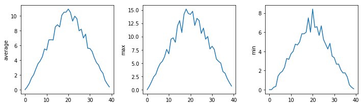

# Analyzing Data from Multiple Files

We now have almost everything we need to process all our data files.
The only thing that's missing is a library with a rather unpleasant name:


{:.input_area}
```python
import glob
```

The `glob` library contains a function, also called `glob`,
that finds files and directories whose names match a pattern.
We provide those patterns as strings:
the character `*` matches zero or more characters,
while `?` matches any one character.
We can use this to get the names of all the CSV files in the current directory:


{:.input_area}
```python
print(glob.glob('inflammation*.csv'))
```

{:.output_stream}
```
[]

```

As these examples show,
`glob.glob`'s result is a list of file and directory paths in arbitrary order.
This means we can loop over it
to do something with each filename in turn.
In our case,
the "something" we want to do is generate a set of plots for each file in our inflammation dataset.
If we want to start by analyzing just the first three files in alphabetical order, we can use the
`sorted` built-in function to generate a new sorted list from the `glob.glob` output:


{:.input_area}
```python
%matplotlib inline
import numpy as np
import matplotlib.pyplot as plt
```


{:.input_area}
```python
filenames = sorted(glob.glob('inflammation*.csv'))
filenames = filenames[0:3]
for f in filenames:
    print(f)

    data = np.loadtxt(fname=f, delimiter=',')

    fig = plt.figure(figsize=(10.0, 3.0))

    axes1 = fig.add_subplot(1, 3, 1)
    axes2 = fig.add_subplot(1, 3, 2)
    axes3 = fig.add_subplot(1, 3, 3)

    axes1.set_ylabel('average')
    axes1.plot(np.mean(data, axis=0))

    axes2.set_ylabel('max')
    axes2.plot(np.max(data, axis=0))

    axes3.set_ylabel('min')
    axes3.plot(np.min(data, axis=0))

    fig.tight_layout()
    plt.show()
```

Sure enough,
the maxima of the first two data sets show exactly the same ramp as the first,
and their minima show the same staircase structure;
a different situation has been revealed in the third dataset,
where the maxima are a bit less regular, but the minima are consistently zero.


<section class="challenge panel panel-success">
<div class="panel-heading">
<h2><span class="fa fa-pencil"></span> Challenge: Plotting Differences</h2>
</div>


<div class="panel-body">

<p>Plot the difference between the average of the first dataset
and the average of the second dataset,
i.e., the difference between the leftmost plot of the first two figures.</p>

</div>

</section>


<section class="solution panel panel-primary">
<div class="panel-heading">
<h2><span class="fa fa-eye"></span> Solution</h2>
</div>

</section>


{:.input_area}
```python
import glob
import numpy as np
import matplotlib.pyplot as plt

filenames = sorted(glob.glob('inflammation*.csv'))

data0 = np.loadtxt(fname=filenames[0], delimiter=',')
data1 = np.loadtxt(fname=filenames[1], delimiter=',')

fig = plt.figure(figsize=(10.0, 3.0))

plt.ylabel('Difference in average')
plt.plot(data0.mean(axis=0) - data1.mean(axis=0))

fig.tight_layout()
plt.show()
```


{:.output_traceback_line}
```
---------------------------------------------------------------------------
```

{:.output_traceback_line}
```
IndexError                                Traceback (most recent call last)
```

{:.output_traceback_line}
```
<ipython-input-5-c67da6b1e673> in <module>()
      5 filenames = sorted(glob.glob('inflammation*.csv'))
      6 
----> 7 data0 = np.loadtxt(fname=filenames[0], delimiter=',')
      8 data1 = np.loadtxt(fname=filenames[1], delimiter=',')
      9 

```

{:.output_traceback_line}
```
IndexError: list index out of range
```


<section class="challenge panel panel-success">
<div class="panel-heading">
<h2><span class="fa fa-pencil"></span> Challenge: Generate Composite Statistics</h2>
</div>


<div class="panel-body">

<p>Use each of the files once to generate a dataset containing values averaged over all patients:</p>

</div>

</section>


{:.input_area}
```python
filenames = glob.glob('inflammation*.csv')
composite_data = numpy.zeros((60,40))
for f in filenames:
    # sum each new file's data into composite_data as it's read
    #
# and then divide the composite_data by number of samples
composite_data /= len(filenames)
```


{:.output_traceback_line}
```
  File "<ipython-input-6-82a1887129c2>", line 7
    composite_data /= len(filenames)
                 ^
IndentationError: expected an indented block

```


Then use pyplot to generate average, max, and min for all patients.


<section class="solution panel panel-primary">
<div class="panel-heading">
<h2><span class="fa fa-eye"></span> Solution</h2>
</div>

</section>


{:.input_area}
```python
import glob
import numpy
import matplotlib.pyplot

filenames = glob.glob('inflammation*.csv')
composite_data = np.zeros((60,40))

for f in filenames:
    data = np.loadtxt(fname = f, delimiter=',')
    composite_data += data

composite_data/=len(filenames)

fig = plt.figure(figsize=(10.0, 3.0))

axes1 = fig.add_subplot(1, 3, 1)
axes2 = fig.add_subplot(1, 3, 2)
axes3 = fig.add_subplot(1, 3, 3)

axes1.set_ylabel('average')
axes1.plot(np.mean(composite_data, axis=0))

axes2.set_ylabel('max')
axes2.plot(np.max(composite_data, axis=0))

axes3.set_ylabel('min')
axes3.plot(np.min(composite_data, axis=0))

fig.tight_layout()

plt.show()
```





---
The material in this notebook is derived from the Software Carpentry lessons
&copy; [Software Carpentry](http://software-carpentry.org/) under the terms
of the [CC-BY 4.0](https://creativecommons.org/licenses/by/4.0/) license.
