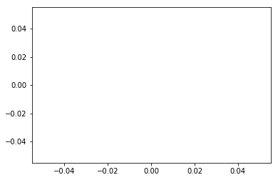

# Imports and namespaces

By now you should be getting fairly comfortable using Python's `import` statement, but in this lesson we'll demonstrate some more ways to use it. We'll also discuss a very important topic related to imports and modularity, the idea of **namespaces**.

## What's in a namespace?

Namespaces are a way of collecting defined variable names into groups. We've actually already seen a demonstration of this idea in one of the challenges from the functions lesson, summarised below.


{:.input_area}
```python
def f2k(f):
    """Convert a temperature in degrees fahrenheit to Kelvins"""
    k = ((f-32)*(5.0/9.0)) + 273.15
    return k

kelvins = f2k(0)
print(k)
```


{:.output_traceback_line}
```
---------------------------------------------------------------------------
```

{:.output_traceback_line}
```
NameError                                 Traceback (most recent call last)
```

{:.output_traceback_line}
```
<ipython-input-1-439bace7e0ce> in <module>()
      5 
      6 kelvins = f2k(0)
----> 7 print(k)

```

{:.output_traceback_line}
```
NameError: name 'k' is not defined
```


From this example we can see that although we have defined the variable `k` in our function, it isn't being recognised as a defined name outside of that function. This is because a function uses its own namespace - variables defined there are not automatically made available outside the function (which is why we need the `return` statement to get values out of functions).

We can see more clearly how this feature is useful by having a second variable called `k` defined outside of the function.


{:.input_area}
```python
# Define some constant
k = 10

def f2k(f):
    """Convert a temperature in degrees fahrenheit to Kelvins"""
    k = ((f-32)*(5.0/9.0)) + 273.15
    print('k = ', k, 'inside the function')
    return k

kelvins = f2k(0)
print('k = ', k, 'outside the function')
```

{:.output_stream}
```
k =  255.3722222222222 inside the function
k =  10 outside the function

```

We can see here that the values of `k` defined inside and outside the function are kept entirely separate, because each region of code uses its own namespace. Without this separation, the likely result of the example above would be that `k` would be overwritten, either when the function is defined or when it is run (possibly both), whereas by using distinct namespaces, both variables can coexist peacefully. Really what we should do in the example above is use more descriptive variable names, but even then it would still be possible for a large code base to use a variable name more than once in different places, so namespaces help reduce the chance of name conflicts.

## Modules as namespaces

One of the most common uses of namespaces is in the context of module imports. We've actually already seen some examples of this, which we will revisit now to demonstrate the principles of namespaces.

When we import a module, such as `numpy`, that module has its own namespace, and we accessed variables from that namespace earlier, like so:


{:.input_area}
```python
import numpy as np

print(np.pi)
```

{:.output_stream}
```
3.141592653589793

```

So in this example the variable `np` represents the NumPy namespace, in which the variable `pi` is defined, and we access this variable using the `<module_name>`.`<variable_name>` syntax we've seen before.

Note that we've seen two different versions of the method we've just described, both `import numpy as np`, as above, and simply `import numpy`. In both cases, the `numpy.np` or `np.pi` syntax works the same way. The only difference between these approaches is that the optional `as` keyword allows us to rename the variable through which we access the namespace, from the default `numpy` to `np` for convenience.

It is also possible to only import specific variables from a module. For this we use another variation on the `import` statement, the `from` keyword:


{:.input_area}
```python
from numpy import pi

print(pi)
```

{:.output_stream}
```
3.141592653589793

```

What's happened here is that instead of accessing the `pi` variable from within the `numpy` namespace every time we need it, we've take it from there and introduced it into our current namespace so that now, `pi` is defined in our code as its own independant variable rather than as something belonging to `numpy`. This can be useful if we know that we'll be using a few things from a module many times, but not using anything else from the same module, since it allows us to skip typing `np.` in front of that variable every time we use it. Note that this only works with the variable we specify. For instance, if we try to use another variable from NumPy, we'll find that it isn't defined:


{:.input_area}
```python
print(sin(pi))
```


{:.output_traceback_line}
```
---------------------------------------------------------------------------
```

{:.output_traceback_line}
```
NameError                                 Traceback (most recent call last)
```

{:.output_traceback_line}
```
<ipython-input-5-03e3a60e0cb5> in <module>()
----> 1 print(sin(pi))

```

{:.output_traceback_line}
```
NameError: name 'sin' is not defined
```


However, we can import more than one variable with the same command, like so:


{:.input_area}
```python
from numpy import pi, sin

print(sin(pi))
```

{:.output_stream}
```
1.2246467991473532e-16

```


<section class="callout panel panel-warning">
<div class="panel-heading">
<h2><span class="fa fa-thumb-tack"></span> Wildcard imports</h2>
</div>


<div class="panel-body">

<p>Since importing things from other namespaces as described above can save a lot of typing, you might wonder why we don't take this to its logical conclusion and import <em>everything</em> from a module, so that we never have to type the module name after we've imported it. In fact, there is a way to do this, using a <em>wildcard</em> import: <code>from &lt;some_module&gt; import *</code>, and you may see this from time to time in other people's code.</p>
<p><strong>Never do this</strong> - this is considered bad practice and is often a bad idea, because then you have <em>every</em> variable that module defines in your current namespace, which can be an extremely large number of variables for a large module like <code>numpy</code> or <code>matplotlib</code>. The whole purpose of namespaces is to avoid naming conflicts, but when you introduce a large number of variables like this you are removing that protection. Unless you have a phenomenal knowledge of the contents of the module you're importing, it is going to be effectively impossible to guarantee that you don't overwrite something important.</p>
<p>You may also see some resources using a module called <code>pylab</code>. This is a module which combines large amounts of NumPy and matplotlib into a single namespace. For exactly the reasons described above, use of <code>pylab</code> is heavily discouraged.</p>

</div>

</section>


## Nested namespaces

So we know that `<module_name>.<variable_name>` accesses a variable from a module's namespace, and we've seen how this works. But we've also seen imports like


{:.input_area}
```python
import matplotlib.pyplot as plt
```

and then things like


{:.input_area}
```python
plt.plot()
```


{:.output_data_text}
```
[]
```


later on. So here we're accessing a _submodule_, `pyplot`, which is defined in the matplotlib namespace, and importing it with the alias `plt` (incidentally, you can also do this with `from matplotlib import pyplot as plt`, but this is more typing). Then we're accessing names from within the `plt` namespace. So from this we can see that namespaces can be nested - accessing names defined inside matplotlib doesn't automatically give us access to names defined in `plt`, which are separate again, and which we can think of as being another level down.

One thing you can do with nested namespaces is to access something several levels deep by stringing together expressions. So for example, instead of `import matplotlib.pyplot as plt` and `plt.plot()`, the same can be achieved with


{:.input_area}
```python
import matplotlib

matplotlib.pyplot.plot()
```


{:.output_data_text}
```
[]
```





## Variables as namespaces

There is another way in which namespaces are used in Python, which we will not cover in great detail, but which you will see used a lot and which is therefore worth having some understanding of. This is the concept of _Object Oriented programming_ (OOP).

Python is an Object Oriented language. For the purposes of this discussion, what this means is that every variable, or _object_, has its own namespace of associated variables which are kept separate from those of other objects, just like we've seen with module namespaces (though most non-module objects will contain many fewer variables).

In fact this is yet another thing that we've seen used already. For example, when we create a NumPy array, like this


{:.input_area}
```python
import numpy as np

x = np.array([1, 2, 3])
```

we get an object, which is returned by the function and which we store in the `x` variable. This object represents a namespace containing a lot of pre-defined things in addition to the data we've given it (`[1, 2, 3]`). For instance, it defines a `max()` function (which is equivalent to `np.max()` but doesn't require an array as input):


{:.input_area}
```python
print(np.max(x)) # The version we've seen before, for comparison
print(x.max()) # Object-oriented version
```

{:.output_stream}
```
3
3

```

In this example, we're accessing the `max()` function from within the namespace of the `x` variable, in exactly the same way as we would with a module. Functions like this, which are defined within the namespace of a variable, are called _methods_. They normally perform some task which relates directly to their parent object, such as `.max()` above which returns the maximum value of that array without the user needing to pass it in as a parameter.

Objects can also contain normal variables (that is, not functions):


{:.input_area}
```python
# Data type of the array
x.dtype
```


{:.output_data_text}
```
dtype('int64')
```


which are called _attributes_. These are often used to store relevant information about the object, such as the array's data type in this example.

And since in Python _all_ variables are objects, attributes can have their own methods and attributes, so we can string together the `.` syntax to access these nested namespaces.


{:.input_area}
```python
# String representation of the array's data type
x.dtype.str
```


{:.output_data_text}
```
'<i8'
```


Don't worry too much if you don't completely understand the details of this. OOP is a large and complex topic and it would be beyond the scope of this summer school to go into it in much more depth. But a lot of scientific software (including large parts of SunPy and Astropy) is written around the concept of variables as objects, and some understanding of that concept will help you to understand what that code is doing when you come to use it.
