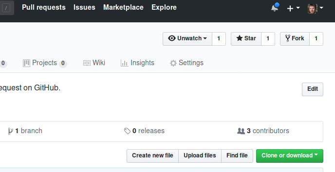
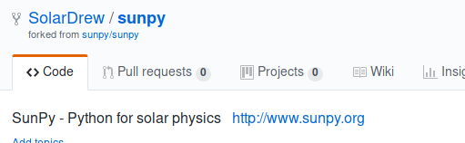

## Working with others

In the previous session we saw how to **push** work from a local repo to one stored on GitHub. This is great for sharing or publishing work, but this session is supposed to be about collaborating with others, which will often mean making changes to an existing project started by someone else. So now we need to look at the workflow for getting work from other people, editing it, and then making those changes available to them.

We've actually already been over most of the individual parts of this process. Again, making changes available is covered by pushing, which we've just learned. We also talked about cloning and briefly about pulling in previous sessions, both of which are ways to copy from a repo in a remote location onto our local machine. So to collaborate with someone on an existing repo, we need to **clone** that repo, make whatever changes we want to using `git add` and `git commit`, then **push** those changes somewhere.

So based on that, let's assume you want to make changes to this notebook repo. You've already cloned it in an earlier lesson, so that's step one done. As a reminder though, here's the command we used:


{:.input_area}
```xonsh
git clone https://github.com/SolarDrew/STFC-summer-school.git
```

In our case, since you already have a folder with the same name as the repo it's trying to clone, this command will fail. But suppose changes have been made to that repo since you cloned it? If we make changes in the same places, then git won't know how to apply the two sets of changes (this is called a **conflict** - more on this later). So we work on the most up-to-date version of the repo, which means getting the changes made to the remote and applying them to our local repo. In this case you should run `git pull`. Do this now with the command


{:.input_area}
```xonsh
git pull origin master
```

Now we want to make some changes to the repo. You may have noticed a new notebook in the repo called `collaborators.ipynb`. We'll be using this notebook to demonstrate the collaboration workflow. Open it now and add your name and GitHub username to the empty cell underneath the heading. Then save the notebook and commit your change with the usual `git add` and `git commit` commands.

Once you've made your changes, you want to share them. We've already seen `git push` in action, so we want to do that again, right? Try it now.


{:.input_area}
```xonsh
git push origin master
```

You should find that this hasn't worked. This is because the version of the repo on GitHub belongs to me, and you don't have permissions to write to it. This is an important aspect of working collaboratively because it means I can trust that nobody can change my copy of my code unless I give them permission. I could give all of you permissions to access my repo and have you all push there, but I'm not going to. One reason is because the changes you have made would conflict with everyone else's, so the push still wouldn't work anyway (again, more on dealing with this in a later session). Another is that it is actually often more useful to have your own version of a repo on GitHub, because it means that you can back up and share incremental changes to the repo before you and your collaborator are ready to combine your work.

So how do you get your own remote copy of someone else's repo?

## Forks and forking

Just like creating a remote repo from scratch, making a remote fork can only be done on GitHub, not through the command line. To make a fork of this notebook repo, go to my copy of it: [github.com/SolarDrew/STFC-summer-school](github.com/SolarDrew/STFC-summer-school) and click the **`Fork`** button in the top-right corner, as shown below.



And that's it! This may take a moment but then it should take you to your own repo which you'll see is a copy of mine. You should also notice that at the top of the page it tells you where the repo came from:



This is why we fork a repo rather than creating a new, empty one and pushing changes to it later - now GitHub knows that your new repo is associated with mine, and this will make things easier later when we want to compare differences between the two.

## Using your fork

So now you have a fork of the repo so now you can push, right? Try it again.


{:.input_area}
```xonsh
git push origin master
```

It still doesn't work! To see why, we need to look at the `origin` remote and see where we're trying to push to:


{:.input_area}
```xonsh
git remote -v
```

This tells us that the `origin` remote is still pointing at the version of the repo that you forked. Fortunately, you can change where a remote points to, with the `git remote` command, like this:

```
git remote set-url <name-of-remote> <new-remote-url>
```

so we can set the URL of the `origin` remote to be your fork:


{:.input_area}
```xonsh
git remote set-url origin https://github.com/<your-username>/STFC-summer-school.git
```

Now, at last, you can push to your new fork:


{:.input_area}
```xonsh
git push origin master
```

Now go back to your browser and look at your fork on GitHub. You should see now that the changes you've committed to the repo (you may need to refresh the page first). You can also go back to my copy and you'll see that it hasn't been affected by your changes.

## Introducing `upstream`

But wait, now if you pull from `origin`, you're getting your own fork. A lot of the time this is fine (when you move to working on a different computer, for example), but ealier we said we want to get changes our contributors have made before making our own. How do you do that now that you can't pull from `origin`?

For this, you need to make use of the fact that git allows you to specify multiple remotes for a repo, using the `git remote add` command which we've already seen:

```
git remote add <name-of-remote> <url-of-remote>
```

In this case the URL is the one which used to be `origin` (https://github.com/SolarDrew/STFC-summer-school.git). But what about the name? Well you can call it anything, but there are some conventions. One we've already seen is 'origin', which is used for _your_ remote version of the repo. In this case where there is a single 'main' version of the repo which other people fork, the convention is for those people to call the main repo 'upstream'.


{:.input_area}
```xonsh
git remote add upstream https://github.com/SolarDrew/STFC-summer-school.git
```

Now if you look at your remotes again you'll see that you have two now, one called `origin` pointing at your repo, and one called `upstream` which points at mine.


{:.input_area}
```xonsh
git remote -v
```


<section class="callout panel panel-warning">
<div class="panel-heading">
<h2><span class="fa fa-thumb-tack"></span> # Other ways to handle remotes</h2>
</div>


<div class="panel-body">

<p>In this case we cloned the repo first, then forked it on GitHub, so we had to change the <code>origin</code> remote, and this is a common path, particularly when you want to look at a project locally before you know that you'll want to collaborating on it. But sometimes you will want to fork the repo first, and then clone your own repo. In that situation, the <code>origin</code> remote will already automatically point at your GitHub repo, and you will only need to add <code>upstream</code> to point at the main repo.</p>
<p>You may also want to use a remote which is somebody else's fork of a central repo, rather than that repo itself or your fork of it. In this case a useful name for that remote would be that person's name or GitHub username, so for example:</p>
<div class="codehilite"><pre><span></span>git remote add cadair https://github.com/Cadair/STFC-summer-school.git
</pre></div>


<p>or</p>
<div class="codehilite"><pre><span></span>git remote add stuart https://github.com/Cadair/STFC-summer-school.git
</pre></div>

</div>

</section>


* TODO (if I have time) Add an example of all of this with a setup including a main upstream repo, an origin and another contributor
