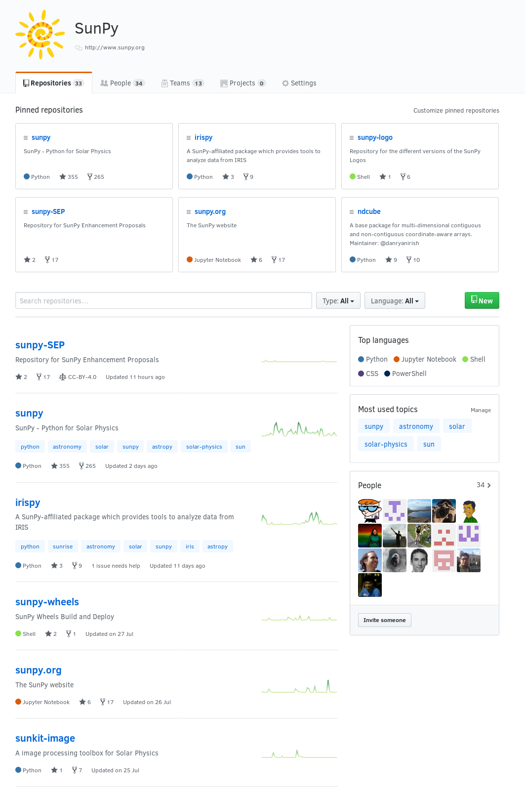
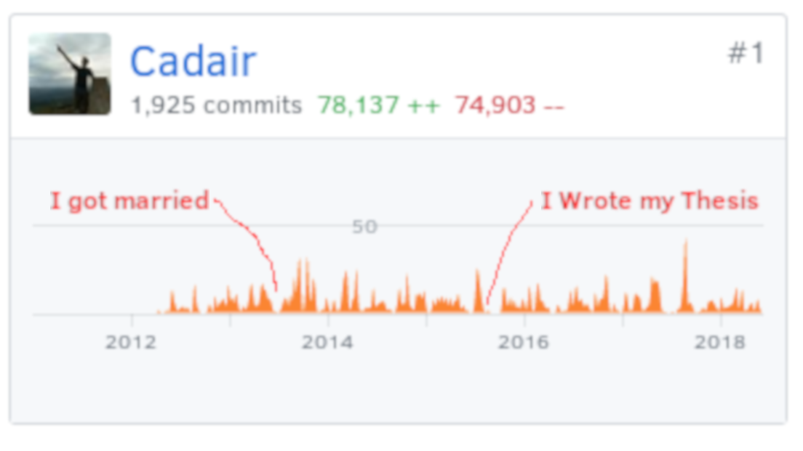
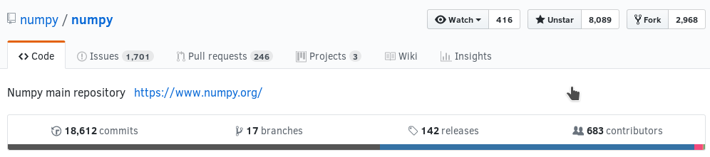
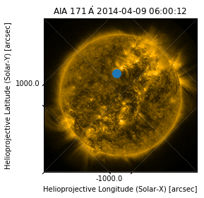

# SunPy and Astropy
## Open Development in Astrophysics

# Open Source

* Publically Accessible Code
* Freedoms to run and modify the code (explicitly set by a licence)
* Free as in zero cost

# Open Development

Where the development of the code is done in the open.

Including:

* Bug reports
* Feature Requests
* Commit logs
* Code review

**Enables anyone to contribute**










# Get Involved!!

* https://sunpy.org/contribute.html
* http://www.astropy.org/contribute.html
* http://yt-project.org/
* https://numfocus.org/

# Demos!


{:.input_area}
```python
%matplotlib inline
import matplotlib.pyplot as plt
```


{:.input_area}
```python
from sunpy.data.sample import AIA_171_ROLL_IMAGE
import sunpy.map

m = sunpy.map.Map(AIA_171_ROLL_IMAGE)
m.peek()
plt.show()
```


## Astropy and SunPy 😍


{:.input_area}
```python
import astropy.units as u
from astropy.coordinates import SkyCoord
```


{:.input_area}
```python
a_point = SkyCoord(200*u.arcsec, 300*u.arcsec, frame=m.coordinate_frame)
a_point
```


{:.output_data_text}
```
<SkyCoord (Helioprojective: obstime=2014-04-09 06:00:12.970000, rsun=696000000.0 m, observer=<HeliographicStonyhurst Coordinate (obstime=2014-04-09 06:00:12.970000): (lon, lat, radius) in (deg, deg, m)
    (0., -6.047074, 1.49860274e+11)>): (Tx, Ty) in arcsec
    (200., 300.)>
```


{:.input_area}
```python
im = m.plot()
ax = plt.gca()
ax.plot_coord(a_point, "o", markersize=12)
plt.show()
```





# TimeSeries


{:.input_area}
```python
from sunpy.data.sample import GOES_XRS_TIMESERIES
```


{:.input_area}
```python
from sunpy.timeseries import TimeSeries
goes = TimeSeries(GOES_XRS_TIMESERIES)
goes.peek()
```


