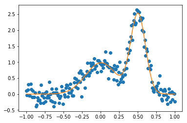

{:.input_area}
```python
import warnings
warnings.filterwarnings("ignore")
```

# SunPy and Astropy
## Open Development in Astrophysics

# Open Source

* Publically Accessible Code
* Freedoms to run and modify the code (explicitly set by a licence)
* Free as in zero cost

# Open Development

Where the development of the code is done in the open.

Including:

* Bug reports
* Feature Requests
* Commit logs
* Code review

**Enables anyone to contribute**


# Get Involved!!

* https://sunpy.org/contribute.html
* http://www.astropy.org/contribute.html
* http://yt-project.org/
* https://numfocus.org/

# Demos!

# Astropy

## Units


{:.input_area}
```python
import astropy.units as u
```

# FITS


{:.input_area}
```python
from astropy.io import fits
```


{:.input_area}
```python
fits.open("/home/stuart/sunpy/data/hsi_obssumm_20121127_043.2.fits").info()
```

{:.output_stream}
```
Filename: /home/stuart/sunpy/data/hsi_obssumm_20121127_043.2.fits
No.    Name      Ver    Type      Cards   Dimensions   Format
  0  PRIMARY       1 PrimaryHDU      11   ()      
  1  HESSI OBS SUMMARY ID TABLE    1 BinTableHDU     15   1R x 3C   [1I, 80A, 1I]   
  2  HSI_OBSSUMMINFO    1 BinTableHDU     17   1R x 4C   [80A, 80A, 1I, 1I]   
  3  HSI_FILEDB    1 BinTableHDU     31   1R x 11C   [1I, 80A, 1J, 1J, 1D, 1D, 1I, 1J, 1E, 1E, 80A]   
  4  HESSI OBS SUMMARY RATE ID TABLE    1 BinTableHDU     17   1R x 4C   [1I, 80A, 1I, 1I]   
  5  HSI_OBSSUMMRATEINFO    1 BinTableHDU     26   1R x 8C   [1D, 18B, 1J, 1E, 1I, 10E, 80A, 720A]   
  6  HSI_OBSSUMMRATEDATA    1 BinTableHDU     11   21600R x 1C   [9B]   
  7  HESSI MOD VARIANCE ID TABLE    1 BinTableHDU     17   1R x 4C   [1I, 80A, 1I, 1I]   
  8  HSI_MODVARIANCEINFO    1 BinTableHDU     24   1R x 7C   [1D, 1J, 1E, 1I, 2E, 80A, 160A]   
  9  HSI_MODVARIANCEDATA    1 BinTableHDU     11   21600R x 1C   [2B]   
 10  HESSI EPHEMERIS ID TABLE    1 BinTableHDU     17   1R x 4C   [1I, 80A, 1I, 1I]   
 11  HSI_EPHEMERISINFO    1 BinTableHDU     25   1R x 7C   [1J, 1E, 1D, 80A, 480A, 80A, 160A]   
 12  HSI_EPHEMERISDATA    1 BinTableHDU     13   4320R x 2C   [6E, 2E]   
 13  HESSI OBS SUMMARY FLAG ID TABLE    1 BinTableHDU     17   1R x 4C   [1I, 80A, 1I, 1I]   
 14  HSI_OBSSUMMFLAGINFO    1 BinTableHDU     20   1R x 5C   [1D, 1J, 1E, 1I, 2560A]   
 15  HSI_OBSSUMMFLAGDATA    1 BinTableHDU     11   21600R x 1C   [32B]   
 16  HESSI QLOOK POINTING ID TABLE    1 BinTableHDU     17   1R x 4C   [1I, 80A, 1I, 1I]   
 17  HSI_QLOOK_POINTING_INFO    1 BinTableHDU     26   1R x 8C   [1D, 1J, 1E, 1I, 1E, 1E, 80A, 160A]   
 18  HSI_QLOOK_POINTING_DATA    1 BinTableHDU     13   86400R x 2C   [2B, 1B]   
 19  HESSI QLOOK ROLL PERIOD ID TABLE    1 BinTableHDU     17   1R x 4C   [1I, 80A, 1I, 1I]   
 20  HSI_QLOOK_ROLL_PERIOD_INFO    1 BinTableHDU     25   1R x 8C   [1D, 1J, 1E, 1I, 1E, 1E, 80A, 80A]   
 21  HSI_QLOOK_ROLL_PERIOD_DATA    1 BinTableHDU     11   4320R x 1C   [1E]   
 22  HESSI QLOOK ROLL ANGLE ID TABLE    1 BinTableHDU     17   1R x 4C   [1I, 80A, 1I, 1I]   
 23  HSI_QLOOK_ROLL_ANGLE_INFO    1 BinTableHDU     25   1R x 8C   [1D, 1J, 1E, 1I, 1E, 1E, 80A, 80A]   
 24  HSI_QLOOK_ROLL_ANGLE_DATA    1 BinTableHDU     11   86400R x 1C   [1B]   

```

# Coordinates


{:.input_area}
```python
from astropy.coordinates import SkyCoord

sc = SkyCoord.from_name("M32")
sc
```


{:.output_data_text}
```
<SkyCoord (ICRS): (ra, dec) in deg
    (10.6742708, 40.8651694)>
```


{:.input_area}
```python
sc.transform_to("galactic")
```


{:.output_data_text}
```
<SkyCoord (Galactic): (l, b) in deg
    (121.1500176, -21.97633425)>
```


# Modeling


{:.input_area}
```python
%matplotlib inline
import matplotlib.pyplot as plt
import numpy as np
import matplotlib as mpl
mpl.rcParams["figure.figsize"] = [9, 6]
```


{:.input_area}
```python
from astropy.modeling.models import Gaussian1D
from astropy.modeling import fitting
```


{:.input_area}
```python
np.random.seed(42)
g1 = Gaussian1D(1, 0, 0.2)
g2 = Gaussian1D(2.5, 0.5, 0.1)
x = np.linspace(-1, 1, 200)
y = g1(x) + g2(x) + np.random.normal(0., 0.2, x.shape)
```


{:.input_area}
```python
plt.plot(x, y, "o")
```


{:.output_data_text}
```
[<matplotlib.lines.Line2D at 0x7fc66fa34358>]
```


{:.input_area}
```python
m2 = Gaussian1D(amplitude=1, mean=0, stddev=0.1) + Gaussian1D(amplitude=2, mean=0.5, stddev=0.1)
fitter = fitting.SLSQPLSQFitter()
gg = fitter(m2, x, y)
```

{:.output_stream}
```
Optimization terminated successfully.    (Exit mode 0)
            Current function value: 6.832859352651364
            Iterations: 15
            Function evaluations: 143
            Gradient evaluations: 15

```


{:.input_area}
```python
plt.plot(x, y, "o")
plt.plot(x, gg(x))
```


{:.output_data_text}
```
[<matplotlib.lines.Line2D at 0x7fc66f9e2860>]
```





# SunPy


{:.input_area}
```python
from sunpy.data.sample import AIA_171_ROLL_IMAGE
import sunpy.map

m = sunpy.map.Map(AIA_171_ROLL_IMAGE)
m.peek()
plt.show()
```


## Astropy and SunPy 😍


{:.input_area}
```python
import astropy.units as u
from astropy.coordinates import SkyCoord
```


{:.input_area}
```python
a_point = SkyCoord(200*u.arcsec, 300*u.arcsec, frame=m.coordinate_frame)
a_point
```


{:.output_data_text}
```
<SkyCoord (Helioprojective: obstime=2014-04-09 06:00:12.970000, rsun=696000000.0 m, observer=<HeliographicStonyhurst Coordinate (obstime=2014-04-09 06:00:12.970000): (lon, lat, radius) in (deg, deg, m)
    (0., -6.047074, 1.49860274e+11)>): (Tx, Ty) in arcsec
    (200., 300.)>
```


{:.input_area}
```python
im = m.plot()
ax = plt.gca()
ax.plot_coord(a_point, "o", markersize=12)
plt.show()
```


# TimeSeries


{:.input_area}
```python
from sunpy.data.sample import GOES_XRS_TIMESERIES
```


{:.input_area}
```python
from sunpy.timeseries import TimeSeries
goes = TimeSeries(GOES_XRS_TIMESERIES)
goes.peek()
```


