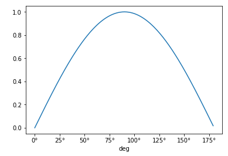

# Units and Quantities

## Objectives

- Use units
- Create functions that accept quantities as arguments
- Create new units

## Basics

How do we define a Quantity and which parts does it have?


{:.input_area}
```python
import astropy.units as u
```


{:.input_area}
```python
# Define a quantity length
length = 26.2 * u.meter
# print it
print(length) # length is a quantity
```

{:.output_stream}
```
26.2 m

```


{:.input_area}
```python
# Type of quantity
type(length)
```


{:.output_data_text}
```
astropy.units.quantity.Quantity
```


{:.input_area}
```python
# Type of unit
type(u.meter)
```


{:.output_data_text}
```
astropy.units.core.IrreducibleUnit
```


{:.input_area}
```python
# Quantity
length
```


$26.2 \; \mathrm{m}$


{:.input_area}
```python
# value
length.value
```


{:.output_data_text}
```
26.2
```


{:.input_area}
```python
# unit
length.unit
```


$\mathrm{m}$


{:.input_area}
```python
# information
length.info
```


{:.output_data_text}
```
dtype = float64
unit = m
class = Quantity
n_bad = 0
```


Quantities can be converted to other units systems or factors by using `to()`


{:.input_area}
```python
# Convert it to: km, lyr
print(length.to(u.km))
print(length.to(u.lightyear))
```

{:.output_stream}
```
0.0262 km
2.7693421851444923e-15 lyr

```

We can do arithmetic operations when the quantities have the compatible units:


{:.input_area}
```python
# arithmetic with distances
distance_start = 10 * u.mm
distance_end = 23 * u.km
length = distance_end - distance_start
print(length)
```

{:.output_stream}
```
22.99999 km

```

Quantities can also be combined, for example to measure speed


{:.input_area}
```python
# calculate a speed
time = 15 * u.minute
speed = length / time
print(speed)
```

{:.output_stream}
```
1.5333326666666667 km / min

```


{:.input_area}
```python
# decompose it
print(speed.decompose())
print(speed.si)
```

{:.output_stream}
```
25.555544444444447 m / s
25.555544444444447 m / s

```


<section class="challenge panel panel-success">
<div class="panel-heading">
<h2><span class="fa fa-pencil"></span> Unit conversions</h2>
</div>


<div class="panel-body">

<ol>
<li>Convert the speed in imperial units (miles/hour) using:
    <code>from astropy.units import imperial</code></li>
<li>Calculate whether a pint is more than half litre.
    <em>You can compare quantities as comparing variables.</em>
    Something strange? Check what deffinition of <a href="https://en.wikipedia.org/wiki/Pint">pint</a> astropy is using.</li>
<li>Does units work with areas? calculate the area of a rectangle of 3 km of side and 5 meter of width. Show them in $m^2$ and convert them to yards$^2$</li>
</ol>

</div>

</section>


{:.input_area}
```python
#1
from astropy.units import imperial
print(speed.to(imperial.mile/u.hour))

#2
print(imperial.pint > 0.5 * u.l)
print(imperial.pint.to(u.ml))
 # A liquid pint in US is 473 ml; in UK is 568 ml

#3
rectangle_area = 3 * u.km * 5 * u.m
print(rectangle_area)
print(rectangle_area.decompose())
print(rectangle_area.to(imperial.yard ** 2))
```

{:.output_stream}
```
57.16612483098704 mi / h
False
473.176473641504
15.0 km m
15000.0 m2
17939.8506945162 yd2

```

## Composed units

Many units are compositions of others, for example, one could create new combinationes for ease of use:


{:.input_area}
```python
# create a composite unit
cms = u.cm / u.s
speed.to(cms)
```


$2555.5544 \; \mathrm{\frac{cm}{s}}$


{:.input_area}
```python
# and in the imperial system
mph = imperial.mile / u.hour
speed.to(mph)
```


$57.166125 \; \mathrm{\frac{mi}{h}}$


and others are already a composition:


{:.input_area}
```python
# what can be converted from s-1?
(u.s ** -1).compose()
```


{:.output_data_text}
```
[Unit("Hz"), Unit("Bq"), Unit("2.7027e-11 Ci")]
```


{:.input_area}
```python
# or Jules?
(u.joule).compose()
```


{:.output_data_text}
```
[Unit("J"), Unit("1e+07 erg"), Unit("4.58742e+17 Ry"), Unit("6.24151e+18 eV")]
```


{:.input_area}
```python
# Unity of R
(13.605692 * u.eV).to(u.Ry)
```


$0.99999993 \; \mathrm{R_{\infty}}$


Sometime we get *no units* quantitites


{:.input_area}
```python
# no units
nounits = 20. * u.cm / (1. * u.m)
nounits
```


$20 \; \mathrm{\frac{cm}{m}}$


What happen if we add a number to this?


{:.input_area}
```python
# arithmetic with no units
nounits + 3
```


$3.2 \; \mathrm{}$


{:.input_area}
```python
# final value of a no unit quantity
nounits.decompose() # It's a unitless quantity
```


$0.2 \; \mathrm{}$


## Equivalencies

Some conversions are not done by a conversion factor as between miles and kilometers, for example converting between wavelength and frequency.


{:.input_area}
```python
# converting spectral quantities
(656.281 * u.nm).to(u.Hz) # Fails because they are not compatible
```


{:.output_traceback_line}
```
---------------------------------------------------------------------------
```

{:.output_traceback_line}
```
UnitConversionError                       Traceback (most recent call last)
```

{:.output_traceback_line}
```
<ipython-input-22-f5e18019b5e4> in <module>()
      1 # converting spectral quantities
----> 2 (656.281 * u.nm).to(u.Hz) # Fails because they are not compatible

```

{:.output_traceback_line}
```
/opt/miniconda/envs/stfc/lib/python3.6/site-packages/astropy/units/quantity.py in to(self, unit, equivalencies)
    845         # and don't want to slow down this method (esp. the scalar case).
    846         unit = Unit(unit)
--> 847         return self._new_view(self._to_value(unit, equivalencies), unit)
    848 
    849     def to_value(self, unit=None, equivalencies=[]):

```

{:.output_traceback_line}
```
/opt/miniconda/envs/stfc/lib/python3.6/site-packages/astropy/units/quantity.py in _to_value(self, unit, equivalencies)
    817             equivalencies = self._equivalencies
    818         return self.unit.to(unit, self.view(np.ndarray),
--> 819                             equivalencies=equivalencies)
    820 
    821     def to(self, unit, equivalencies=[]):

```

{:.output_traceback_line}
```
/opt/miniconda/envs/stfc/lib/python3.6/site-packages/astropy/units/core.py in to(self, other, value, equivalencies)
    963             If units are inconsistent
    964         """
--> 965         return self._get_converter(other, equivalencies=equivalencies)(value)
    966 
    967     def in_units(self, other, value=1.0, equivalencies=[]):

```

{:.output_traceback_line}
```
/opt/miniconda/envs/stfc/lib/python3.6/site-packages/astropy/units/core.py in _get_converter(self, other, equivalencies)
    897                             pass
    898 
--> 899             raise exc
    900 
    901     def _to(self, other):

```

{:.output_traceback_line}
```
/opt/miniconda/envs/stfc/lib/python3.6/site-packages/astropy/units/core.py in _get_converter(self, other, equivalencies)
    883         try:
    884             return self._apply_equivalencies(
--> 885                 self, other, self._normalize_equivalencies(equivalencies))
    886         except UnitsError as exc:
    887             # Last hope: maybe other knows how to do it?

```

{:.output_traceback_line}
```
/opt/miniconda/envs/stfc/lib/python3.6/site-packages/astropy/units/core.py in _apply_equivalencies(self, unit, other, equivalencies)
    867         raise UnitConversionError(
    868             "{0} and {1} are not convertible".format(
--> 869                 unit_str, other_str))
    870 
    871     def _get_converter(self, other, equivalencies=[]):

```

{:.output_traceback_line}
```
UnitConversionError: 'nm' (length) and 'Hz' (frequency) are not convertible
```


{:.input_area}
```python
# but doing it right
(656.281 * u.nm).to(u.Hz, equivalencies=u.spectral())
```


$4.5680502 \times 10^{14} \; \mathrm{Hz}$


Other built-in equivalencies are: 
 - `parallax()`
 - Doppler (`dopplr_radio`, `doppler_optical`, `doppler_relativistic`)
 - spectral flux density
 - brigthness temperature
 - temperature energy
 - and you can [build your own](http://astropy.readthedocs.org/en/stable/units/equivalencies.html#writing-new-equivalencies)


{:.input_area}
```python
# finding the equivalencies
u.Hz.find_equivalent_units()
```


{:.output_data_text}
```
  Primary name | Unit definition | Aliases     
[
  Bq           | 1 / s           | becquerel    ,
  Ci           | 3.7e+10 / s     | curie        ,
  Hz           | 1 / s           | Hertz, hertz ,
]
```


{:.input_area}
```python
# but also using other systems
u.Hz.find_equivalent_units(equivalencies=u.spectral())
```


{:.output_data_text}
```
  Primary name | Unit definition        | Aliases                         
[
  AU           | 1.49598e+11 m          | au, astronomical_unit            ,
  Angstrom     | 1e-10 m                | AA, angstrom                     ,
  Bq           | 1 / s                  | becquerel                        ,
  Ci           | 3.7e+10 / s            | curie                            ,
  Hz           | 1 / s                  | Hertz, hertz                     ,
  J            | kg m2 / s2             | Joule, joule                     ,
  Ry           | 2.17987e-18 kg m2 / s2 | rydberg                          ,
  cm           | 0.01 m                 | centimeter                       ,
  eV           | 1.60218e-19 kg m2 / s2 | electronvolt                     ,
  earthRad     | 6.3781e+06 m           | R_earth, Rearth                  ,
  erg          | 1e-07 kg m2 / s2       |                                  ,
  jupiterRad   | 7.1492e+07 m           | R_jup, Rjup, R_jupiter, Rjupiter ,
  k            | 100 / m                | Kayser, kayser                   ,
  lyr          | 9.46073e+15 m          | lightyear                        ,
  m            | irreducible            | meter                            ,
  micron       | 1e-06 m                |                                  ,
  pc           | 3.08568e+16 m          | parsec                           ,
  solRad       | 6.957e+08 m            | R_sun, Rsun                      ,
]
```


## Printing the quantities


{:.input_area}
```python
# Printing values with different formats
print("{0.value:0.03f} {0.unit:FITS}".format(speed))
print("{0.value:0.03f} {0.unit:latex_inline}".format(speed))
```

{:.output_stream}
```
1.533 km min-1
1.533 $\mathrm{km\,min^{-1}}$

```

## Arrays

Quantities can also be applied to arrays


{:.input_area}
```python
# different ways of defining a quantity for a single value
length = 44 * u.m
time = u.Quantity(23, u.s)
speed = length / time
speed
```


$1.9130435 \; \mathrm{\frac{m}{s}}$


{:.input_area}
```python
# now with lists
length_list = [1, 2, 3] * u.m

# and arrays
import numpy as np
time_array = np.array([1, 2, 3]) * u.s

# and its arithmetics
length_list / time_array
```


$[1,~1,~1] \; \mathrm{\frac{m}{s}}$


{:.input_area}
```python
# angles are smart!
angle = u.Quantity(np.arange(180), u.deg)
print(angle[[0, -1]])
print(np.sin(angle[[0, -1]]))
```

{:.output_stream}
```
[  0. 179.] deg
[0.         0.01745241]

```

## Plotting quantities

To work nicely with matplotlib we need to do as follows:


{:.input_area}
```python
# allowing for plotting
from astropy.visualization import quantity_support
quantity_support()

# loading matplotlib
%matplotlib inline
from matplotlib import pyplot as plt
```


{:.input_area}
```python
# Ploting the previous array
plt.plot(angle, np.sin(angle))
```


{:.output_data_text}
```
[<matplotlib.lines.Line2D at 0x7ffb57948400>]
```





## Creating functions with quantities as units

We want to have functions that contain the information of the untis, and with them we can be sure that we will be always have the *right* result.


{:.input_area}
```python
# Create a function for the Kinetic energy
@u.quantity_input(mass=u.kg, speed=u.m/u.s)
def kinetic(mass, speed):
    return (mass * speed ** 2 / 2.).to(u.joule)
```


{:.input_area}
```python
# run without units
kinetic(5, 10) # Fails! it doesn't specify the units.
```


{:.output_traceback_line}
```
---------------------------------------------------------------------------
```

{:.output_traceback_line}
```
AttributeError                            Traceback (most recent call last)
```

{:.output_traceback_line}
```
/opt/miniconda/envs/stfc/lib/python3.6/site-packages/astropy/units/decorators.py in _validate_arg_value(param_name, func_name, arg, targets, equivalencies)
     52         try:
---> 53             is_equivalent = arg.unit.is_equivalent(allowed_unit,
     54                                                    equivalencies=equivalencies)

```

{:.output_traceback_line}
```
AttributeError: 'int' object has no attribute 'unit'
```

{:.output_traceback_line}
```

During handling of the above exception, another exception occurred:

```

{:.output_traceback_line}
```
TypeError                                 Traceback (most recent call last)
```

{:.output_traceback_line}
```
<ipython-input-33-e2dcfb5d250c> in <module>()
      1 # run without units
----> 2 kinetic(5, 10) # Fails! it doesn't specify the units.

```

{:.output_traceback_line}
```
/opt/miniconda/envs/stfc/lib/python3.6/site-packages/astropy/utils/decorators.py in kinetic(mass, speed)
    825             name = func.__name__
    826 
--> 827         func = make_function_with_signature(func, name=name, **wrapped_args)
    828         func = functools.update_wrapper(func, wrapped, assigned=assigned,
    829                                         updated=updated)

```

{:.output_traceback_line}
```
/opt/miniconda/envs/stfc/lib/python3.6/site-packages/astropy/units/decorators.py in wrapper(*func_args, **func_kwargs)
    216                 #   the value of the argument:
    217                 _validate_arg_value(param.name, wrapped_function.__name__,
--> 218                                     arg, valid_targets, self.equivalencies)
    219 
    220             # Call the original function with any equivalencies in force.

```

{:.output_traceback_line}
```
/opt/miniconda/envs/stfc/lib/python3.6/site-packages/astropy/units/decorators.py in _validate_arg_value(param_name, func_name, arg, targets, equivalencies)
     65             raise TypeError("Argument '{0}' to function '{1}' has {2}. "
     66                   "You may want to pass in an astropy Quantity instead."
---> 67                      .format(param_name, func_name, error_msg))
     68 
     69     else:

```

{:.output_traceback_line}
```
TypeError: Argument 'mass' to function 'kinetic' has no 'unit' attribute. You may want to pass in an astropy Quantity instead.
```


{:.input_area}
```python
# Run with units
kinetic(5 * u.kg, 100 * cms)
```


$2.5 \; \mathrm{J}$


<section class="challenge panel panel-success">
<div class="panel-heading">
<h2><span class="fa fa-pencil"></span> Using `quantity_input`</h2>
</div>


<div class="panel-body">

<ol>
<li>Create a function that calculates potential energy where $g$ defaults to Earth value, but could be used for different planets. Test it for any of the $g$ values for any other <a href="http://www.physicsclassroom.com/class/circles/Lesson-3/The-Value-of-g&quot;">planets</a>.</li>
</ol>

</div>

</section>


{:.input_area}
```python
#4
@u.quantity_input(mass=u.kg, height=u.m, g=u.m / u.s ** 2)
def potential(mass, height, g=9.8 * u.m / u.s **2):
    return (0.5 * mass * g * height).to(u.joule)
```


{:.input_area}
```python
# run it for some values
potential(5 * u.kg, 30 *u.cm)
```


$7.35 \; \mathrm{J}$


{:.input_area}
```python
# on Mars:
potential(5 * u.kg, 1 * u.m, g=3.75 * u.m/u.s**2)
```


$9.375 \; \mathrm{J}$


## Create your own units

Some times we want to create our own units:


{:.input_area}
```python
# Create units for a laugh scale
titter = u.def_unit('titter')
chuckle = u.def_unit('chuckle', 5 * titter)
laugh = u.def_unit('laugh', 4 * chuckle)
guffaw = u.def_unit('guffaw', 3 * laugh)
rofl = u.def_unit('rofl', 4 * guffaw)
death_by_laughing = u.def_unit('death_by_laughing', 10 * rofl)
print((1 * rofl).to(titter))

```

{:.output_stream}
```
240.0 titter

```


<section class="challenge panel panel-success">
<div class="panel-heading">
<h2><span class="fa fa-pencil"></span> Area with units</h2>
</div>


<div class="panel-body">

<ol>
<li>Convert the area calculated before <code>rectangle_area</code> in <a href="https://en.wikipedia.org/wiki/Hectare">hectares</a> (1 hectare = 100 ares; 1 are = 100 $m^2$).</li>
</ol>

</div>

</section>


{:.input_area}
```python
#5
ares = u.def_unit('ares', (10 * u.m)**2)
hectar = u.def_unit('hectares', 100 * ares)
print(rectangle_area.to(hectar))
```

{:.output_stream}
```
1.5 hectares

```
