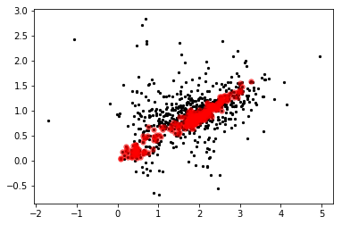

# Astropy: Tables


<section class="objectives panel panel-warning">
<div class="panel-heading">
<h2><span class="fa fa-certificate"></span> Objectives</h2>
</div>


<div class="panel-body">

<ul>
<li>Create tables</li>
<li>Access data in tables</li>
<li>Combining tables</li>
<li>Aggregation</li>
<li>Masking</li>
<li>Reading/writing</li>
</ul>

</div>

</section>


## Documentation

For more information about the features presented below, you can read the
[astropy.table](http://docs.astropy.org/en/stable/table/index.html) docs.

## Creating tables


{:.input_area}
```python
import numpy as np
from astropy.table import Table
```


{:.input_area}
```python
# Creating a table from scratch
t1 = Table()
t1['name'] = ['source 1', 'source 2', 'source 3']
t1['flux'] = [1.2, 2.2, 3.1]
```


{:.input_area}
```python
# Looking at the table
t1
```


<div markdown="0">
<i>Table length=3</i>
<table id="table140090867010528" class="table-striped table-bordered table-condensed">
<thead><tr><th>name</th><th>flux</th></tr></thead>
<thead><tr><th>str8</th><th>float64</th></tr></thead>
<tr><td>source 1</td><td>1.2</td></tr>
<tr><td>source 2</td><td>2.2</td></tr>
<tr><td>source 3</td><td>3.1</td></tr>
</table>
</div>


{:.input_area}
```python
# Adding a column
t1['size'] = [1,5,4]
t1
```


<div markdown="0">
<i>Table length=3</i>
<table id="table140090867010528" class="table-striped table-bordered table-condensed">
<thead><tr><th>name</th><th>flux</th><th>size</th></tr></thead>
<thead><tr><th>str8</th><th>float64</th><th>int64</th></tr></thead>
<tr><td>source 1</td><td>1.2</td><td>1</td></tr>
<tr><td>source 2</td><td>2.2</td><td>5</td></tr>
<tr><td>source 3</td><td>3.1</td><td>4</td></tr>
</table>
</div>


{:.input_area}
```python
# Accessing a column
t1['size']
```


<div markdown="0">
&lt;Column name=&apos;size&apos; dtype=&apos;int64&apos; length=3&gt;
<table>
<tr><td>1</td></tr>
<tr><td>5</td></tr>
<tr><td>4</td></tr>
</table>
</div>


{:.input_area}
```python
# Converting to a Numpy array
np.array(t1['size'])
```


{:.output_data_text}
```
array([1, 5, 4])
```


{:.input_area}
```python
# Accessing a cell
t1['size'][0]
```


{:.output_data_text}
```
1
```


{:.input_area}
```python
# Accessing a row
t1[0]
```


<div markdown="0">
<i>Row index=0</i>
<table id="table140090867010528">
<thead><tr><th>name</th><th>flux</th><th>size</th></tr></thead>
<thead><tr><th>str8</th><th>float64</th><th>int64</th></tr></thead>
<tr><td>source 1</td><td>1.2</td><td>1</td></tr>
</table>
</div>


## Units in tables


{:.input_area}
```python
# Set unit on column
t1['size'].unit = 'cm'
t1
```


<div markdown="0">
<i>Table length=3</i>
<table id="table140090867010528" class="table-striped table-bordered table-condensed">
<thead><tr><th>name</th><th>flux</th><th>size</th></tr></thead>
<thead><tr><th></th><th></th><th>cm</th></tr></thead>
<thead><tr><th>str8</th><th>float64</th><th>int64</th></tr></thead>
<tr><td>source 1</td><td>1.2</td><td>1</td></tr>
<tr><td>source 2</td><td>2.2</td><td>5</td></tr>
<tr><td>source 3</td><td>3.1</td><td>4</td></tr>
</table>
</div>


Some unitful operations will then work:


{:.input_area}
```python
t1['size'].to('m')
```


$[0.01,~0.05,~0.04] \; \mathrm{m}$


However, you may run into unexpected behavior, so if you are planning on using table columns as Quantities, we recommend that you use the ``QTable`` class:


{:.input_area}
```python
type(t1['size'])
```


{:.output_data_text}
```
astropy.table.column.Column
```


{:.input_area}
```python
from astropy.table import QTable
qt1 = QTable(t1)
type(qt1['size'])
```


{:.output_data_text}
```
astropy.units.quantity.Quantity
```


<section class="challenge panel panel-success">
<div class="panel-heading">
<h2><span class="fa fa-pencil"></span> Challenge</h2>
</div>


<div class="panel-body">

<ol>
<li>Make a table that contains three columns: <code>spectral type</code>, <code>temperature</code>, and <code>radius</code>, and incude 5 rows with fake data (or real data if you like, for example from <a href="http://www.atlasoftheuniverse.com/startype.html">here</a>). Try including units on the columns that can have them.</li>
<li>Find the mean temperature and the maximum radius</li>
<li>Try and find out how to add and remove rows</li>
<li>Add a new column which gives the luminosity (using $L=4\pi R^2 \sigma T^4$)</li>
</ol>

</div>

</section>


{:.input_area}
```python
#1
from astropy import units as u
t = QTable()
t['spectral type'] = ['O5', 'B5', 'A5', 'F5', 'G5']
t['radius'] = [12, 3.9, 1.7, 1.3, 0.92] * u.R_sun
t['temperature'] = [45000, 15000, 8200, 6400, 5700] * u.K
t
```


<div markdown="0">
<i>QTable length=5</i>
<table id="table140090864147872" class="table-striped table-bordered table-condensed">
<thead><tr><th>spectral type</th><th>radius</th><th>temperature</th></tr></thead>
<thead><tr><th></th><th>solRad</th><th>K</th></tr></thead>
<thead><tr><th>str2</th><th>float64</th><th>float64</th></tr></thead>
<tr><td>O5</td><td>12.0</td><td>45000.0</td></tr>
<tr><td>B5</td><td>3.9</td><td>15000.0</td></tr>
<tr><td>A5</td><td>1.7</td><td>8200.0</td></tr>
<tr><td>F5</td><td>1.3</td><td>6400.0</td></tr>
<tr><td>G5</td><td>0.92</td><td>5700.0</td></tr>
</table>
</div>


{:.input_area}
```python
#2
print('Mean temperature:', np.mean(t['temperature']))
print('Maximum radius:', np.mean(t['radius']))
```

{:.output_stream}
```
Mean temperature: 16060.0 K
Maximum radius: 3.964000000000001 solRad

```


{:.input_area}
```python
#3
t.add_row({'spectral type': 'K5',
           'temperature': 4300 * u.K,
           'radius': 0.72 * u.R_sun})
t.remove_row(0)
t
```


<div markdown="0">
<i>QTable length=5</i>
<table id="table140090864147872" class="table-striped table-bordered table-condensed">
<thead><tr><th>spectral type</th><th>radius</th><th>temperature</th></tr></thead>
<thead><tr><th></th><th>solRad</th><th>K</th></tr></thead>
<thead><tr><th>str2</th><th>float64</th><th>float64</th></tr></thead>
<tr><td>B5</td><td>3.9</td><td>15000.0</td></tr>
<tr><td>A5</td><td>1.7</td><td>8200.0</td></tr>
<tr><td>F5</td><td>1.3</td><td>6400.0</td></tr>
<tr><td>G5</td><td>0.92</td><td>5700.0</td></tr>
<tr><td>K5</td><td>0.72</td><td>4300.0</td></tr>
</table>
</div>


{:.input_area}
```python
#4
from numpy import pi
from astropy.constants import sigma_sb
t['luminosity'] = (4 * pi * t['radius'] ** 2 * sigma_sb * t['temperature'] ** 4).to(u.L_sun)
t
```


<div markdown="0">
<i>QTable length=5</i>
<table id="table140090864147872" class="table-striped table-bordered table-condensed">
<thead><tr><th>spectral type</th><th>radius</th><th>temperature</th><th>luminosity</th></tr></thead>
<thead><tr><th></th><th>solRad</th><th>K</th><th>solLum</th></tr></thead>
<thead><tr><th>str2</th><th>float64</th><th>float64</th><th>float64</th></tr></thead>
<tr><td>B5</td><td>3.9</td><td>15000.0</td><td>693.7250235023215</td></tr>
<tr><td>A5</td><td>1.7</td><td>8200.0</td><td>11.7718945281512</td></tr>
<tr><td>F5</td><td>1.3</td><td>6400.0</td><td>2.554463553120115</td></tr>
<tr><td>G5</td><td>0.92</td><td>5700.0</td><td>0.8049486705065919</td></tr>
<tr><td>K5</td><td>0.72</td><td>4300.0</td><td>0.15967316182594046</td></tr>
</table>
</div>


## Iterating over tables

It is possible to iterate over rows or over columns. To iterate over rows, simply iterate over the table itself:


{:.input_area}
```python
for row in t1:
    print(row)
```

{:.output_stream}
```
  name   flux size
               cm 
-------- ---- ----
source 1  1.2    1
  name   flux size
               cm 
-------- ---- ----
source 2  2.2    5
  name   flux size
               cm 
-------- ---- ----
source 3  3.1    4

```

Rows can act like dictionaries, so you can access specific columns from a row:


{:.input_area}
```python
for row in t1:
    print(row['name'])
```

{:.output_stream}
```
source 1
source 2
source 3

```

Iterating over columns is also easy:


{:.input_area}
```python
for colname in t1.columns:
    column = t1[colname]
    print(column)
```

{:.output_stream}
```
  name  
--------
source 1
source 2
source 3
flux
----
 1.2
 2.2
 3.1
size
 cm 
----
   1
   5
   4

```

Accessing specific rows from a column object can also be done with the item notation:


{:.input_area}
```python
for colname in t1.columns:
    column = t1[colname]
    print(column[0])
```

{:.output_stream}
```
source 1
1.2
1

```

## Joining tables


{:.input_area}
```python
from astropy.table import join
```


{:.input_area}
```python
t2 = Table()
t2['name'] = ['source 1', 'source 3']
t2['flux2'] = [1,9]
```


{:.input_area}
```python
t3 = join(t1, t2, join_type='outer')
t3
```


<div markdown="0">
<i>Table masked=True length=3</i>
<table id="table140090864145296" class="table-striped table-bordered table-condensed">
<thead><tr><th>name</th><th>flux</th><th>size</th><th>flux2</th></tr></thead>
<thead><tr><th></th><th></th><th>cm</th><th></th></tr></thead>
<thead><tr><th>str8</th><th>float64</th><th>int64</th><th>int64</th></tr></thead>
<tr><td>source 1</td><td>1.2</td><td>1</td><td>1</td></tr>
<tr><td>source 2</td><td>2.2</td><td>5</td><td>--</td></tr>
<tr><td>source 3</td><td>3.1</td><td>4</td><td>9</td></tr>
</table>
</div>


{:.input_area}
```python
np.mean(t3['flux2'])
```


{:.output_data_text}
```
5.0
```


## Masked tables


{:.input_area}
```python
t4 = Table(masked=True)
t4['name'] = ['source 1', 'source 2', 'source 3']
t4['flux'] = [1.2, 2.2, 3.1]
```


{:.input_area}
```python
t4['flux'].mask = [1,0,1]
t4
```


<div markdown="0">
<i>Table masked=True length=3</i>
<table id="table140090864211560" class="table-striped table-bordered table-condensed">
<thead><tr><th>name</th><th>flux</th></tr></thead>
<thead><tr><th>str8</th><th>float64</th></tr></thead>
<tr><td>source 1</td><td>--</td></tr>
<tr><td>source 2</td><td>2.2</td></tr>
<tr><td>source 3</td><td>--</td></tr>
</table>
</div>


## Slicing

Tables can be sliced like Numpy arrays:


{:.input_area}
```python
obs = Table.read("""name    obs_date    mag_b  mag_v
                    M31     2012-01-02  17.0   17.5
                    M31     2012-01-02  17.1   17.4
                    M101    2012-01-02  15.1   13.5
                    M82     2012-02-14  16.2   14.5
                    M31     2012-02-14  16.9   17.3
                    M82     2012-02-14  15.2   15.5
                    M101    2012-02-14  15.0   13.6
                    M82     2012-03-26  15.7   16.5
                    M101    2012-03-26  15.1   13.5
                    M101    2012-03-26  14.8   14.3
                    """, format='ascii')
```


{:.input_area}
```python
obs[1:4]
```


<div markdown="0">
<i>Table length=3</i>
<table id="table140090864144848" class="table-striped table-bordered table-condensed">
<thead><tr><th>name</th><th>obs_date</th><th>mag_b</th><th>mag_v</th></tr></thead>
<thead><tr><th>str4</th><th>str10</th><th>float64</th><th>float64</th></tr></thead>
<tr><td>M31</td><td>2012-01-02</td><td>17.1</td><td>17.4</td></tr>
<tr><td>M101</td><td>2012-01-02</td><td>15.1</td><td>13.5</td></tr>
<tr><td>M82</td><td>2012-02-14</td><td>16.2</td><td>14.5</td></tr>
</table>
</div>


{:.input_area}
```python
obs[obs['mag_b'] > 16]
```


<div markdown="0">
<i>Table length=4</i>
<table id="table140090864212120" class="table-striped table-bordered table-condensed">
<thead><tr><th>name</th><th>obs_date</th><th>mag_b</th><th>mag_v</th></tr></thead>
<thead><tr><th>str4</th><th>str10</th><th>float64</th><th>float64</th></tr></thead>
<tr><td>M31</td><td>2012-01-02</td><td>17.0</td><td>17.5</td></tr>
<tr><td>M31</td><td>2012-01-02</td><td>17.1</td><td>17.4</td></tr>
<tr><td>M82</td><td>2012-02-14</td><td>16.2</td><td>14.5</td></tr>
<tr><td>M31</td><td>2012-02-14</td><td>16.9</td><td>17.3</td></tr>
</table>
</div>


{:.input_area}
```python
obs['mag_b', 'mag_v']
```


<div markdown="0">
<i>Table length=10</i>
<table id="table140090864211448" class="table-striped table-bordered table-condensed">
<thead><tr><th>mag_b</th><th>mag_v</th></tr></thead>
<thead><tr><th>float64</th><th>float64</th></tr></thead>
<tr><td>17.0</td><td>17.5</td></tr>
<tr><td>17.1</td><td>17.4</td></tr>
<tr><td>15.1</td><td>13.5</td></tr>
<tr><td>16.2</td><td>14.5</td></tr>
<tr><td>16.9</td><td>17.3</td></tr>
<tr><td>15.2</td><td>15.5</td></tr>
<tr><td>15.0</td><td>13.6</td></tr>
<tr><td>15.7</td><td>16.5</td></tr>
<tr><td>15.1</td><td>13.5</td></tr>
<tr><td>14.8</td><td>14.3</td></tr>
</table>
</div>


<section class="challenge panel panel-success">
<div class="panel-heading">
<h2><span class="fa fa-pencil"></span> Challenge</h2>
</div>


<div class="panel-body">

<p>Starting from the <code>obs</code> table:</p>
<ol>
<li>Make a new table that shows every other row, starting with the second row? (that is, the second, fourth, sixth, etc. rows).</li>
<li>Make a new table the only contains rows where <code>name</code> is <code>M31</code></li>
</ol>

</div>

</section>


{:.input_area}
```python
#1
subset1 = obs[1::2]
subset1
```


<div markdown="0">
<i>Table length=5</i>
<table id="table140090864212344" class="table-striped table-bordered table-condensed">
<thead><tr><th>name</th><th>obs_date</th><th>mag_b</th><th>mag_v</th></tr></thead>
<thead><tr><th>str4</th><th>str10</th><th>float64</th><th>float64</th></tr></thead>
<tr><td>M31</td><td>2012-01-02</td><td>17.1</td><td>17.4</td></tr>
<tr><td>M82</td><td>2012-02-14</td><td>16.2</td><td>14.5</td></tr>
<tr><td>M82</td><td>2012-02-14</td><td>15.2</td><td>15.5</td></tr>
<tr><td>M82</td><td>2012-03-26</td><td>15.7</td><td>16.5</td></tr>
<tr><td>M101</td><td>2012-03-26</td><td>14.8</td><td>14.3</td></tr>
</table>
</div>


{:.input_area}
```python
#2
subset2 = obs[obs['name'] == 'M31']
subset2
```


<div markdown="0">
<i>Table length=3</i>
<table id="table140090864349592" class="table-striped table-bordered table-condensed">
<thead><tr><th>name</th><th>obs_date</th><th>mag_b</th><th>mag_v</th></tr></thead>
<thead><tr><th>str4</th><th>str10</th><th>float64</th><th>float64</th></tr></thead>
<tr><td>M31</td><td>2012-01-02</td><td>17.0</td><td>17.5</td></tr>
<tr><td>M31</td><td>2012-01-02</td><td>17.1</td><td>17.4</td></tr>
<tr><td>M31</td><td>2012-02-14</td><td>16.9</td><td>17.3</td></tr>
</table>
</div>


## Grouping and Aggregation


{:.input_area}
```python
obs_by_name = obs.group_by('name')
```


{:.input_area}
```python
obs_by_name
```


<div markdown="0">
<i>Table length=10</i>
<table id="table140090864350936" class="table-striped table-bordered table-condensed">
<thead><tr><th>name</th><th>obs_date</th><th>mag_b</th><th>mag_v</th></tr></thead>
<thead><tr><th>str4</th><th>str10</th><th>float64</th><th>float64</th></tr></thead>
<tr><td>M101</td><td>2012-01-02</td><td>15.1</td><td>13.5</td></tr>
<tr><td>M101</td><td>2012-02-14</td><td>15.0</td><td>13.6</td></tr>
<tr><td>M101</td><td>2012-03-26</td><td>15.1</td><td>13.5</td></tr>
<tr><td>M101</td><td>2012-03-26</td><td>14.8</td><td>14.3</td></tr>
<tr><td>M31</td><td>2012-01-02</td><td>17.0</td><td>17.5</td></tr>
<tr><td>M31</td><td>2012-01-02</td><td>17.1</td><td>17.4</td></tr>
<tr><td>M31</td><td>2012-02-14</td><td>16.9</td><td>17.3</td></tr>
<tr><td>M82</td><td>2012-02-14</td><td>16.2</td><td>14.5</td></tr>
<tr><td>M82</td><td>2012-02-14</td><td>15.2</td><td>15.5</td></tr>
<tr><td>M82</td><td>2012-03-26</td><td>15.7</td><td>16.5</td></tr>
</table>
</div>


{:.input_area}
```python
for group in obs_by_name.groups:
    print(group)
    print("")
```

{:.output_stream}
```
name  obs_date  mag_b mag_v
---- ---------- ----- -----
M101 2012-01-02  15.1  13.5
M101 2012-02-14  15.0  13.6
M101 2012-03-26  15.1  13.5
M101 2012-03-26  14.8  14.3

name  obs_date  mag_b mag_v
---- ---------- ----- -----
 M31 2012-01-02  17.0  17.5
 M31 2012-01-02  17.1  17.4
 M31 2012-02-14  16.9  17.3

name  obs_date  mag_b mag_v
---- ---------- ----- -----
 M82 2012-02-14  16.2  14.5
 M82 2012-02-14  15.2  15.5
 M82 2012-03-26  15.7  16.5


```


{:.input_area}
```python
obs_by_name.groups.aggregate(np.mean)
```


<div markdown="0">
<i>Table length=3</i>
<table id="table140090864350096" class="table-striped table-bordered table-condensed">
<thead><tr><th>name</th><th>mag_b</th><th>mag_v</th></tr></thead>
<thead><tr><th>str4</th><th>float64</th><th>float64</th></tr></thead>
<tr><td>M101</td><td>15.000000000000002</td><td>13.725000000000001</td></tr>
<tr><td>M31</td><td>17.0</td><td>17.400000000000002</td></tr>
<tr><td>M82</td><td>15.699999999999998</td><td>15.5</td></tr>
</table>
</div>


## Writing data


{:.input_area}
```python
obs.write('test.fits', overwrite=True)
```


{:.input_area}
```python
obs.write('test.vot', format='votable', overwrite=True)
```

## Reading data


{:.input_area}
```python
t4 = Table.read('2mass.tbl', format='ascii.ipac')
```


{:.input_area}
```python
t4
```


<div markdown="0">
<i>Table masked=True length=929</i>
<table id="table140090863407176" class="table-striped table-bordered table-condensed">
<thead><tr><th>ra</th><th>dec</th><th>clon</th><th>clat</th><th>err_maj</th><th>err_min</th><th>err_ang</th><th>designation</th><th>j_m</th><th>j_cmsig</th><th>j_msigcom</th><th>j_snr</th><th>h_m</th><th>h_cmsig</th><th>h_msigcom</th><th>h_snr</th><th>k_m</th><th>k_cmsig</th><th>k_msigcom</th><th>k_snr</th><th>ph_qual</th><th>rd_flg</th><th>bl_flg</th><th>cc_flg</th><th>ndet</th><th>gal_contam</th><th>mp_flg</th><th>dist</th><th>angle</th><th>j_h</th><th>h_k</th><th>j_k</th></tr></thead>
<thead><tr><th>deg</th><th>deg</th><th></th><th></th><th>arcsec</th><th>arcsec</th><th>deg</th><th></th><th>mag</th><th>mag</th><th>mag</th><th></th><th>mag</th><th>mag</th><th>mag</th><th></th><th>mag</th><th>mag</th><th>mag</th><th></th><th></th><th></th><th></th><th></th><th></th><th></th><th></th><th></th><th></th><th></th><th></th><th></th></tr></thead>
<thead><tr><th>float64</th><th>float64</th><th>str12</th><th>str13</th><th>float64</th><th>float64</th><th>int64</th><th>str16</th><th>float64</th><th>float64</th><th>float64</th><th>float64</th><th>float64</th><th>float64</th><th>float64</th><th>float64</th><th>float64</th><th>float64</th><th>float64</th><th>float64</th><th>str3</th><th>str3</th><th>str3</th><th>str3</th><th>str6</th><th>int64</th><th>int64</th><th>float64</th><th>float64</th><th>float64</th><th>float64</th><th>float64</th></tr></thead>
<tr><td>274.429506</td><td>-13.870547</td><td>18h17m43.08s</td><td>-13d52m13.97s</td><td>0.08</td><td>0.08</td><td>45</td><td>18174308-1352139</td><td>16.305</td><td>0.142</td><td>0.143</td><td>6.7</td><td>14.048</td><td>0.107</td><td>0.108</td><td>13.6</td><td>13.257</td><td>0.066</td><td>0.066</td><td>16.5</td><td>CAA</td><td>222</td><td>111</td><td>0ss</td><td>066655</td><td>0</td><td>0</td><td>975.080151</td><td>256.448</td><td>2.257</td><td>0.791</td><td>3.048</td></tr>
<tr><td>274.423821</td><td>-13.86974</td><td>18h17m41.72s</td><td>-13d52m11.06s</td><td>0.06</td><td>0.06</td><td>90</td><td>18174171-1352110</td><td>14.802</td><td>0.058</td><td>0.059</td><td>26.7</td><td>12.635</td><td>0.059</td><td>0.06</td><td>50.1</td><td>11.768</td><td>0.045</td><td>0.046</td><td>65.2</td><td>AAA</td><td>222</td><td>111</td><td>0ss</td><td>666666</td><td>0</td><td>0</td><td>993.752042</td><td>256.878</td><td>2.167</td><td>0.867</td><td>3.034</td></tr>
<tr><td>274.424587</td><td>-13.739629</td><td>18h17m41.90s</td><td>-13d44m22.66s</td><td>0.08</td><td>0.08</td><td>45</td><td>18174190-1344226</td><td>16.328</td><td>--</td><td>--</td><td>--</td><td>14.345</td><td>0.059</td><td>0.06</td><td>10.4</td><td>13.405</td><td>0.046</td><td>0.047</td><td>14.4</td><td>UAA</td><td>022</td><td>011</td><td>0cc</td><td>003666</td><td>0</td><td>0</td><td>995.726698</td><td>284.113</td><td>--</td><td>0.94</td><td>--</td></tr>
<tr><td>274.433933</td><td>-13.769502</td><td>18h17m44.14s</td><td>-13d46m10.21s</td><td>0.08</td><td>0.08</td><td>45</td><td>18174414-1346102</td><td>16.281</td><td>0.098</td><td>0.099</td><td>6.8</td><td>14.057</td><td>0.035</td><td>0.036</td><td>13.5</td><td>12.956</td><td>0.032</td><td>0.033</td><td>21.8</td><td>CAA</td><td>222</td><td>111</td><td>000</td><td>065566</td><td>0</td><td>0</td><td>942.627418</td><td>278.252</td><td>2.224</td><td>1.101</td><td>3.325</td></tr>
<tr><td>274.437013</td><td>-13.885698</td><td>18h17m44.88s</td><td>-13d53m08.51s</td><td>0.09</td><td>0.09</td><td>45</td><td>18174488-1353085</td><td>15.171</td><td>--</td><td>--</td><td>--</td><td>14.412</td><td>0.152</td><td>0.152</td><td>9.8</td><td>13.742</td><td>0.095</td><td>0.095</td><td>10.6</td><td>UBA</td><td>622</td><td>022</td><td>0cc</td><td>005566</td><td>0</td><td>0</td><td>964.105389</td><td>252.93</td><td>--</td><td>0.67</td><td>--</td></tr>
<tr><td>274.433996</td><td>-13.752446</td><td>18h17m44.16s</td><td>-13d45m08.81s</td><td>0.08</td><td>0.08</td><td>90</td><td>18174415-1345088</td><td>16.54</td><td>--</td><td>--</td><td>--</td><td>14.519</td><td>0.083</td><td>0.083</td><td>8.8</td><td>13.604</td><td>0.043</td><td>0.044</td><td>12.0</td><td>UBA</td><td>022</td><td>011</td><td>0cc</td><td>005666</td><td>0</td><td>0</td><td>953.230532</td><td>281.908</td><td>--</td><td>0.915</td><td>--</td></tr>
<tr><td>274.418138</td><td>-13.77215</td><td>18h17m40.35s</td><td>-13d46m19.74s</td><td>0.08</td><td>0.08</td><td>90</td><td>18174035-1346197</td><td>17.98</td><td>--</td><td>--</td><td>--</td><td>14.61</td><td>0.043</td><td>0.044</td><td>8.1</td><td>13.456</td><td>0.056</td><td>0.057</td><td>13.8</td><td>UBA</td><td>022</td><td>011</td><td>000</td><td>001645</td><td>0</td><td>0</td><td>996.047248</td><td>277.25</td><td>--</td><td>1.154</td><td>--</td></tr>
<tr><td>274.433695</td><td>-13.899049</td><td>18h17m44.09s</td><td>-13d53m56.58s</td><td>0.06</td><td>0.06</td><td>90</td><td>18174408-1353565</td><td>13.011</td><td>0.021</td><td>0.024</td><td>139.0</td><td>10.917</td><td>0.02</td><td>0.021</td><td>243.8</td><td>10.013</td><td>0.017</td><td>0.019</td><td>328.3</td><td>AAA</td><td>222</td><td>111</td><td>000</td><td>666666</td><td>0</td><td>0</td><td>990.166399</td><td>250.466</td><td>2.094</td><td>0.904</td><td>2.998</td></tr>
<tr><td>274.425482</td><td>-13.77149</td><td>18h17m42.12s</td><td>-13d46m17.36s</td><td>0.08</td><td>0.08</td><td>135</td><td>18174211-1346173</td><td>16.086</td><td>--</td><td>--</td><td>--</td><td>13.709</td><td>0.065</td><td>0.066</td><td>18.6</td><td>12.503</td><td>0.044</td><td>0.045</td><td>33.1</td><td>UAA</td><td>622</td><td>012</td><td>00c</td><td>005555</td><td>0</td><td>0</td><td>970.896919</td><td>277.582</td><td>--</td><td>1.206</td><td>--</td></tr>
<tr><td>...</td><td>...</td><td>...</td><td>...</td><td>...</td><td>...</td><td>...</td><td>...</td><td>...</td><td>...</td><td>...</td><td>...</td><td>...</td><td>...</td><td>...</td><td>...</td><td>...</td><td>...</td><td>...</td><td>...</td><td>...</td><td>...</td><td>...</td><td>...</td><td>...</td><td>...</td><td>...</td><td>...</td><td>...</td><td>...</td><td>...</td><td>...</td></tr>
<tr><td>274.81801</td><td>-14.001245</td><td>18h19m16.32s</td><td>-14d00m04.48s</td><td>0.18</td><td>0.16</td><td>1</td><td>18191632-1400044</td><td>16.24</td><td>0.113</td><td>0.113</td><td>5.6</td><td>15.531</td><td>0.164</td><td>0.164</td><td>2.5</td><td>15.252</td><td>--</td><td>--</td><td>--</td><td>CDU</td><td>220</td><td>110</td><td>000</td><td>060600</td><td>0</td><td>0</td><td>809.817146</td><td>149.61</td><td>0.709</td><td>--</td><td>--</td></tr>
<tr><td>274.822709</td><td>-14.037254</td><td>18h19m17.45s</td><td>-14d02m14.11s</td><td>0.07</td><td>0.07</td><td>45</td><td>18191745-1402141</td><td>15.999</td><td>0.097</td><td>0.098</td><td>7.0</td><td>14.009</td><td>0.032</td><td>0.033</td><td>10.0</td><td>13.077</td><td>0.035</td><td>0.036</td><td>16.4</td><td>CAA</td><td>222</td><td>111</td><td>000</td><td>062656</td><td>0</td><td>0</td><td>931.339773</td><td>152.779</td><td>1.99</td><td>0.932</td><td>2.922</td></tr>
<tr><td>274.880758</td><td>-13.99956</td><td>18h19m31.38s</td><td>-13d59m58.42s</td><td>0.06</td><td>0.06</td><td>90</td><td>18193138-1359584</td><td>14.163</td><td>0.035</td><td>0.037</td><td>37.8</td><td>11.179</td><td>0.02</td><td>0.021</td><td>135.6</td><td>9.765</td><td>0.017</td><td>0.019</td><td>347.1</td><td>AAA</td><td>222</td><td>111</td><td>000</td><td>556666</td><td>0</td><td>0</td><td>935.512452</td><td>137.762</td><td>2.984</td><td>1.414</td><td>4.398</td></tr>
<tr><td>274.652526</td><td>-14.055106</td><td>18h18m36.61s</td><td>-14d03m18.38s</td><td>0.06</td><td>0.06</td><td>90</td><td>18183660-1403183</td><td>15.035</td><td>0.052</td><td>0.054</td><td>19.4</td><td>13.099</td><td>0.04</td><td>0.041</td><td>27.5</td><td>12.254</td><td>0.041</td><td>0.041</td><td>41.7</td><td>AAA</td><td>222</td><td>111</td><td>c00</td><td>566666</td><td>0</td><td>0</td><td>908.109808</td><td>190.682</td><td>1.936</td><td>0.845</td><td>2.781</td></tr>
<tr><td>274.760586</td><td>-13.999927</td><td>18h19m02.54s</td><td>-13d59m59.74s</td><td>0.08</td><td>0.08</td><td>90</td><td>18190254-1359597</td><td>16.329</td><td>0.122</td><td>0.123</td><td>5.5</td><td>14.488</td><td>0.067</td><td>0.067</td><td>6.4</td><td>13.617</td><td>0.051</td><td>0.052</td><td>11.1</td><td>CCA</td><td>222</td><td>111</td><td>000</td><td>060616</td><td>0</td><td>0</td><td>724.557553</td><td>163.227</td><td>1.841</td><td>0.871</td><td>2.712</td></tr>
<tr><td>274.831132</td><td>-14.020027</td><td>18h19m19.47s</td><td>-14d01m12.10s</td><td>0.08</td><td>0.08</td><td>45</td><td>18191947-1401120</td><td>16.203</td><td>--</td><td>--</td><td>--</td><td>13.238</td><td>0.02</td><td>0.021</td><td>20.4</td><td>12.016</td><td>0.023</td><td>0.024</td><td>43.6</td><td>UAA</td><td>022</td><td>011</td><td>000</td><td>006666</td><td>0</td><td>0</td><td>891.347132</td><td>149.27</td><td>--</td><td>1.222</td><td>--</td></tr>
<tr><td>274.972435</td><td>-13.760374</td><td>18h19m53.38s</td><td>-13d45m37.35s</td><td>0.12</td><td>0.11</td><td>10</td><td>18195338-1345373</td><td>17.472</td><td>--</td><td>--</td><td>--</td><td>16.755</td><td>--</td><td>--</td><td>--</td><td>14.413</td><td>0.084</td><td>0.084</td><td>4.8</td><td>UUD</td><td>002</td><td>001</td><td>000</td><td>000006</td><td>0</td><td>0</td><td>964.828933</td><td>79.963</td><td>--</td><td>--</td><td>--</td></tr>
<tr><td>274.870009</td><td>-13.817775</td><td>18h19m28.80s</td><td>-13d49m03.99s</td><td>0.08</td><td>0.08</td><td>45</td><td>18192880-1349039</td><td>16.933</td><td>--</td><td>--</td><td>--</td><td>14.514</td><td>0.064</td><td>0.065</td><td>6.3</td><td>12.957</td><td>0.041</td><td>0.041</td><td>18.4</td><td>UCA</td><td>022</td><td>011</td><td>000</td><td>002666</td><td>0</td><td>0</td><td>592.998058</td><td>93.69</td><td>--</td><td>1.557</td><td>--</td></tr>
<tr><td>274.735323</td><td>-13.941575</td><td>18h18m56.48s</td><td>-13d56m29.67s</td><td>0.14</td><td>0.14</td><td>45</td><td>18185647-1356296</td><td>16.643</td><td>--</td><td>--</td><td>--</td><td>14.88</td><td>--</td><td>--</td><td>--</td><td>14.291</td><td>0.116</td><td>0.117</td><td>6.0</td><td>UUC</td><td>002</td><td>001</td><td>000</td><td>000004</td><td>0</td><td>0</td><td>498.524438</td><td>165.968</td><td>--</td><td>--</td><td>--</td></tr>
<tr><td>274.866294</td><td>-13.841778</td><td>18h19m27.91s</td><td>-13d50m30.40s</td><td>0.08</td><td>0.08</td><td>45</td><td>18192791-1350304</td><td>15.615</td><td>--</td><td>--</td><td>--</td><td>13.911</td><td>0.075</td><td>0.075</td><td>10.9</td><td>12.765</td><td>0.134</td><td>0.134</td><td>21.9</td><td>UAE</td><td>022</td><td>011</td><td>0cc</td><td>005545</td><td>0</td><td>0</td><td>591.97725</td><td>102.147</td><td>--</td><td>1.146</td><td>--</td></tr>
</table>
</div>


<section class="challenge panel panel-success">
<div class="panel-heading">
<h2><span class="fa fa-pencil"></span> Challenge</h2>
</div>


<div class="panel-body">

<p>Using the <code>t4</code> table above:</p>
<ol>
<li>
<p>Make a plot that shows <code>j_m</code>-<code>h_m</code> on the x-axis, and <code>h_m</code>-<code>k_m</code> on the y-axis</p>
</li>
<li>
<p>Make a new table that contains the subset of rows where the <code>j_snr</code>, <code>h_snr</code>, and <code>k_snr</code> columns, which give the signal-to-noise-ratio in the J, H, and K band, are greater than 10, and try and show these points in red in the plot you just made.</p>
</li>
<li>
<p>Make a new table (based on the full table) that contains only the RA, Dec, and the <code>j_m</code>, <code>h_m</code> and <code>k_m</code> columns, then try and write out this catalog into a format that you can read into another software package. For example, try and write out the catalog into CSV format, then read it into a spreadsheet software package (e.g. Excel, Google Docs, Numbers, OpenOffice). You may run into an issue at this point - if so, take a look at https://github.com/astropy/astropy/issues/7357 to see how to fix it.</p>
</li>
</ol>

</div>

</section>


{:.input_area}
```python
#1
import matplotlib.pyplot as plt
plt.scatter(t4['j_m'] - t4['h_m'], t4['h_m'] - t4['k_m'], )
```


{:.output_data_text}
```
<matplotlib.collections.PathCollection at 0x7f696f91a630>
```


{:.input_area}
```python
#2
subset = t4[(t4['j_snr'] > 10) & (t4['h_snr'] > 10) & (t4['k_snr'] > 10)]
subset
```


<div markdown="0">
<i>Table masked=True length=264</i>
<table id="table140090819443568" class="table-striped table-bordered table-condensed">
<thead><tr><th>ra</th><th>dec</th><th>clon</th><th>clat</th><th>err_maj</th><th>err_min</th><th>err_ang</th><th>designation</th><th>j_m</th><th>j_cmsig</th><th>j_msigcom</th><th>j_snr</th><th>h_m</th><th>h_cmsig</th><th>h_msigcom</th><th>h_snr</th><th>k_m</th><th>k_cmsig</th><th>k_msigcom</th><th>k_snr</th><th>ph_qual</th><th>rd_flg</th><th>bl_flg</th><th>cc_flg</th><th>ndet</th><th>gal_contam</th><th>mp_flg</th><th>dist</th><th>angle</th><th>j_h</th><th>h_k</th><th>j_k</th></tr></thead>
<thead><tr><th>deg</th><th>deg</th><th></th><th></th><th>arcsec</th><th>arcsec</th><th>deg</th><th></th><th>mag</th><th>mag</th><th>mag</th><th></th><th>mag</th><th>mag</th><th>mag</th><th></th><th>mag</th><th>mag</th><th>mag</th><th></th><th></th><th></th><th></th><th></th><th></th><th></th><th></th><th></th><th></th><th></th><th></th><th></th></tr></thead>
<thead><tr><th>float64</th><th>float64</th><th>str12</th><th>str13</th><th>float64</th><th>float64</th><th>int64</th><th>str16</th><th>float64</th><th>float64</th><th>float64</th><th>float64</th><th>float64</th><th>float64</th><th>float64</th><th>float64</th><th>float64</th><th>float64</th><th>float64</th><th>float64</th><th>str3</th><th>str3</th><th>str3</th><th>str3</th><th>str6</th><th>int64</th><th>int64</th><th>float64</th><th>float64</th><th>float64</th><th>float64</th><th>float64</th></tr></thead>
<tr><td>274.423821</td><td>-13.86974</td><td>18h17m41.72s</td><td>-13d52m11.06s</td><td>0.06</td><td>0.06</td><td>90</td><td>18174171-1352110</td><td>14.802</td><td>0.058</td><td>0.059</td><td>26.7</td><td>12.635</td><td>0.059</td><td>0.06</td><td>50.1</td><td>11.768</td><td>0.045</td><td>0.046</td><td>65.2</td><td>AAA</td><td>222</td><td>111</td><td>0ss</td><td>666666</td><td>0</td><td>0</td><td>993.752042</td><td>256.878</td><td>2.167</td><td>0.867</td><td>3.034</td></tr>
<tr><td>274.433695</td><td>-13.899049</td><td>18h17m44.09s</td><td>-13d53m56.58s</td><td>0.06</td><td>0.06</td><td>90</td><td>18174408-1353565</td><td>13.011</td><td>0.021</td><td>0.024</td><td>139.0</td><td>10.917</td><td>0.02</td><td>0.021</td><td>243.8</td><td>10.013</td><td>0.017</td><td>0.019</td><td>328.3</td><td>AAA</td><td>222</td><td>111</td><td>000</td><td>666666</td><td>0</td><td>0</td><td>990.166399</td><td>250.466</td><td>2.094</td><td>0.904</td><td>2.998</td></tr>
<tr><td>274.431606</td><td>-13.781877</td><td>18h17m43.59s</td><td>-13d46m54.76s</td><td>0.06</td><td>0.06</td><td>45</td><td>18174358-1346547</td><td>13.87</td><td>0.032</td><td>0.034</td><td>63.0</td><td>13.406</td><td>0.06</td><td>0.061</td><td>24.6</td><td>13.365</td><td>0.087</td><td>0.088</td><td>15.0</td><td>AAA</td><td>222</td><td>111</td><td>ccc</td><td>666666</td><td>0</td><td>0</td><td>945.318343</td><td>275.508</td><td>0.464</td><td>0.041</td><td>0.505</td></tr>
<tr><td>274.433361</td><td>-13.892246</td><td>18h17m44.01s</td><td>-13d53m32.09s</td><td>0.06</td><td>0.06</td><td>45</td><td>18174400-1353320</td><td>15.151</td><td>0.059</td><td>0.06</td><td>19.4</td><td>13.37</td><td>0.064</td><td>0.065</td><td>25.5</td><td>12.599</td><td>0.048</td><td>0.049</td><td>30.3</td><td>AAA</td><td>222</td><td>111</td><td>000</td><td>566666</td><td>0</td><td>0</td><td>983.384329</td><td>251.834</td><td>1.781</td><td>0.771</td><td>2.552</td></tr>
<tr><td>274.427483</td><td>-13.768612</td><td>18h17m42.60s</td><td>-13d46m07.00s</td><td>0.06</td><td>0.06</td><td>90</td><td>18174259-1346070</td><td>14.423</td><td>0.041</td><td>0.043</td><td>37.9</td><td>13.926</td><td>0.064</td><td>0.065</td><td>15.3</td><td>13.744</td><td>0.052</td><td>0.053</td><td>10.6</td><td>AAA</td><td>222</td><td>222</td><td>ccc</td><td>666666</td><td>0</td><td>0</td><td>965.406417</td><td>278.247</td><td>0.497</td><td>0.182</td><td>0.679</td></tr>
<tr><td>274.43155</td><td>-13.883111</td><td>18h17m43.57s</td><td>-13d52m59.20s</td><td>0.06</td><td>0.06</td><td>90</td><td>18174357-1352591</td><td>15.702</td><td>0.084</td><td>0.085</td><td>11.7</td><td>13.725</td><td>0.091</td><td>0.091</td><td>18.4</td><td>12.908</td><td>0.069</td><td>0.07</td><td>22.8</td><td>AAA</td><td>222</td><td>222</td><td>ccc</td><td>266666</td><td>0</td><td>0</td><td>979.746164</td><td>253.778</td><td>1.977</td><td>0.817</td><td>2.794</td></tr>
<tr><td>274.432195</td><td>-13.723433</td><td>18h17m43.73s</td><td>-13d43m24.36s</td><td>0.06</td><td>0.06</td><td>90</td><td>18174372-1343243</td><td>13.843</td><td>0.019</td><td>0.023</td><td>64.6</td><td>11.363</td><td>0.02</td><td>0.021</td><td>161.7</td><td>10.243</td><td>0.019</td><td>0.021</td><td>265.6</td><td>AAA</td><td>222</td><td>111</td><td>000</td><td>666666</td><td>0</td><td>0</td><td>986.230333</td><td>287.779</td><td>2.48</td><td>1.12</td><td>3.6</td></tr>
<tr><td>274.429849</td><td>-13.838672</td><td>18h17m43.16s</td><td>-13d50m19.22s</td><td>0.06</td><td>0.06</td><td>45</td><td>18174316-1350192</td><td>15.726</td><td>0.069</td><td>0.07</td><td>11.4</td><td>13.911</td><td>0.053</td><td>0.053</td><td>15.5</td><td>13.025</td><td>0.069</td><td>0.07</td><td>20.5</td><td>AAA</td><td>222</td><td>111</td><td>c00</td><td>166666</td><td>0</td><td>0</td><td>953.670451</td><td>263.151</td><td>1.815</td><td>0.886</td><td>2.701</td></tr>
<tr><td>274.427993</td><td>-13.829856</td><td>18h17m42.72s</td><td>-13d49m47.48s</td><td>0.06</td><td>0.06</td><td>90</td><td>18174271-1349474</td><td>13.307</td><td>0.029</td><td>0.032</td><td>105.8</td><td>12.919</td><td>0.063</td><td>0.063</td><td>38.6</td><td>12.795</td><td>0.065</td><td>0.065</td><td>25.3</td><td>AEA</td><td>222</td><td>212</td><td>c0c</td><td>665566</td><td>0</td><td>0</td><td>956.908469</td><td>265.084</td><td>0.388</td><td>0.124</td><td>0.512</td></tr>
<tr><td>...</td><td>...</td><td>...</td><td>...</td><td>...</td><td>...</td><td>...</td><td>...</td><td>...</td><td>...</td><td>...</td><td>...</td><td>...</td><td>...</td><td>...</td><td>...</td><td>...</td><td>...</td><td>...</td><td>...</td><td>...</td><td>...</td><td>...</td><td>...</td><td>...</td><td>...</td><td>...</td><td>...</td><td>...</td><td>...</td><td>...</td><td>...</td></tr>
<tr><td>274.788401</td><td>-13.953847</td><td>18h19m09.22s</td><td>-13d57m13.85s</td><td>0.06</td><td>0.06</td><td>90</td><td>18190921-1357138</td><td>14.991</td><td>0.041</td><td>0.043</td><td>18.9</td><td>12.716</td><td>0.036</td><td>0.037</td><td>32.9</td><td>11.688</td><td>0.024</td><td>0.026</td><td>65.5</td><td>AAA</td><td>222</td><td>111</td><td>ccc</td><td>666655</td><td>0</td><td>0</td><td>610.307615</td><td>149.875</td><td>2.275</td><td>1.028</td><td>3.303</td></tr>
<tr><td>274.797491</td><td>-14.066624</td><td>18h19m11.40s</td><td>-14d03m59.85s</td><td>0.06</td><td>0.06</td><td>90</td><td>18191139-1403598</td><td>13.965</td><td>0.036</td><td>0.038</td><td>48.6</td><td>13.019</td><td>0.053</td><td>0.053</td><td>24.9</td><td>12.61</td><td>0.042</td><td>0.043</td><td>28.0</td><td>AAA</td><td>222</td><td>111</td><td>000</td><td>555566</td><td>0</td><td>0</td><td>993.135358</td><td>160.109</td><td>0.946</td><td>0.409</td><td>1.355</td></tr>
<tr><td>274.804877</td><td>-13.91268</td><td>18h19m13.17s</td><td>-13d54m45.65s</td><td>0.06</td><td>0.06</td><td>45</td><td>18191317-1354456</td><td>14.356</td><td>0.035</td><td>0.037</td><td>33.9</td><td>13.504</td><td>0.055</td><td>0.056</td><td>15.9</td><td>13.273</td><td>0.049</td><td>0.05</td><td>15.2</td><td>AAA</td><td>222</td><td>111</td><td>000</td><td>666656</td><td>0</td><td>0</td><td>525.943465</td><td>136.214</td><td>0.852</td><td>0.231</td><td>1.083</td></tr>
<tr><td>274.900945</td><td>-13.903238</td><td>18h19m36.23s</td><td>-13d54m11.66s</td><td>0.06</td><td>0.06</td><td>90</td><td>18193622-1354116</td><td>12.454</td><td>0.028</td><td>0.03</td><td>182.3</td><td>11.81</td><td>0.03</td><td>0.031</td><td>75.8</td><td>11.36</td><td>0.024</td><td>0.026</td><td>79.9</td><td>AAA</td><td>222</td><td>111</td><td>000</td><td>556655</td><td>0</td><td>0</td><td>780.501247</td><td>116.308</td><td>0.644</td><td>0.45</td><td>1.094</td></tr>
<tr><td>274.836101</td><td>-14.037536</td><td>18h19m20.66s</td><td>-14d02m15.13s</td><td>0.06</td><td>0.06</td><td>45</td><td>18192066-1402151</td><td>15.217</td><td>0.061</td><td>0.062</td><td>14.3</td><td>13.358</td><td>0.062</td><td>0.062</td><td>18.2</td><td>12.489</td><td>0.051</td><td>0.052</td><td>28.2</td><td>AAA</td><td>222</td><td>111</td><td>000</td><td>266666</td><td>0</td><td>0</td><td>954.544823</td><td>150.31</td><td>1.859</td><td>0.869</td><td>2.728</td></tr>
<tr><td>274.862392</td><td>-13.84573</td><td>18h19m26.97s</td><td>-13d50m44.63s</td><td>0.06</td><td>0.06</td><td>90</td><td>18192697-1350446</td><td>14.369</td><td>0.041</td><td>0.043</td><td>31.2</td><td>12.46</td><td>0.03</td><td>0.031</td><td>41.7</td><td>11.561</td><td>0.026</td><td>0.027</td><td>66.4</td><td>AAA</td><td>222</td><td>111</td><td>000</td><td>666633</td><td>0</td><td>0</td><td>581.867714</td><td>103.799</td><td>1.909</td><td>0.899</td><td>2.808</td></tr>
<tr><td>274.858201</td><td>-13.918294</td><td>18h19m25.97s</td><td>-13d55m05.86s</td><td>0.06</td><td>0.06</td><td>45</td><td>18192596-1355058</td><td>14.156</td><td>0.052</td><td>0.054</td><td>38.0</td><td>12.13</td><td>0.051</td><td>0.052</td><td>56.5</td><td>11.215</td><td>0.037</td><td>0.038</td><td>91.3</td><td>AAA</td><td>222</td><td>111</td><td>ccc</td><td>666666</td><td>0</td><td>0</td><td>680.283673</td><td>126.015</td><td>2.026</td><td>0.915</td><td>2.941</td></tr>
<tr><td>274.611341</td><td>-14.056347</td><td>18h18m26.72s</td><td>-14d03m22.85s</td><td>0.06</td><td>0.06</td><td>90</td><td>18182672-1403228</td><td>15.066</td><td>0.07</td><td>0.071</td><td>18.9</td><td>13.367</td><td>0.091</td><td>0.091</td><td>21.5</td><td>12.634</td><td>0.065</td><td>0.065</td><td>29.4</td><td>AAA</td><td>222</td><td>111</td><td>ccc</td><td>666666</td><td>0</td><td>0</td><td>949.652829</td><td>199.19</td><td>1.699</td><td>0.733</td><td>2.432</td></tr>
<tr><td>274.880758</td><td>-13.99956</td><td>18h19m31.38s</td><td>-13d59m58.42s</td><td>0.06</td><td>0.06</td><td>90</td><td>18193138-1359584</td><td>14.163</td><td>0.035</td><td>0.037</td><td>37.8</td><td>11.179</td><td>0.02</td><td>0.021</td><td>135.6</td><td>9.765</td><td>0.017</td><td>0.019</td><td>347.1</td><td>AAA</td><td>222</td><td>111</td><td>000</td><td>556666</td><td>0</td><td>0</td><td>935.512452</td><td>137.762</td><td>2.984</td><td>1.414</td><td>4.398</td></tr>
<tr><td>274.652526</td><td>-14.055106</td><td>18h18m36.61s</td><td>-14d03m18.38s</td><td>0.06</td><td>0.06</td><td>90</td><td>18183660-1403183</td><td>15.035</td><td>0.052</td><td>0.054</td><td>19.4</td><td>13.099</td><td>0.04</td><td>0.041</td><td>27.5</td><td>12.254</td><td>0.041</td><td>0.041</td><td>41.7</td><td>AAA</td><td>222</td><td>111</td><td>c00</td><td>566666</td><td>0</td><td>0</td><td>908.109808</td><td>190.682</td><td>1.936</td><td>0.845</td><td>2.781</td></tr>
</table>
</div>


{:.input_area}
```python
#2 (continued)
import matplotlib.pyplot as plt
plt.scatter(t4['j_m'] - t4['h_m'],
            t4['h_m'] - t4['k_m'],
            s=5, color='black')
plt.scatter(subset['j_m'] - subset['h_m'],
            subset['h_m'] - subset['k_m'],
            s=30, color='red', alpha=0.5)
```


{:.output_data_text}
```
<matplotlib.collections.PathCollection at 0x7f696f80ac18>
```





{:.input_area}
```python
#3
simple = t4['ra', 'dec', 'j_m', 'h_m', 'k_m']
simple
```


<div markdown="0">
<i>Table masked=True length=929</i>
<table id="table140090818675544" class="table-striped table-bordered table-condensed">
<thead><tr><th>ra</th><th>dec</th><th>j_m</th><th>h_m</th><th>k_m</th></tr></thead>
<thead><tr><th>deg</th><th>deg</th><th>mag</th><th>mag</th><th>mag</th></tr></thead>
<thead><tr><th>float64</th><th>float64</th><th>float64</th><th>float64</th><th>float64</th></tr></thead>
<tr><td>274.429506</td><td>-13.870547</td><td>16.305</td><td>14.048</td><td>13.257</td></tr>
<tr><td>274.423821</td><td>-13.86974</td><td>14.802</td><td>12.635</td><td>11.768</td></tr>
<tr><td>274.424587</td><td>-13.739629</td><td>16.328</td><td>14.345</td><td>13.405</td></tr>
<tr><td>274.433933</td><td>-13.769502</td><td>16.281</td><td>14.057</td><td>12.956</td></tr>
<tr><td>274.437013</td><td>-13.885698</td><td>15.171</td><td>14.412</td><td>13.742</td></tr>
<tr><td>274.433996</td><td>-13.752446</td><td>16.54</td><td>14.519</td><td>13.604</td></tr>
<tr><td>274.418138</td><td>-13.77215</td><td>17.98</td><td>14.61</td><td>13.456</td></tr>
<tr><td>274.433695</td><td>-13.899049</td><td>13.011</td><td>10.917</td><td>10.013</td></tr>
<tr><td>274.425482</td><td>-13.77149</td><td>16.086</td><td>13.709</td><td>12.503</td></tr>
<tr><td>...</td><td>...</td><td>...</td><td>...</td><td>...</td></tr>
<tr><td>274.81801</td><td>-14.001245</td><td>16.24</td><td>15.531</td><td>15.252</td></tr>
<tr><td>274.822709</td><td>-14.037254</td><td>15.999</td><td>14.009</td><td>13.077</td></tr>
<tr><td>274.880758</td><td>-13.99956</td><td>14.163</td><td>11.179</td><td>9.765</td></tr>
<tr><td>274.652526</td><td>-14.055106</td><td>15.035</td><td>13.099</td><td>12.254</td></tr>
<tr><td>274.760586</td><td>-13.999927</td><td>16.329</td><td>14.488</td><td>13.617</td></tr>
<tr><td>274.831132</td><td>-14.020027</td><td>16.203</td><td>13.238</td><td>12.016</td></tr>
<tr><td>274.972435</td><td>-13.760374</td><td>17.472</td><td>16.755</td><td>14.413</td></tr>
<tr><td>274.870009</td><td>-13.817775</td><td>16.933</td><td>14.514</td><td>12.957</td></tr>
<tr><td>274.735323</td><td>-13.941575</td><td>16.643</td><td>14.88</td><td>14.291</td></tr>
<tr><td>274.866294</td><td>-13.841778</td><td>15.615</td><td>13.911</td><td>12.765</td></tr>
</table>
</div>


{:.input_area}
```python
#3 (continued)
simple.write('2mass_subset.csv', format='ascii.csv', overwrite=True, comment='#')
```
