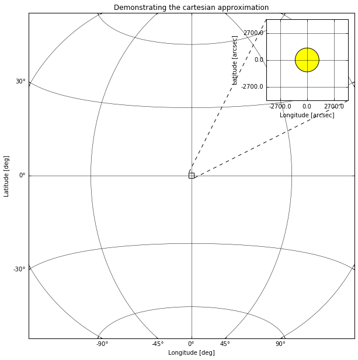
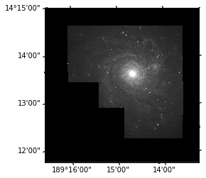
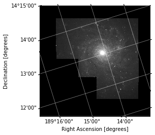
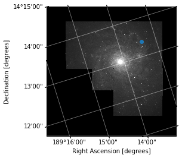
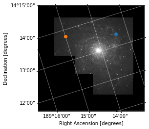
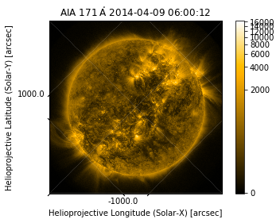
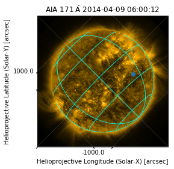

# Images and Coordinates in Astronomy

In this lesson we are going to look at aspects of processing and viewing images specific to Astronomy and Solar Astronomy. By the end of this lesson you should understand:

* Projected Coordinate Systems in Images
* World Coordinate Systems
* Using WCS to calculate coordinates in images
* Plotting images with WCS in images
* Using SunPy Map

## Projected Coordinate Systems

When taking images of the sky, we are projecting the spherical celestial coordinate system onto a 2-dimensional plane, which means that there is no simple linear relation between pixel coordinates and celestial coordinates

There are multiple coordinate systems used to describe the locations in 2D and 3D space for both Astronomy and Solar Physics. We shall use a couple of these systems here as examples but if you want to know more about them there are many of resources avalible.




### Physical Coordinate Systems

Projected coordinate systems are one type of physical coordinate systems, they are the one we will be focusing on in this lesson due to their applicability to imaging data. Astropy and SunPy support representing point in many different physical coordinate systems, both projected and fully 3D, such as ICRS or Helioprojective.


{:.input_area}
```python
import sunpy.coordinates
from astropy.coordinates import SkyCoord
import astropy.units as u
```


{:.input_area}
```python
icrs = SkyCoord(10*u.deg, 86*u.deg, frame='icrs')
icrs
```


{:.output_data_text}
```
<SkyCoord (ICRS): (ra, dec) in deg
    (10., 86.)>
```


{:.input_area}
```python
hpc = SkyCoord(100*u.arcsec, 700*u.arcsec, obstime="now", frame='helioprojective')
hpc
```


{:.output_data_text}
```
<SkyCoord (Helioprojective: obstime=2018-09-05 16:32:12.039703, rsun=695508.0 km, observer=<HeliographicStonyhurst Coordinate (obstime=2018-09-05 16:32:12.039703): (lon, lat, radius) in (deg, deg, AU)
    (0., 7.24258301, 1.00820494)>): (Tx, Ty) in arcsec
    (100., 700.)>
```


{:.input_area}
```python
hpc.transform_to('heliographic_stonyhurst')
```


{:.output_data_text}
```
<SkyCoord (HeliographicStonyhurst: obstime=2018-09-05 16:32:12.039703): (lon, lat, radius) in (deg, deg, km)
    (10.35630578, 54.33656833, 695508.0000005)>
```


### World Coordinate System

#### From pixels  to physical coordinates

The FITS files have a standard for describing the physical coordinate system associated with imaging data, this is called the world coordinate system or WCS, sometimes the specific FITS version of this is referred to as FITS-WCS.

There are multiple papers describing the FITS-WCS standard for various types of data, there is a list here: http://fits.gsfc.nasa.gov/fits_wcs.html

As you learned in the previous lesson we can load FITS files with Astropy. To demonstrate a simple example of a FITS file with FITS-WCS information in the header we shall use an image from SunPy:


{:.input_area}
```python
from sunpy.data.sample import AIA_171_IMAGE
from astropy.io import fits

hdulist = fits.open(AIA_171_IMAGE)
hdulist.verify('silentfix')
hdulist[0].header
```


{:.output_data_text}
```
SIMPLE  =                    T / conforms to FITS standard                      
BITPIX  =                  -32 / array data type                                
NAXIS   =                    2 / number of array dimensions                     
NAXIS1  =                 1024                                                  
NAXIS2  =                 1024                                                  
BLD_VERS= 'V5R12X  '                                                            
LVL_NUM =                  1.5                                                  
T_REC   = '2011-06-07T06:33:03Z'                                                
TRECSTEP=                  1.0                                                  
TRECEPOC= '1977.01.01_00:00:00_TAI'                                             
TRECROUN=                    1                                                  
ORIGIN  = 'SDO     '                                                            
DATE    = '2012-10-16T19:45:34'                                                 
TELESCOP= 'SDO     '                                                            
INSTRUME= 'AIA_3   '                                                            
DATE-OBS= '2011-06-07T06:33:02.77'                                              
T_OBS   = '2011-06-07T06:33:02.88Z'                                             
CAMERA  =                    3                                                  
IMG_TYPE= 'LIGHT   '                                                            
EXPTIME =             0.234256                                                  
EXPSDEV =             0.000135                                                  
INT_TIME=             0.507812                                                  
WAVELNTH=                  171                                                  
WAVEUNIT= 'angstrom'                                                            
WAVE_STR= '171_THIN'                                                            
FSN     =             27194331                                                  
FID     =                    0                                                  
QUALLEV0=                    0                                                  
QUALITY =                    0                                                  
TOTVALS =             16777216                                                  
DATAVALS=             16777216                                                  
MISSVALS=                    0                                                  
PERCENTD=                100.0                                                  
DATAMIN =                   -8                                                  
DATAMAX =                17722                                                  
DATAMEDN=                   18                                                  
DATAMEAN=              26.6888                                                  
DATARMS =            9429260.0                                                  
DATASKEW=    81.43300000000001                                                  
DATAKURT=        17076.7421875                                                  
DATACENT=                30.76                                                  
DATAP01 =                 -1.0                                                  
DATAP10 =                  1.0                                                  
DATAP25 =                  3.0                                                  
DATAP75 =                 39.0                                                  
DATAP90 =                 64.0                                                  
DATAP95 =                 87.0                                                  
DATAP98 =                127.0                                                  
DATAP99 =                168.0                                                  
NSATPIX =                   29                                                  
OSCNMEAN= 'nan     '                                                            
OSCNRMS = 'nan     '                                                            
FLAT_REC= 'aia.flatfield[:#30]'                                                 
NSPIKES =                  977                                                  
CTYPE1  = 'HPLN-TAN'                                                            
CUNIT1  = 'arcsec  '                                                            
CRVAL1  =    3.223099507700556                                                  
CDELT1  =             2.402792                                                  
CRPIX1  =                512.5                                                  
CTYPE2  = 'HPLT-TAN'                                                            
CUNIT2  = 'arcsec  '                                                            
CRVAL2  =    1.385781353025793                                                  
CDELT2  =             2.402792                                                  
CRPIX2  =                512.5                                                  
CROTA2  =            -0.138829                                                  
R_SUN   =        1573.89688496                                                  
MPO_REC = 'sdo.master_pointing[:#394]'                                          
INST_ROT=             0.019327                                                  
IMSCL_MP=             0.599489                                                  
X0_MP   =          2049.459961                                                  
Y0_MP   =          2049.030029                                                  
ASD_REC = 'sdo.lev0_asd_0004[:#10672125]'                                       
SAT_Y0  =            -4.519384                                                  
SAT_Z0  =            13.793308                                                  
SAT_ROT =             -3.4E-05                                                  
ACS_MODE= 'SCIENCE '                                                            
ACS_ECLP= 'NO      '                                                            
ACS_SUNP= 'YES     '                                                            
ACS_SAFE= 'NO      '                                                            
ACS_CGT = 'GT3     '                                                            
ORB_REC = 'sdo.fds_orbit_vectors[2011.06.07_06:33:00_UTC]'                      
DSUN_REF=       149597870691.0                                                  
DSUN_OBS=       151846026489.0                                                  
RSUN_REF=          696000000.0                                                  
RSUN_OBS=    945.4367109999999                                                  
GAEX_OBS=         -13315441.72                                                  
GAEY_OBS=         -25080995.82                                                  
GAEZ_OBS=          31173320.91                                                  
HAEX_OBS=       -36634444009.2                                                  
HAEY_OBS=      -147360551017.0                                                  
HAEZ_OBS=          35731768.47                                                  
OBS_VR  =    86.97246699999999                                                  
OBS_VW  =         31968.269521                                                  
OBS_VN  =          4842.822869                                                  
CRLN_OBS=           340.698273                                                  
CRLT_OBS=             0.048591                                                  
CAR_ROT =                 2111                                                  
HGLN_OBS=                  0.0                                                  
HGLT_OBS=             0.048591                                                  
ROI_NWIN=          -2147483648                                                  
ROI_SUM =          -2147483648                                                  
ROI_NAX1=          -2147483648                                                  
ROI_NAY1=          -2147483648                                                  
ROI_LLX1=          -2147483648                                                  
ROI_LLY1=          -2147483648                                                  
ROI_NAX2=          -2147483648                                                  
ROI_NAY2=          -2147483648                                                  
ROI_LLX2=          -2147483648                                                  
ROI_LLY2=          -2147483648                                                  
PIXLUNIT= 'DN      '                                                            
DN_GAIN =                 17.7                                                  
EFF_AREA=                2.419                                                  
EFF_AR_V=                  3.0                                                  
TEMPCCD =                -71.0                                                  
TEMPGT  =               14.327                                                  
TEMPSMIR=               34.029                                                  
TEMPFPAD=                16.29                                                  
ISPSNAME= 'aia.lev0_isp_0011'                                                   
ISPPKTIM= '2011-06-07T06:32:57.50Z'                                             
ISPPKTVN= '001.197 '                                                            
AIVNMST =                  453                                                  
AIMGOTS =           1686119616                                                  
ASQHDR  =           2174677979                                                  
ASQTNUM =                    2                                                  
ASQFSN  =             27194331                                                  
AIAHFSN =             27194323                                                  
AECDELAY=                 1537                                                  
AIAECTI =                    0                                                  
AIASEN  =                    0                                                  
AIFDBID =                  241                                                  
AIMGOTSS=                55109                                                  
AIFCPS  =                   10                                                  
AIFTSWTH=                    0                                                  
AIFRMLID=                 3057                                                  
AIFTSID =                41729                                                  
AIHISMXB=                    7                                                  
AIHIS192=              8377773                                                  
AIHIS348=              8384772                                                  
AIHIS604=              8386035                                                  
AIHIS860=              8386516                                                  
AIFWEN  =                  204                                                  
AIMGSHCE=                  237                                                  
AECTYPE =                    2                                                  
AECMODE = 'ON      '                                                            
AISTATE = 'CLOSED  '                                                            
AIAECENF=                    1                                                  
AIFILTYP=                    0                                                  
AIMSHOBC=               41.104                                                  
AIMSHOBE=            26.068001                                                  
AIMSHOTC=            55.327999                                                  
AIMSHOTE=            69.344002                                                  
AIMSHCBC=           275.432007                                                  
AIMSHCBE=           260.484009                                                  
AIMSHCTC=              289.556                                                  
AIMSHCTE=           303.395996                                                  
AICFGDL1=                    0                                                  
AICFGDL2=                  107                                                  
AICFGDL3=                  171                                                  
AICFGDL4=                  236                                                  
AIFOENFL=                    1                                                  
AIMGFSN =                    5                                                  
AIMGTYP =                    0                                                  
AIAWVLEN=                    7                                                  
AIAGP1  =                    0                                                  
AIAGP2  =                    0                                                  
AIAGP3  =                    0                                                  
AIAGP4  =                    0                                                  
AIAGP5  =                    0                                                  
AIAGP6  =                    0                                                  
AIAGP7  =                    0                                                  
AIAGP8  =                  619                                                  
AIAGP9  =                  683                                                  
AIAGP10 =                  748                                                  
AGT1SVY =                    2                                                  
AGT1SVZ =                   -6                                                  
AGT2SVY =                    0                                                  
AGT2SVZ =                   -1                                                  
AGT3SVY =                   -2                                                  
AGT3SVZ =                    3                                                  
AGT4SVY =                   -5                                                  
AGT4SVZ =                    5                                                  
AIMGSHEN=                    4                                                  
KEYWDDOC= 'https:  '                                                            
RECNUM  =             76618218                                                  
BLANK   =               -32768                                                  
DATE_OBS= '2011-06-07T06:33:02.77'                                              
XCEN    =        2.91938326953                                                  
YCEN    =        1.09323792231                                                  
DETECTOR= 'AIA     '                                                            
COMMENT FITS (Flexible Image Transport System) format is defined in 'Astronomyan
COMMENT d Astrophysics', volume 376, page 359; bibcode: 2001A&A...376..359HFITSH
COMMENT EAD2STRUCT                                                              
HISTORY FITSHEAD2STRUCT run at: Fri May 26 11:33:15 2017mreadfits_shm VERSION:  
HISTORY 1.20read_sdo VERSION:  2.10aia2wcsmin.pro VERSION:  5.10aia2wcsminaia2wc
HISTORY smin  MPO_date: 2012-09-04T00:00:00Zaia2wcsmin  MPO_t_start: 2011-06-05T
HISTORY 00:00:00Zaia2wcsmin  MPO_t_stop: 2011-06-12T00:00:00Zaia2wcsmin  MPO_ver
HISTORY sion: 5ssw_reg.pro VERSION:  1.30ssw_regssw_reg  ROT called with cubic i
HISTORY nterpolation: cubic = -0.500000ssw_reg  Image registered to SDO image wi
HISTORY th FSN = 27194330ssw_reg  Image registered to SDO image with T_OBS = 201
HISTORY 1-06-07T06:33:01.aia_fix_header.pro VERSION:  1.00aia_prep.pro VERSION: 
HISTORY  5.10aia_reg.pro VERSION:  1.20                                         
```


As you can see there are lots of keys in this and most other real world FITS headers. The ones we need to understand for FITS-WCS are:

Reference Pixel and Coordinate:


{:.input_area}
```python
header = hdulist[0].header

print(header['CRVAL1'], header['CRVAL2'])
print(header['CRPIX1'], header['CRPIX2'])
```

{:.output_stream}
```
3.223099507700556 1.385781353025793
512.5 512.5

```

Pixel resolution (at the reference pixel):


{:.input_area}
```python
print(header['CDELT1'], header['CDELT2'])
```

{:.output_stream}
```
2.402792 2.402792

```

Rotation angle, in degress (at the reference pixel):


{:.input_area}
```python
print(header['CROTA2'])
```

{:.output_stream}
```
-0.138829

```

Coordinate System and Projection:


{:.input_area}
```python
print(header['CTYPE1'], header['CTYPE2'])
```

{:.output_stream}
```
HPLN-TAN HPLT-TAN

```


<section class="challange panel panel-success">
<div class="panel-heading">
<h2><span class="fa fa-pencil"></span> Keyword Extraction</h2>
</div>


<div class="panel-body">

<p>Extract and print out the <code>TELESCOP</code> value from the header.</p>
<p>Next, extract the <code>WAVELNTH</code> and <code>WAVEUNIT</code> values, use these to construct an astropy Quantity object for the wavelength of this image.</p>

</div>

</section>


<section class="solution panel panel-primary">
<div class="panel-heading">
<h2><span class="fa fa-eye"></span> Solution</h2>
</div>

</section>


{:.input_area}
```python
header['TELESCOP']
```


{:.output_data_text}
```
'SDO'
```


{:.input_area}
```python
import astropy.units as u
u.Quantity(header['WAVELNTH'], unit=header['WAVEUNIT'])
```


$171 \; \mathrm{\mathring{A}}$


We could now sit down and work out how to convert from a pixel coordinate to a physical coordinate described by this header (Helioprojective).

However, we can cheat and just use Astropy.


{:.input_area}
```python
from astropy.wcs import WCS

wcs = WCS(header)
```

We can convert from pixel to world coordinate:


{:.input_area}
```python
wcs.wcs_pix2world(((100, 100),), 0)
```


{:.output_data_text}
```
array([[ 3.59725580e+02, -2.73595993e-01]])
```


Or back again:


{:.input_area}
```python
wcs.wcs_world2pix([[  3.59725669e+02,  -2.74328093e-01]], 0)
```


{:.output_data_text}
```
array([[100.13559125,  98.90341705]])
```


The last parameter to the two above examples is the 'origin' parameter. It is a flag that tells WCS if you indexes should be 0-based (like numpy) or 1-based (like FITS).
Here we are using 0 as we want to convert to and from numpy indexes of the array.

## Where are my Pixels?

```
[-500, 0]
[500, 500]
[0, 0]
```


<section class="solution panel panel-primary">
<div class="panel-heading">
<h2><span class="fa fa-eye"></span> Solution</h2>
</div>

</section>


{:.input_area}
```python
print(wcs.wcs_pix2world(((-500, 0),), 1))
print(wcs.wcs_pix2world(((500, 500),), 1))
print(wcs.wcs_pix2world(((0, 0),), 1))
```

{:.output_stream}
```
[[ 3.59324315e+02 -3.40013041e-01]]
[[ 3.59992532e+02 -7.93784855e-03]]
[[ 3.59658007e+02 -3.40839229e-01]]

```

### WCS and SkyCoord

A common usecase for WCS + Coordinates is to store or transform from pixel coordinates to one or more different physical coordinates. Combining Astropy WCS and Coordinates makes this easy.

Assuming we have the WCS object we created from the FITS header above we can get an astropy Coordinate Frame:


{:.input_area}
```python
from astropy.wcs.utils import wcs_to_celestial_frame
```


{:.input_area}
```python
hpc_frame = wcs_to_celestial_frame(wcs)
hpc_frame
```


{:.output_data_text}
```
<Helioprojective Frame (obstime=2011-06-07 06:33:02.770000, rsun=695508.0 km, observer=earth)>
```


We can then use this when creating `SkyCoord` objects:


{:.input_area}
```python
SkyCoord(100*u.arcsec, -500*u.arcsec, frame=hpc_frame)
```


{:.output_data_text}
```
<SkyCoord (Helioprojective: obstime=2011-06-07 06:33:02.770000, rsun=695508.0 km, observer=<HeliographicStonyhurst Coordinate (obstime=2011-06-07 06:33:02.770000): (lon, lat, radius) in (deg, deg, AU)
    (0., 0.03652003, 1.01484379)>): (Tx, Ty) in arcsec
    (100., -500.)>
```


*Note: For solar data you should always use `sunpy.map` for this*

## Plotting with wcsaxes

In this section we are going to use the `astropy.visualization.wcsaxes` subpackage to make WCS aware image plots.

For this example we are going to use a Hubble image.


{:.input_area}
```python
from astropy.io import fits

hdulist = fits.open('./h_n4571_f555_mosaic.fits.gz')
hdulist
```


{:.output_data_text}
```
[<astropy.io.fits.hdu.image.PrimaryHDU object at 0x7fa699064c50>]
```


{:.input_area}
```python
wcs = WCS(hdulist[0].header)
```


{:.input_area}
```python
import matplotlib.pyplot as plt
```


{:.input_area}
```python
ax = plt.subplot(111, projection=wcs)
ax.imshow(hdulist[0].data, cmap='gray', vmax=1000, interpolation=None, origin='lower')
```


{:.output_data_text}
```
<matplotlib.image.AxesImage at 0x7fa696ea2390>
```





This image now has physcial labels in the native coordinate system of the image. We can see what the coordinate system and projection of this image is using the 'CTYPE' header entries we saw earlier.


{:.input_area}
```python
print(hdulist[0].header['CTYPE1'], hdulist[0].header['CTYPE2'])
```

{:.output_stream}
```
RA---TAN DEC--TAN

```

We can tell that this is in the FK5 coordinate system by the presence of a 'equinox' entry in the header:


{:.input_area}
```python
hdulist[0].header['equinox']
```


{:.output_data_text}
```
2000.0
```


<section class="challange panel panel-success">
<div class="panel-heading">
<h2><span class="fa fa-pencil"></span> Add some labels</h2>
</div>


<div class="panel-body">

<p>Now we have a nice plot with physically meaningful ticks, we should label our axes.</p>
<p>Add labels to the axes saying "Right Ascension [degrees]" and "Declination [degrees]"</p>
<p>Also overlay a coordinate grid using:
<code>ax.coords.grid()</code>
Look up the documentation for this method to see what parameters you can specify.</p>

</div>

</section>


<section class="solution panel panel-primary">
<div class="panel-heading">
<h2><span class="fa fa-eye"></span> Solution</h2>
</div>

</section>


{:.input_area}
```python
plt.figure()
ax = plt.subplot(111, projection=wcs)
ax.imshow(hdulist[0].data, cmap='gray', vmax=1000, interpolation=None, origin='lower')
ax.set_xlabel("Right Ascension [degrees]")
ax.set_ylabel("Declination [degrees]")
ax.coords.grid(color='white', alpha=0.5, linestyle='solid')
```





Now we have a nice plot, we can do a couple of things to plot.

### Overplotting in Pixel Coordinates


{:.input_area}
```python
plt.figure()
ax = plt.subplot(111, projection=wcs)

ax.imshow(hdulist[0].data, cmap='gray', vmax=1000, interpolation=None, origin='lower')
ax.set_xlabel("Right Ascension [degrees]")
ax.set_ylabel("Declination [degrees]")
ax.coords.grid(color='white', alpha=0.5, linestyle='solid')

ax.plot(3000, 3000, 'o')
```


{:.output_data_text}
```
[<matplotlib.lines.Line2D at 0x7fa68d81be10>]
```





### Overplotting in World Coordinates


{:.input_area}
```python
fig = plt.figure()
ax = plt.subplot(111, projection=wcs)

ax.imshow(hdulist[0].data, cmap='gray', vmax=1000, interpolation=None, origin='lower')
ax.set_xlabel("Right Ascension [degrees]")
ax.set_ylabel("Declination [degrees]")
ax.coords.grid(color='white', alpha=0.5, linestyle='solid')

ax.set_autoscale_on(False)

ax.plot(3000, 3000, 'o')
# Overplot in FK5 in Degrees
ax.plot(189.25, 14.23, 'o', transform=ax.get_transform('fk5'))
```


{:.output_data_text}
```
[<matplotlib.lines.Line2D at 0x7fa68d7fc8d0>]
```





<section class="challange panel panel-success">
<div class="panel-heading">
<h2><span class="fa fa-pencil"></span> Overplot in a different coordinate system</h2>
</div>


<div class="panel-body">

<p>Using <code>ax.get_transform()</code> you can specify coordinates in any system that astropy coordinates can transform to, try overplotting a point in the <code>'galactic'</code> system.</p>
<p>Also overlay a coordinate grid using:
<code>ax.coords.grid()</code>
Look up the <a href="http://wcsaxes.readthedocs.io/en/latest/overlaying_coordinate_systems.html">documentation</a> for this method to see what parameters you can specify.</p>

</div>

</section>


###  Overplotting Another Coordinate System


{:.input_area}
```python
fig = plt.figure()
ax = plt.subplot(111, projection=wcs)
ax.imshow(hdulist[0].data, cmap='gray', vmax=1000, interpolation=None, origin='lower')
ax.set_xlabel("Right Ascension [degrees]")
ax.set_ylabel("Declination [degrees]")
ax.coords.grid(color='white', alpha=0.5, linestyle='solid')

overlay = ax.get_coords_overlay('galactic')
overlay.grid(color='orange', alpha=1, linestyle='solid')
overlay['l'].set_axislabel("Galactic Longitude [degrees]")
overlay['b'].set_axislabel("Galactic Latitude [degrees]")


ax.plot(287.5, 76.65, 'o', transform=ax.get_transform('galactic'))
```


{:.output_data_text}
```
[<matplotlib.lines.Line2D at 0x7fa68d75f2b0>]
```


## SunPy Map

The SunPy Map class is a wrapper for solar images which makes some of the above opertations easier.


{:.input_area}
```python
import sunpy.map
from sunpy.data.sample import AIA_171_ROLL_IMAGE

amap = sunpy.map.Map(AIA_171_ROLL_IMAGE)
amap.peek()
```





### Coordinate Systems

The SunPy map will calculate some of the things we did earlier automatically, and add some extra information.


{:.input_area}
```python
amap.coordinate_system
```


{:.output_data_text}
```
SpatialPair(axis1='HPLN-TAN', axis2='HPLT-TAN')
```


{:.input_area}
```python
amap.coordinate_frame
```


{:.output_data_text}
```
<Helioprojective Frame (obstime=2014-04-09 06:00:12.970000, rsun=696000000.0 m, observer=<HeliographicStonyhurst Coordinate (obstime=2014-04-09 06:00:12.970000): (lon, lat, radius) in (deg, deg, m)
    (0., -6.047074, 1.49860274e+11)>)>
```


{:.input_area}
```python
amap.wcs
```


{:.output_data_text}
```
WCS Keywords

Number of WCS axes: 2
CTYPE : 'HPLN-TAN'  'HPLT-TAN'  
CRVAL : 0.0  0.0  
CRPIX : 2053.459961  2047.880005  
PC1_1 PC1_2  : 0.7073447192241196  0.7068687630570128  
PC2_1 PC2_2  : -0.7068687630570128  0.7073447192241196  
CDELT : 0.599489  0.599489  
NAXIS : 0  0
```


### Plotting

SunPy map uses these attributes to do it's plotting with WCSAxes like we did manually earlier. We can therefore use the overplotting and grid techniques to improve the plot:


{:.input_area}
```python
import astropy.units as u
```


{:.input_area}
```python
fig = plt.figure()
amap = sunpy.map.Map(AIA_171_ROLL_IMAGE)

im = amap.plot()
ax = plt.gca()
ax.set_autoscale_on(False)

x = 500*u.arcsec
y = -300*u.arcsec

ax.plot(x.to(u.deg), y.to(u.deg), 'o', transform=ax.get_transform('world'))

overlay = ax.get_coords_overlay('heliographic_stonyhurst')
overlay.grid(color='cyan', alpha=1, linestyle='solid')
```





{:.input_area}
```python
amap.pixel_to_data(100*u.pix, 200*u.pix)
```


{:.output_data_text}
```
<SkyCoord (Helioprojective: obstime=2014-04-09 06:00:12.970000, rsun=696000000.0 m, observer=<HeliographicStonyhurst Coordinate (obstime=2014-04-09 06:00:12.970000): (lon, lat, radius) in (deg, deg, m)
    (0., -6.047074, 1.49860274e+11)>): (Tx, Ty) in arcsec
    (-1610.53285218, 44.2122476)>
```


{:.input_area}
```python
amap.data_to_pixel(SkyCoord(0*u.arcsec, 0*u.arcsec, frame=amap.coordinate_frame))
```


{:.output_data_text}
```
PixelPair(x=<Quantity 2052.459961 pix>, y=<Quantity 2046.880005 pix>)
```


<section class="challange panel panel-success">
<div class="panel-heading">
<h2><span class="fa fa-pencil"></span> Rotate your Owl</h2>
</div>


<div class="panel-body">

<p>Why is the Sun wonky?</p>
<p>Use the <a href="http://docs.sunpy.org/en/stable/code_ref/map.html#sunpy.map.mapbase.GenericMap.rotate"><code>rotate()</code></a> method of SunPy Map to align the coordinate grid to the pixel grid in this sample image.</p>
<p>Once you have run rotate, plot the resulting image, and compare with the one above.</p>

</div>

</section>


{:.input_area}
```python
mr = amap.rotate()
mr.peek()
```


{:.output_traceback_line}
```
---------------------------------------------------------------------------
```

{:.output_traceback_line}
```
MemoryError                               Traceback (most recent call last)
```

{:.output_traceback_line}
```
<ipython-input-38-194907119f42> in <module>()
----> 1 mr = amap.rotate()
      2 mr.peek()

```

{:.output_traceback_line}
```
/opt/miniconda/envs/stfc/lib/python3.6/site-packages/sunpy/map/mapbase.py in rotate(self, angle, rmatrix, order, scale, recenter, missing, use_scipy)
   1150                                     image_center=np.flipud(pixel_center),
   1151                                     recenter=recenter, missing=missing,
-> 1152                                     use_scipy=use_scipy).T
   1153 
   1154         if recenter:

```

{:.output_traceback_line}
```
/opt/miniconda/envs/stfc/lib/python3.6/site-packages/sunpy/image/transform.py in affine_transform(image, rmatrix, order, scale, image_center, recenter, missing, use_scipy)
    130 
    131         rotated_image = skimage.transform.warp(adjusted_image, tform, order=order,
--> 132                                                mode='constant', cval=missing)
    133 
    134     return rotated_image

```

{:.output_traceback_line}
```
/opt/miniconda/envs/stfc/lib/python3.6/site-packages/skimage/transform/_warps.py in warp(image, inverse_map, map_args, output_shape, order, mode, cval, clip, preserve_range)
    883                                 input_shape[2])
    884 
--> 885             coords = warp_coords(coord_map, output_shape)
    886 
    887         # Pre-filtering not necessary for order 0, 1 interpolation

```

{:.output_traceback_line}
```
/opt/miniconda/envs/stfc/lib/python3.6/site-packages/skimage/transform/_warps.py in warp_coords(coord_map, shape, dtype)
    596     # Map each (row, col) pair to the source image according to
    597     # the user-provided mapping
--> 598     tf_coords = coord_map(tf_coords)
    599 
    600     # Reshape back to a (2, M, N) coordinate grid

```

{:.output_traceback_line}
```
/opt/miniconda/envs/stfc/lib/python3.6/site-packages/skimage/transform/_warps.py in coord_map(*args)
    874 
    875             def coord_map(*args):
--> 876                 return inverse_map(*args, **map_args)
    877 
    878             if len(input_shape) == 3 and len(output_shape) == 2:

```

{:.output_traceback_line}
```
/opt/miniconda/envs/stfc/lib/python3.6/site-packages/skimage/transform/_geometric.py in __call__(self, coords)
    571 
    572         """
--> 573         return self._apply_mat(coords, self.params)
    574 
    575     def inverse(self, coords):

```

{:.output_traceback_line}
```
/opt/miniconda/envs/stfc/lib/python3.6/site-packages/skimage/transform/_geometric.py in _apply_mat(self, coords, matrix)
    548 
    549         x, y = np.transpose(coords)
--> 550         src = np.vstack((x, y, np.ones_like(x)))
    551         dst = np.dot(src.transpose(), matrix.transpose())
    552 

```

{:.output_traceback_line}
```
/opt/miniconda/envs/stfc/lib/python3.6/site-packages/numpy/core/shape_base.py in vstack(tup)
    232 
    233     """
--> 234     return _nx.concatenate([atleast_2d(_m) for _m in tup], 0)
    235 
    236 def hstack(tup):

```

{:.output_traceback_line}
```
MemoryError: 
```

